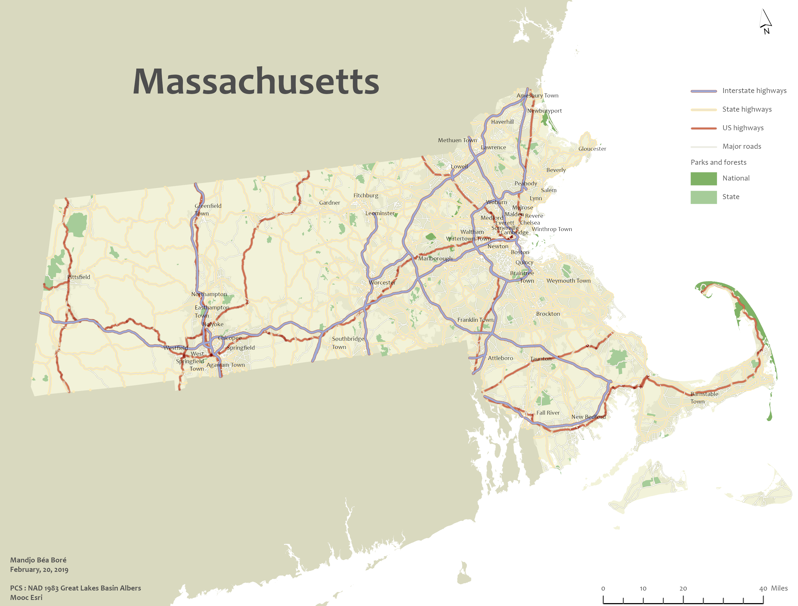
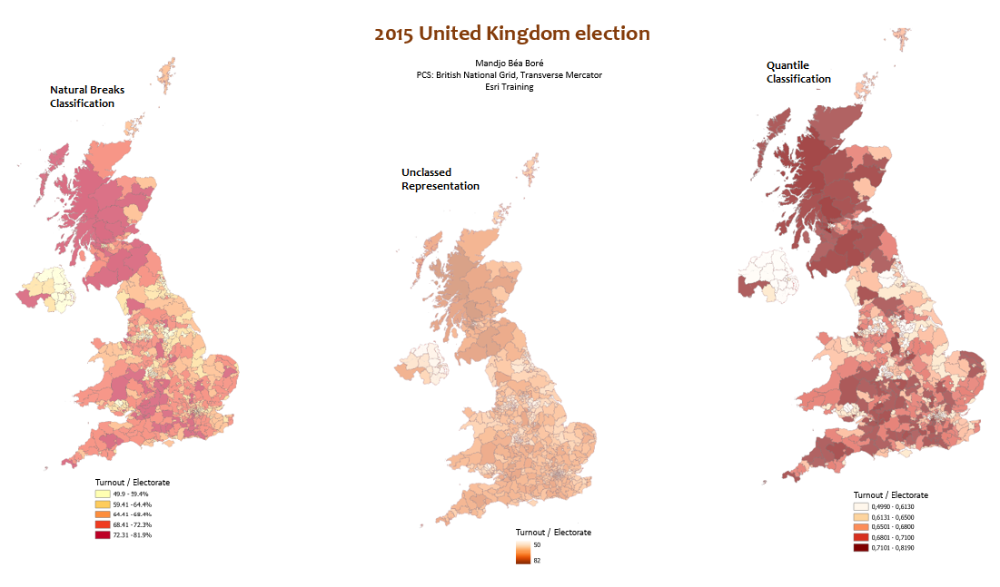
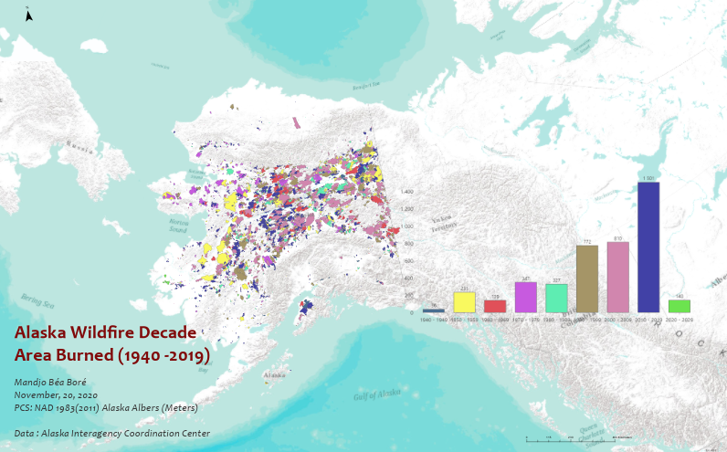

In this page, you will find some graphics that show where things are and why they’re there. It’s all about learning to communicate spatial information to tell you something interesting, to say some story that give some facts.

As said <a href="https://twitter.com/kennethfield" target="_blank">Kenneth</a>, cartographers make decisions all the time about what to put on the map and what to take off the map. Therefore, thank you for your compromise about things you will or not see.

# 1. Reference Map of Massachusetts

I use ArcGIS Pro to make this reference map during the ESRI Cartography Mooc. ESRI offers generously data and instructions throughout the Mooc. The map shows the northeast region of the United States and focuses on the state of Massachusetts.

The goal of the project was to symbolize and label layers throuhg some basic symbol editing, label placement techniques, colors editing, setting a map projection and so on.

# 2. Vietnam War bombing missions

I use ArcGIS Pro to make this guiding map project from ESRI free courses. The CSV file is from the Vietnam page at <a href="https://insight.livestories.com/s/v2/vietnam/48973b96-8add-4898-9b33-af2a676b10bb/" target="_blank">data.mil</a>, a public website compiled by the Defense Digital Service in collaboration with the United States Department of Defense.

If you're history enthusiast, this map might be of your interest. I love the geoDesign that shows bombing missions during the Vietnam War.

To make this layout, I added a layer of bombing missions and then symbolized them. I also added reference information (World cities, World Hillshade, World countries generalised ) from ArcGIS Living Atlas before labeling each item. Then, I created a time series chart and hexagon bin inset map to provide more information about the data. Finally, I arranged all of the elements in a print layout (ANSI-Landscape, ANSI D 22" x34"), prioritizing visual clarity and aesthetics.

# 3. Results of 2015 UK election

These choropleth maps are made from the data of the electoral constituencies for the United Kingdom of Great Britain and Northern Ireland. I used ArcGIS Pro from Esri Training to explore three methods (natural breaks classification, quantile classification, unclassed representation) of classifying numerical data for thematic mapping. Lighter shades match lower data values and the darker ones match higher data values.

The same dataset has been used to develop a range of alternative thematic maps that tell the story of the 2015 general election of the United Kingdom of Great Britain and Northern Ireland. The thematic map showing the winning political party in each area using a unique value(winning party) symbolized of by the political party. A graduate color (choropleth) map that show the share of the votes that the winning members of Parliament received.

# 3. Alaska Fire Service (AFS)

AFS provides wildland fire management. I use QGIS software to access AFS's GIS  <a href="https://fire.ak.blm.gov/arcgis/rest/services/MapAndFeatureServices" target="_blank">data Service</a> from ArcGIS Server.  

After exploring AFS Data in QGIS, I display fire perimeters in a category of fireseasons and apply some filter to extract  desired information from the dataset. From that analysis, I find out that in 1950, the fire called Little Black River burned the most acres from 1940(80 years) in Alaska Fire History. 

I also use the Group Stats tool in QGIS to extract data statistics (burn area and burn counts) from historic fire perimeters data of Alaska dataset.

