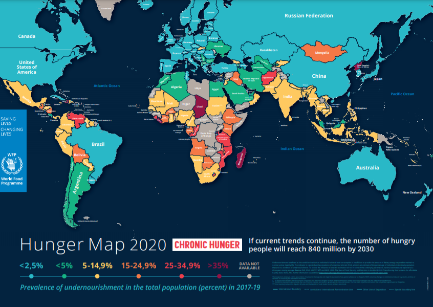

For most farmers, when land is scarce, they cut down trees in order to plant crops. But planting trees and crops and/or animals together on the same piece of land (agroforestry) can make farmland more productive and provide more and different crops—thanks to the work of my friend Gabriel and I, young BSc graduates of Environmental Studies.

Gabriel and I conducted this project to ensure that Agroforestry serves the three objectives of agriculture: food production, rural development, and environmental protection.

This kind of practice would be valuable anywhere, but it’s especially useful in Africa, where the prevalence of undernourishment in the population remains stubbornly high.

According to the World Food Program (WFP), the map below, most African countries have higher prevalence of undernourishment in the population. For WFP, if current trends continue, the number of hungry people will reach 840 million by 2030 in the world.

Source: <a href="https://www.wfp.org/publications/hunger-map-2020/" target="_blank">WFP 2020 - Hunger Map</a>

Growing up in Guinea, my friend and I were aware of undernourishment in the population. This may not be the case in our families but it’s a real world problem to face. We studied Environmental sciences in college and were very excited of working on this research project. And we were even more excited when we visited rural communities with the team of Dr. Famoï Béavogui, who was a director of Guinea Agricultural Research Institute. Walking through the farmlands, interviewing farmers, sleeping with them, and listening to them, we came face to face to realize the role of agroforestry in providing a wide range of economic, sociocultural, and environmental benefits.

“The question was, ‘How agroforestry practices meet the needs of farmers in their current environment?’” That was the question ask by Dr. Famoï, and the answer to this question should lead to our graduation.

So, we decided to find an answer.

We first explored the landscape, how agroforest farmlands were structured. The most striking element relates to the wide differentiation between trees products according to the proportion of total income used to buy food, or for medicine, firewood, shade, thatch, or lumber. In visited villages, agroforest farmlands were almost the same structure with the predominant trees of Shea tree, Mango tree, néré trees and much more. But we also discovered that most women from the home city—especially in visited rural areas—were more interested to Shea trees and néré trees. Their activities are almost around these trees.

We knew that while women may lack financial supports, technology to quickly transformed trees products, many of them did have a lot of traditional knowledge that was readily apply in their daily activities. Working with my friend, we decided secondly to evaluate the “place” of trees products in the household economy of every selected agroforest farmland. This economic analysis conducted on every agroforest farmland show that the highest gross potential income generated from one village’s trees products activity was US$ 2 913,95 in 2008. Developing a strong rural policy can help bridge the gap in care for rural women activities.

Researcher who were supporting us added other information including soil amelioration by trees in agroforest farming and the growth of nitrogen-fixing trees, including an important role play in the conservation of biodiversity within deforested, fragmented landscapes by providing habitats and resources for plant and animal species, maintaining landscape connectivity.

Agroforestry farmland crop also help secure and reduced soil erosion and the impact of raindrops, improve soil structure.

While agroforestry farmland owner, mostly women use basic and traditional technics, the demand of agroforest products (shea butter for example) on market continue to grow more popular whether on amazon or in local market. Strengthening women’s work by supplying them with new equipment will add more value to their activity and allowed them to gain more experience that will be engaging for rural communities. In addition to a small association charge, agroforest farmland women association generates revenue to manage their activities by charging clients a small fee when their ask to produce products.

While the popularity of forest products (shea butter, cocoa, or wine) are one measure of success, agroforestry has already had a positive impact on scientific community. We hope to facilitate women activities where their struggling with a lack of agricultural and economical services.
