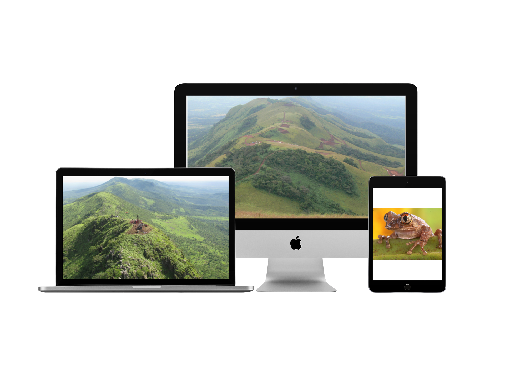
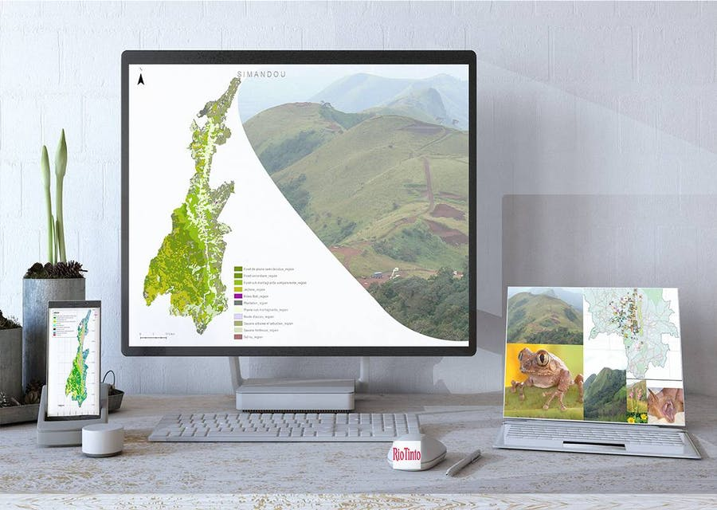

Have you heard about the `process` of assisting the recovery of an ecosystem that has been damaged, degraded or destroyed? Whether it’s from inappropriate forest exploitation, mining or deforestation for agricultural expansion, this post will show you a practical case study of mining in Guinea and how a mining company, Rio Tinto is using ecological restoration to recover back the ecosystems.

The `International Year of Biodiversity` was held in `2010` to raise awareness of the importance of biodiversity worldwide. At the same year, I am studying in Paris to get a Master degree in Integrated Land Management and planning. By inviting student to choose their own thesis subject for a biodiversity preservation project, Nathalie Machon, Professor of Ecology at the Paris Museum of Natural History, learned a lot about her students' interests and passions.

```javascript
How to reconcile mining and Biodiversity preservation ?
```

I choose this question as my thesis subject for one reason: Guinea.

Born and raised in Guinea, I knew that the mining industry is estimated directly and indirectly to contribute to 36% of the country GDP, and is therefore considered to be an essential part of living and economic development.

However, mining activities destroyed ecosystems, produce ‘mine wastes’: unwanted solid and liquid materials which are currently uneconomic and contain contaminants in concentrations that pose serious hazards to ecosystem and human health, elements (iron) involved in biogeochemical cycles and components (metals) that are potentially economic and could be recovered.

I also knew that understanding and predicting the impacts of mining and mine wastes requires
knowledge of the links between their distribution and climate, geological hazards, ecosystem productivity, land-use and urbanisation in Guinea.

Such knowledge will enable mining companies, governments and non-governmental organisations to manage, remediate and exploit mine wastes and sustain the globally vital mining industry.

To be successful in solving this question, I spent some days and months researching bibliographical notes about mining in Guinea and others places for the first. The compilation of documents, study and mission reports, and other information including Internet research, as well as information obtained from one-on-one consultations have
allowed for a greater understanding of the Pic de Fon area and of the subject of the study.

Given the limited availability of documents pertaining to this topic, this literature review consists only of a collection of general information on mining cases in Guinea, and later about ecological restoration.

Later, I reached out to the Rio Tinto environmental executive department, sending some emails and I was welcome (despite some administrative difficulties) to start an internship project with the environmental team in Guinea.
The project was finally carried out as part of a contract agreement between the University Montpellier2, the laboratory of Centre d’Ecologie Fonctionnelle et Evolutive de Montpellier and the company Rio Tinto Simandou.

To be a sccessful candidate in this project, I was responsible for developing research using ecological restauration approch in other to help restore back ecosystems. Dr. James Aronson, from le Centre d’Ecologie Fonctionnelle et Evolutive (CNRS) kindly accepted me in his lab. We drawn one plan : with the aim to identify the potential for ecological restoration and rehabilitation, which will serve as a bridge to reconcile the inevitable and potential conflicts between mining and biodiversity, we start asking ouselve the following questions:

_How can we best preserve biodiversity and good sustainable functioning of natural ecosystems of the Pic de Fon classified forest in the presence of strong mining exploitation activities?_

_How can we promote the well-being of local people and other stakeholders in the Pic de Fon forest through joint management of at least some economic and environmental enhancement activities at the landscape level?_

So we described firstly the context and objectives of the study. Then we focus on the approach and methodology used in the study. Finally, the results obtained through different aspects of the work was presented and then discussed.
The forêt classée du Pic de Fon was incorporated into the state forest sector as a classified according to decree N° 8113 in November, 4, 1953 of the Governor General of West Africa (French colonial administration).



Rio Tinto is a world-class iron ore mining project located in South Eastern Guinea. Rio adopts high environmental standards, finances impact assessment, and research on rehabilitation and ecological restoration. Significant studies have been completed on biodiversity in the region by Conservation International, The Royal Botanic Gardens Kew (UK), and other competent institutions.

The field work in Guinea aims to characterize different vegetation types and the various species that have been selected for ecological restoration. This section describes the organization of the landscape of the Forêt Classée du Pic de Fon. The Pic de Fon vegetation types have been identified from the vegetation map completed before and a fieldwork project that was conducted in the course of our study, starting from Canga-East to the top of Simandou range.


It was a wonderful experience to work with many people from different enviromment and cultural background. But I am sure of one thing, I could not be able to reach my goal without the support of many people around me. Many thanks to all of you.
