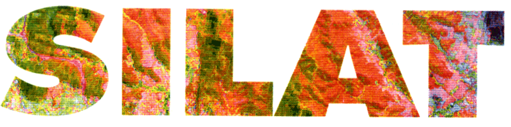

Wondering what happens when computer science and geography come together? The power to collect, store, manage, query, visualize spatial data, and output maps is unleashed, providing tools to inform choices about where we live or where things happen! That's what the advanced MSc SILAT will teach you, and in this post, I will give you top 10 reasons why I decided to choose the SILAT MSc.

SILAT stands for "Systèmes d’informations localisées pour l’aménagement des territoires" [Localized Information Systems for Land Management] and it's one of AgroParisTech University's executive program. The MSc is based at "Maison de la Télédétection " [House of Remote Sensing], in South of France. Lecturers are mainly from academic and research institutions (AgroParisTech, CIRAD, IRD and Irstea) dedicated to remote sensing and broadly to spatial information.

Choosing between AgroParisTech University's executive MSc can be tougher. Like choosing between candy bars, each executive program seems pretty cool. But coming from Environmental Science background, I didn't have tough decision making process about what I wanted to study. I had already planned to study the disciplines of spatial data science and here are some reasons of my choice of the SIALT MSc:

### 1 - Location: Place matters

The first reason why this MSc is important is the fact that we cannot get away from the location issue. We need to know Geo-information or localized information because things happen in our country and continent, state, city or town, street. How close or how far something is that may or may not affect us ? We are constantly thinking spatially anytime we tell someone, that a next road or the restaurant they're looking for is just a couple blocks away. For all my previous academic projects, I needed to map places. So yes, place matters !

### 2 - Demand on Market

The second reason why SILAT is important is the ability to better understand the limitless potential of GIS in many cases (agriculture, forests, urban planning, Banking, climate Change, environment & biodiversity and so on). Learning how to work with Geospatial Data is an excellent way to open doors for a future career. GIS data is used for many applications across many fields, if you do not find your way in urban planning GIS or GIS business, you still have many other choices to make. GIS is everywhere !

### 3 - High standards of teaching

SILAT is well-illustrated lectures by the instructors (mainly researchers), but also guest lectures from companies or public services, to ensure that students are hearing and seing a variety of viewpoints and using a varety of GIS and Remote Sensing tools. Each week, students are able to examine what GIS & Remote Sensing is thourgh interactive mapping that showcases real-word case study examples of GIS from around the globe (Europe and Africa mainly).

### 4 - Variety of Courses

There are mainly four disciplines in Spatial Data Science or four academic disciplines related to spatial data science, which are Geographic Information System (GIS), Database Management System (DBMS), Data Analytics, and Spatial Big Data Systems. SILAT covers all five GIS layers, which are spatial reference framework, spatial data model, spatial data acquisition systems, spatial data analysis, and geo-visualization. They also teach some tools in Data analytics but not the Big Data System.

### 5 - Project management skills

The fourth reason why you should consider to take this MSc is the project management skills. As you move along in the MSc, you will discover the interrelationships of both the technical and human aspects that contribute to how GIS strategies are composed. The MSc concludes with you outlining your own GIS project or field research, and receiving feedback about that from your peers. At the end of the program, the student will write a thesis to be approved by the The Committee of lectuerers. Student also present the projects as a seminar open to all in the related field of GIS ouside the school.

### 6 - Partnership

One of the best thing about this MSc is the partnership with companies, academic and research institutions. Students are require to submit a proposed project in partnership with a host company or researh lab that covers generally his/her training costs. According to the type of project, every student is supported by a personal superviser while executing the project.

### 7 - Financial Aid

France gouverment and some local and regional organizations offer a very generous financial program. You may not be eligible to this aid if you're not from France or Europe, but there many other Sholarship Program out there like the Joint Japan/World Bank Graduate Scholarship Program (JJ/WBGSP). This Program enable mid-caeer professionals in developing countries and Japan to complete graduate degrees in development-related fields.

### 8 - Research opportunities

Based in research hub, the research activities of the host center cover all spatial information research. Most lecturers (teacher-researchers) are affiliated to differents laboratories and play an important role not only in supervising student but also in research activities, organisation in France, Europe, and around the world. Not usually but there maybe some programs that offer interesting research opportunities to student.

### 9 - Housing & People

Having lived in Paris and heard about housing in Geneva or New-York, housing in Montpelier is pretty sweet. 95% of students live on campus, that is different than most schools. There are a few cultural sensitivities to be mindful of. Don't be affraid to use the little "s'il vous plaît" at the end of all requests. “Voulez-vous coucher avec moi?” seems to be a joke that people make about France but be sure that they don’t think it’s funny.

### 10 The Beauty of the South

When you go south you never go back north. Like many coastal locations, the south of France is a great place to spend time on the beach. Through a combination of the wind, the high temperatures and the mountains make the south beautiful and magical to visit. But unemployment rate is high, and for that reason, the south of France can be hard some time, even for a short time.
