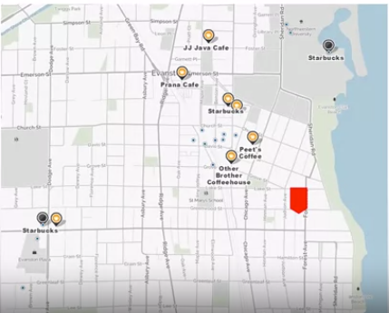
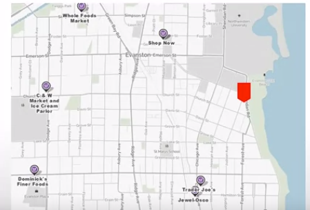

#### Front-end web development

To read the whole instruction article - [Setup Algolia account for your GatsbyJS blog](https://dev.greglobinski.com/setup-algolia-account/) - you have to move to [Front-end web development with Greg](https://dev.greglobinski.com) website.

...
Ici, tu as un très beau texte de la problématique, il ne manqu'à mettre mes propres termes et exemples

Here are some real world problems of spatial data science. A financial investment group considers purchasing commercial timberland in the southeastern states of the U.S., in order to diversify their investment portfolio. What would be good regions or counties for the investment?

The second question is, a municipal government plans to integrate and manage all spatial data set at the central DBMS. And make each department access to the database, while they have different level of authority. What would be the solution in architecture to support such requirements?

The third problem is, a public health authority wants to check if any spatial patterns exist between administrative district and disease prevalence. If it exists, they would like to figure out regional factors that would contribute to higher or lower diseases prevalence. How can they solve the problem?

The next problem is, a defence research agency is ordered to develop framework to present an optimal design of surveillance network against potential infiltration. It is about how to optimally locate thermal observation devices in a battle field. How could the agency solve the problem?

The last problem is that a taxi call service company want to provide a new service with taxi drivers, named "Passenger Finder". Which can guide to the places where many passengers are waiting for taxi cabs.

These are the practical problems of spatial data science that you can solve after taking this course. In fact, with respect to the five problems that I mentioned, I'll give you my solutions in the final week of this course.

Spatial data science is an interdisciplinary subject. For which you need to understand GIS, database management systems, data analytics, and big data system. Those subject will be covered throughout this course.

One differentiating aspect of my course is that only open-source software will be used. QGIS for GIS, PostgreSQL and PostGIS for DBMS. R for data analytics and Hadoop related solutions for big data systems.

I invite you join me in this journey of exploring spatial data and applications. Hopefully, you could find this course interesting as well as helpful for your career development. Thank you.


### Introduction to Spatial Data Science.

Welcome everyone and thank you for signing up for my courses, Spatial Data Science and Applications and taking the first class. In this class, we'll discuss what spatial data science is.

In order to give you the concept of spatial data science, we will review related disciplines, science and data science in the first place and then discuss the definition of spatial data science and its unique aspects. For your better understanding, examples of spatial data science problems will be presented as well.

What is a science? I present two definitions here. One from WiKi, the other from Webster.

The one is focusing on activity or method, the other is more on subject.

As a subject, science is set of human knowledge on general truths. As an activity or a method, science is used to explain events or phenomena of the universe. Traditionally, science method pursued finding causal relationship. In other words, it was used to answer "why"? Why is this happening?

For that, a hypothesis was set and tested with the experiments, which is precisely designed particularly removing any biases.

Sometimes other approaches could be used. No matter what, focus on scientific method was always on establishing causal relationships.

On the other hand, data science is in the spotlight recently in the era of 'big data'. In the definition of data science, there are three noticeable words. "interdisciplinary", "insight", and "data".

"Interdisciplinary" means that data science requires understanding of multiple disciplines and the combination.

"Insight" replaced "truth" in the definition of science, which means that data science is not pursuing general truths or general laws.

"Data" replaced "hypothesis" and "experiment", which means that data analysis is the major tool to find knowledge and insights.

The term "data science" was used by Peter Naur in 1960 as a substitute of Computer Science. And early in 1997, Jack Wu mentioned "is Statistics equal to Data Science?"

All in all, the focus of data science is placed on "correlation" based on the data analysis rather than "causality".

Data science generally does not try to answer why or cause and effect.

To become a data scientist, he or she needs to have expertise in a variety of disciplines. DBMS and Big Data System such as Hadoop should be understood for data handling and management. Statistics, machine learning, and related to data mining techniques are essential for data analytics.

Experience of data visualization is a big plus for delivery of results and visual analysis.

Application domain knowledge is always helpful, but it can be supported by domain expert as a team member.

Spatial data science is similar to data science in definition. But, there is a major difference that spatial data science equally focuses on both causality and correlation.

In other words, spatial data science pursues answers to the question "why" and also a simple pattern of spatial phenomena.

Spatial data science is also multi-disciplinary, so that spatial data handling and management are important disciplines and expertise of spatial data analytics and visualization are also critical qualification of spatial data scientists. Additionally, proficiency with GIS will be very helpful.

The difference between data science and spatial data science would be explained in the figure. It can be composed of two disciplines- spatial science and data science. While the one pursues causality, the other does correlation or pattern mining.

With a given diagram, the relationship is also illustrated. Spatial data science has overlapped area with data science. At the same time, it has different aspect from data science, which is named as spatial science. We could find quite a few fields related to spatial data science, seeking knowledge of spatial phenomena.

Just to name a few, urban traffic problems, health care issues, for example regional prevalence of a specific disease, politics. Business intelligence, city operation, hydrology, disaster vulnerability, emergency service, and many others.

### Real world problem of spatial data science

Ces problème m'inspire le mooc d'esri en marketing

Let's take a look at a real world problem of spatial data science.

#### revenue estimation of a new coffee shop

What is the revenue estimation of a new coffee shop in Evanston, Illinois? Or, where is the optimal location of a new coffee shop in Evanston, IL?



It's a similar location of a different case. What is the revenue estimation of a new grocery store in Evanston, IL? Or, where is the optimal location of a new grocery store in Evanston, IL?



How can you get the answers to the questions?

There are two approaches as mentioned, Causality Approach and Data Mining Approach. Causality Approach based on spatial science investigates supply side and demand side.

Location and capacity with nearby competing stores. Spatial distribution of potential customers are carefully mapped. And service accessibility models, such as gravity model or 2-step floating catchment analysis are applied.

And then customer shares are estimated and eventually get an revenue estimation at the given location.

On the other hand, data mining approach is to find the existing store, which has a similar pattern of the new store and then use the revenue of the existing store as the estimation.

Or, build a regression model of which target variable is revenue and input variables are characteristics of the store and its location. And then, use the model for revenue estimation.

Which one do you think is more appropriate than the other?

In general, data mining approach works very well in case of small retail shops such as coffee shop. On the other hand, causality approach works better for larger stores such as grocery store, department store and so on.

#### How long would it take to...

Let's take a look at other examples. The next problem is, "How long would it take to leave New York University for Columbia University by Taxi Cab at 6:00 p.m on Monday?" Causality approach takes steps such as trip generation to build origin-generation table, modal split about decision-making of transportation type, trip assignment to roads, and then get the travel time estimation.

Data mining approach uses historical data sets of taxi trajectory, then find a similar trajectory which covers the origin NYU and the destination, Columbia University. Under similar condition parameter such as, 6:00 p.m, Monday, weather condition and occurrence of any special events.

Based on the trajectory of pattern mining and matching, the travel time can be estimated as well.

#### hydrological question...

The next example is a hydrological question. Where would be flooded in the city of New Orleans at the precipitation rate of one inch per hour for five hours?

We can use either conventional hydrological process with spatial data, such as digital elevation model, which is a causality approach.

Or a heuristics data mining approach, with pattern matching as explained in the slide.

#### What is the air pollution level at Peking University...

The last example is "What is the air pollution level at Peking University at 10 a.m tomorrow?" The causality approach is to combine inventory of pollutant emission and weather condition into computational fluid dynamics and estimate air pollution level at a given location and time. Data mining approach would train a Machine Learning Algorithm which takes in air pollution data and produce air pollution map with a given condition. We discussed definition of Science, Data Science and Spatial Data Science particularly the similarity and the difference between Data Science and Spatial Data Science was discussed in more detail. Yellow portion of the diagram would illustrate similar aspect of data science and spatial data science, while the blue portion would represent unique aspects of spatial data science.

In the addition to difference between causality approach and data mining approach, there are quite a few issues which differentiate Spatial Data Science from Data Science. It requires hands-on experience of different disciplines such as GIS, Spatial DBMS, Spatial Big Data Systems, Spatial Data Analytics.

Unique characteristics of spatial data should also be realized and understood to claim the role of a Spatial Data Scientist.

In this course, you will learn more about unique aspects of spatial data science.

In summary, spatial data science uses both causality approaches and data mining approaches. Spatial data science is not just the extension of data science. And it has rather unique aspects different from data science,

which would be of a value proposition that I can, you can get from this course.

There are four main disciplines of spatial data science, GIS, spatial DBMS, spatial big data systems and spatial data analytics. These topics will be discussed later. Alright, this is the end of the first lecture. Hopefully, you enjoyed it and see you in the next lecture.


### Why is Spatial Special? (I) - A Business Perspective

[MUSIC] Welcome back. In this lecture, we'll discuss unique aspects of spatial data science. "Why is spatial special?" in terms of business perspectives.

For that, I will start with my personal experience and give you a brief overview. What's going on around spatial data in major IT companies. And then the value of spatial data will be discussed based on the five reasons why those major companies have maps in-house and consider them as the essential assets. [SOUND] To discuss about this topic, I would like to start with my personal experience.

My background is a little different from most of other professors. Right after obtaining Ph.D. degree, I joined a startup company in Chicago area, name Forest One, worked as the CTO for four and a half years. The business model of the company was to provide value-added spatial information to natural resource industry. On Oct. 28, 2004, Shailu Verma, Vice President of Marketing came to my office and asked, "Joon, do you have any information on Google's acquisition of Keyhole?" I was surprised because I thought I should have known that beforehand, but just answered "Keyhole? The company competed against us for State of Montana project." At the time, we were just a small start-up, so in order to make a cash flow to move on, we bid on quite a few government projects on GIS, system integration, and many others. Shailu and I discussed, and it occurred to me that Keyhole developed a web-based visualization tool of satellite and aerial images, and made their effort on promotion of the new product. I slept on the issue...Why? Why did Google acquire Keyhole?

In other words, why did Google invest their money in acquiring Keyhole? In business world, a company never invests even a single dime without a cause. What is the objective of the investment? That was my question. I could find the answer that night, Ahh~ Google will have maps!! At that time, Google only provided a small search window and just expanded their service to email in 2004. Of course, no map service. The answer was so obvious. What other purpose could Google have for the acquisition of Keyhole, except for offering a map service? In May, 2005, Google Earth, a global map service was launched, and the world was shocked and astonished at the quality and the coverage of Google Earth.

Now let's move to a new question. What do you think does Apple, Google, Microsoft, Nokia and Amazon have in common? I think the company have three things in common, what are they?

First of all, they are or used to be world No. 1 company in a sector of IT industry. Second, they made an attempt to develop their own operating systems. iOS for Apple, Android for Google, Windows for Microsoft, Symbian for Nokia and Fire for Amazon.

Third, they all have their own map products in-house. Now you can see 3D maps of downtown San Francisco offered by the companies. Now it is natural to raise another question. Why do the major IT companies have maps in house? Why?

The first and simple reason is because spatial data is 'excellent contents'. Just think about how often you access map service through your smart phone.

However, it would not be enough to justify all the frenzy around in house map production of major IT companies.

If it is just content, no matter how good they might be, outsourcing could be a simple and viable solution.

The second reason is 'spatialization of information'. This concept tells that most of the information have location, so that it can be managed with location. In other words, information can be organized on top of map. If this could be applied, a search engine can present different results to different users at different locations.

Imagine one user in New York, and the other in San Francisco searching with the same keyword, let's say 'sushi bar'. Each user would expect the sushi bar nearby in their city, either New York or San Francisco. 'Spatial' can present the capability of organizing information more efficient manner. Thanks to 'spatial' search engine now retrieves more relevant results for the users in different locations.

Now let's take a break and go to the following YouTube link, where you can watch a short video clip of movie "Minority Report". Enjoy it.

Isn't it scary?

This movie visualizes personal identifying advertisement in the future. Only Guinness Beer selectively called "John Anderson!" because he's a potential buyer or even a frequent buyer of the beer. Now let's imagine that current location of a smartphone user is known or his/her past trajectory are stored. Then what can we do? Actually, not we, the major IT companies can send out advertisements related to the location. It must be a well-targeted marketing strategy, surely, good performances are expected. It is a widely-known fact that over 90% of Google's revenue comes from online advertising.

Now more business transactions are made on mobile devices than traditional desktop computers. In this situation, location based advertisement designed for mobile device is the name of the game. More seriously, it's a matter for survival for any companies in online advertisement, including Google. The figure on the slide is an example of human trajectory. Actually it's my trajectory one day in August 2016. Now do you recognize how variable this data could be? This data set are being accumulated in either Google data center or Apple data center whenever you turn on the location service of your smartphone. The fourth reason is 'interface between human and robot'. The figure is showing two cases- drone delivery and autonomous driving. A map is a basis to allow robot recognize its origin and destination for either delivery or driving.

Through a map as an interface, human intention can be understood and the mission can be completed by a robot.

Let's take one step further. In case of autonomous driving. Recently, the main research and development direction of autonomous driving is context and environment awareness with sensor technology and machine learning. However, if very accurate spatial information and other context information that given through a map, safety and quality of autonomous driving can be significantly improved.

There was quite a big M/A cases, which supports my argument. Three German Motor companies, Audi, BMW, Mercedes together acquired Nokia HERE Map in 2015, why? Mainly to take an initiative in autonomous vehicle market. Their plan seemingly to make maps play a central role of presenting high-definition spatial information as well as sharing spatial context awareness with other vehicles. This trend was even accelerated recently.

Dec. 2016, a Chinese consortium including Tencent acquired a 10% stake in HERE Maps.

And a week later, in year 2017, Intel also acquired a 15% of HERE Maps. Microsoft also presented their plan to work with HERE Maps for the IOT (Internet of things) strategy. The last but not the least, map is a platform of almost everything including big data.

Human is a creature living on the Earth, and almost all the activities are intrinsically spatial. It is said that there are three major sources of big data which are people, machine, and organization. Any big data can be represent on table map, they're called 'spatial big data', which is one of the main topics in this course.

Now we can summarize the value map with the sentence next to me. Map or spatial is a platform and interface on which human, space, advertisement, hardware, software, contents, service, and future robot (car and drones), and IOT can be integrated all together. This is the true value map, the core infrastructure of the future IT industry. Now back to original question- Why is spatial special? Spatial is a critical issue, a matter of survival for big name IT companies. Spatial will make a sustainable impact on the way of our living. Spatial is a platform and an interface of almost everything related to human being. This is the end of this lecture in which we discussed why spatial is special, from business perspective. In the next lecture, we will discuss the same question from technical perspectives. Hope you all enjoying this lecture, and see you next time.

### Why is Spatial Special? (II) - A Technical Perspective

In the previous lecture, we tried to figure out the answers to the question, "Why is spatial special?" from business perspectives. In this lecture, we'll discuss the answers to the same question from technical perspectives- particularly spatial data management and processing. I'll give you the answer from four different categories. Spatial Data in DBMS, which is about technical difficulties in storing spatial data in DBMS. Topology of Spatial Data, which is about tight relationship among spatial object - point, line, polygons. Spatial data indexing, problems and difficulties in applying multi-dimensional data indexing. Spatial Big Data Processing. Problems and difficulties in applying data parallelism to spatial data.

Spatial information is expressed in terms of point, line, polygon or images. These datasets are not conventional data types such as numbers, date, and text string, which means that conventional relational DBMS cannot accommodate such datasets in the table. In fact, we can break down spatial data type, (in the case, a polygon) and save it into tables, in a conventional relational DBMS, as shown in the figure. However, four tables are required with overlapping attribute to accommodate a polygon as a parcel boundary. This problem was resolved after Object Relational DBMS was developed, which can save user-defined data type into table. Topology is a branch of Mathematics about spatial relationship which does not change due to elastic deformation of underlying space. In spatial data management, topology is defined as a set of rules that describe spatial relationships among spatial objects, such as point, line, polygons. And those rules are implemented in data structure. There are numerous topological models of spatial data. Here you're looking at a widely known topological data model of a point, node, line, chain, and polygon. Their hierarchical relationships are defined in the diagram. This topological model will be discussed in more detail later. Instead, I would like to give you a very simple topology of trajectory. As you can see, it has only two rules. Trajectory has one starting point and one ending point. And points are stored in the time order of trajectory. The two rules can be implemented simply with time-ordered storing of points. Why do you think we need topology of spatial data? It is because topology can present two main benefits, data integrity checking and efficient spatial operations. Just imagine what if points in trajectory are arbitrarily saved in a data structure. It will take a lot of time to conduct a simple analysis and to check if a given point is on trajectory or not. Now let's take a look at issues of spatial data indexing. As B-tree is a standard indexing method in conventional relational DBMS, R-tree which is multi-dimensional extension of B-tree considered as a de facto standard in spatial DBMS. The figure contains quite a few spatial object distributed in 2D space. The key idea of R-tree is to group nearby spatial object, and to represent them with Minimum Bonding Rectangles, also known as MBR. In the next level of the tree, the figure illustrates how to group the given spatial object with MBR. The next figure illustrates the R-tree structure of the given spatial objects and MBRs. Leaf nodes in the bottom store spatial objects. As with the other tree indexing, the searching algorithm is quite simple to check a search rectangle similar to B-tree. One major problem is that a very large overhead is required building R-tree. Can we apply R-tree to spatial big data? The answer is rather negative due to the high computation overhead.

Now let's extend our discussion to spatial big data computing based on the understanding the nature of spatial data management. MapReduce has been the most popular programming framework for big data processing with a parallel and distributed algorithm on a cluster. Hadoop is still the most widely MapReduce framework, using Hadoop Distributed File System also known as HDFS, although Spark is gaining more and more popularity recently. The figure in the slide is a very simple conceptual diagram of Hadoop system for big data processing. As the name implies, MapReduce jobs are principally composed of two steps, the map step and the reduce step. The map step which take a set of data and converts it into another set of data, where individual elements are broken down into tuples of key and value pairs. The reduce step takes the output from map as input and combine those data tuples into smaller set of tuples. We can see a problem already. MapReduce uses only single key which is one-dimensional, not two-dimensional key. Spatial relationship could hardly be considered, and it's not appropriate for spatial data processing. Overall, map-reduce is ideally suited for simple parallel computation on large size of data. But if computation that each node depend on data that resides on other nodes, the performance would be rapidly decrease. It is cut off for jobs such as web crawling, log analysis of typical big data processing, where dealing with velocity, volume, variety is more important than guaranteeing 100% data integrity and completeness. Now my question is, "How appropriate do you think is MapReduce maybe when dealing with spatial big data?" In reality, a certain application of MapReduce to spatial big data problem came up with disastrous performance. Why? Because of the nature of spatial data - strong spatial autocorrelation, inter-related topology, inter-dependency of spatial data components, which are hardly supported by conventional MapReduce framework. Then what would be alternative solutions? Well, alternative solutions are problem-dependent. Sometime, even conventional Hadoop works beautifully for spatial big data problem which it deals with. For example, independent point events, for noise removal. Perhaps, another value proposition of this course would be to make learners understand potential as well as the limitations of big data computing for spatial data.

In this lecture, we have discussed the answer to the question, "Why is spatial special?" in terms of spatial data management and processing. Alright, this is the end of this lecture. Hopefully, you enjoyed it, and see you in the next lecture.

### Why is Spatial Special? (III) - A Data Perspective

Hi, everyone. In this lecture, we'll discuss the answers to the same question. "Why is spatial special?" From perspectives of spatial data characteristics and analytics. I'll give you the answer from four different categories again. The first law with geography, which is about spatial autocorrelation issue. Coordinates systems, issues on transformation between 3D and 2D space. Uncertainty which is about the fact that spatial data is basically probabilistic. Modifiable Areal Unit problem, different aggregations would make different outcomes in spatial analysis. Dr. Tobler in 1970, stated the first law of geography, "Everything is related to everything else, but near things are more related than distance things." This is a fundamental concept of spatial autocorrelation applicable to all spatial variables. The figure illustrates the concept of spatial autocorrelation. Which one do you think looks more natural? Left or right? Yes, the image on the right side looks more natural. In reality, it's a digital elevation model which is depicting a small portion of the surface of the earth. The value of spatial autocorrelation is 0.8. On the other hand, the left image is 2D random noise which has zero spatial autocorrelation and it has no spatial dependence. Spatial autocorrelation can be defined as the measure of the degree to which one object is similar to other nearby objects. So that positive spatial relationship or spatial autocorrelation is assumed reasonable for spatial phenomena. On the contrary, in most statistical analyses, independence of data is generally assumed, so the strong presence of spatial autocorrelation makes spatial analysis complicated. Let's take a look at the figure with two examples. What would be your estimates of the empty cells of A and B? How about the average value of surrounding eight cells? If it is applied, then A is estimated as 25 and B is 65. It appears reasonable in terms of spatial context. However, the original dataset of two examples are identical as given under the figure. Without consideration of a spatial dependence, estimates of A and B should be the same. Interdependence of spatial data should be always considered in any statistical analysis of spatial data. The next issue is coordinate system. There are mainly two ways of representing locations with coordinates. Geographic or 2D Cartesian. Geographic is based on 3D, longitude lambda, latitude of phi, and ellipsoidal height with a small h. On the other hand, 2D Cartesian is simply x and y. When you apply any analytics to your spatial data, you have to check the coordinates system in the very first step. Think about the given problem. If you have spatial data with geographic coordinates, and the simple distance computation is not an easy task at all. Moreover, there are thousands and thousands different map projections and coordinates systems. So clear understanding of coordinates system is required for advanced spatial data management and analytics. Another important aspect of spatial data is uncertainty. Spatial data is basically measurement and intrinsically prone to error. As a result, any analysis result of spatial data is stochastic, in other words, probabilistic. Let's see the example on the slide. When you see $1,000 on your bank account, it is literally $1,000, and in this course, deterministic. On the other hand, when you have a human trajectory collected by GPS unit, the location X, Y inevitably has uncertainty. As a result, when you conduct any further analysis with the trajectory, the result is probabilistic. So we have to understand the nature of a spatial data and to get used to living with uncertainty in spatial analysis. Let's take a look at another example. Hydrological analysis came up with red region of flooding at the precipitation rate of 1 inch/hr for 3 hours. Two ways of presenting the analysis result, either deterministic in the above or probabilistic in the below. Probabilistic statement in the below is the way of living with uncertainty, and is more realistic. Now, let's move to the next issue. Let's take a look at the figure with the given dataset depending on the way of aggregation, the results become quite different. We call this problem as "Modifiable Areal Unit Problem", which is often occurring to cartographic representation. It can be described as the same basic data yield different results when aggregated in different ways. And it can happen with two cases, scale effect and zoning effects as described on the slide. One research found that correlations between Republican voting and percentage of old people could vary from -0.97 to +0.99, depending on how county in Iowa were aggregated. So completely the opposite results were produced due to the problem. Definitely, scale and unit problems should be carefully considered in spatial data management and analysis.

In this lecture, we have discussed the answer to the question why is spatial is special, in terms of spatial data characteristics and analytics. Spatial data analysis have quite a few different issues from data science. Alright, this is the end of the first week, hopefully you enjoyed it and see you all in the next week.

# Solution Structures of Spatial Data Science Problems

Attetention, ces informations ne servent qu'à l'inspiration pour mieux écrire mes posts.

This poste is entitled "Solution Structures of Spatial Data Science Problems", which is composed of four lectures and will give learners an overview of academic subjects, software tools, and their combinations for the solution structures of spatial data science problems.

The first lecture, "Four Disciplines for Spatial Data Science and Applications" will introduce four academic disciplines related to spatial data science, which are Geographic Information System (GIS), Database Management System (DBMS), Data Analytics, and Big Data Systems.

The second lecture "Open Source Software's" will introduce open source software's in the four related disciplines, QGIS for GIS, PostgreSQL and PostGIS for DBMS, R for Data Analytics, Hadoop and Hadoop-based solutions for Big Data System, which will be used throughout this course.

The third lecture "Spatial Data Science Problems" will present six solution structures, which are different combinations of GIS, DBMS, Data Analytics, and Big Data Systems. The solution structures are related to the characteristics of given problems, which are the data size, the number of users, level of analysis, and main focus of problems.

The fourth lecture "Spatial Data vs. Spatial Big Data" will make learner have a solid understanding of spatial data and spatial big data in terms of similarity and differences. Additionally, the value of spatial big data will be discussed.

### Four Disciplines for Spatial Data Science and Applications

Welcome back. This is the first lecture of the second week. This week, we'll discuss four major disciplines in spatial data science and applications. In the first week, we started on the definition of spatial data science and later, we'll discuss the unique aspects of spatial data science. To the question, why is spatial special? One of the answers was, spatial is not simply GIS, DBMS, data analytics, or big data problem. It is rather the combination of all the disciplines.

I would like to suggest four disciplines to have some expertise on, in order to claim a role of spatial data scientist. They are, as you can see, GIS, Spatial Data Base Management System, Spatial Data Analytics, and Big Data System. Definitely, application domain knowledge will be a big plus, such as business, urban planning, transportation science, public health, disaster management, and any domain where spatial data are intensively used. Now, let us briefly review each discipline one by one. GIS. GIS stands for Geographic Information System. It can be defined as a system which collects, stores and manages, queries, analyzes, visualizes spatial data. In a wider definition, a system which combines hardware, software, data, people, organization, and policy regarding spatial data. GIS can be considered as the limited version of CAD for spatial data production, database management system for data management and a data analysis tool. The most powerful aspect with GIS is that, it is a geo-visualization tool which is specifically designed for cartographic representations of spatial data. In other words, map-making is well-supported. There are quite a few GIS softwares in commercial market, as well as in open source software domain, ArcGIS is undisputedly the leading GIS software. Hexagon or Intergraph GeoMedia, General Electrics Smallworld, and Pitney Bow MapInfo. They are the four major commercial GIS softwares. On the other hand, Quantum GIS, also known as QGIS is the most popular open-source GIS software. Advantages of using GIS is that, it can cover to a certain degree, most all the processes of spatial data science and applications - spatial data production, spatial data management, basic query, geo-processing, some advanced analysis and geo-visualization. It can do everything. On the other hand, GIS has a limitation that it can handle almost all the aspects of spatial data science only with limited capability. It has DBMS functionality, but it does not support standard query language and generally designed only for single user. Meaning that GIS does not support some concurrency control, some analytical power but it is not fully fledged. Furthermore, generally no big data functionality is presented.

Spatial Data Base Management System. What is Spatial DBMS? Spatial Database Management System is a database which can store and query, not only conventional data set of number and text, but also user-defined data types of spatial data, such as point and polygon of vector objects and images of raster object. It became feasible after object relational DBMS was developed. Spatial DBMS softwares are a basically object relational DBMS with the spatial data of built-in data types and spatial query language. Examples include Oracle Spatial - an extension of market leading DBMS Oracle, PostGIS which is an extension of postgres SQL and open-source software and Microsoft SQL. Some limited version of Spatial DBMS are SpatialLite and ArcGIS. Spatial DBMS inherited all the DBMS functionality. So, removal of redundant and inconsistent data, concurrency control, backup and recovery are supported. In other words, characteristics of ACID which is stands for - Atomicity, Consistency, Isolation, and Durability are given and supported. In addition to that, as the name goes, it has spatial data type and spatial operations and spatial query language. Spatial data indexing and spatial query optimization are supported as well. However, it also has some limitations. Spatial DBMS has only limited operations supported in query language, so that it cannot deal with high-end modeling and analytics of spatial data. A visualization is also big limitation. At the same time, just like any other DBMS, Spatial DBMS has weakness of big data management which is based on a different paradigm.

Now, data analytics. It can be defined as a science of examining and processing raw data with the goal of finding useful information. Generally, it takes a series of processes such as cleansing, selecting, transforming, modeling, and summarizing data. There are many data analytic tools for domain specific or generic purpose. There are variety of data analytic tools of commercial or open-source, R is the most renowned data analytic tool in open-source community which has its own ecosystem in which any developer can build his or her own package for spatial data analytics. There are also quite a few packages based on R, and KNIME and Rapidminer are also popular open-source solutions. In commercial arena, SAS or SPSS is a very powerful and popular business data analytic tool. If you want more freedom in data analytics, then you can also consider Direct programming languages with many data analysis libraries, such as Python and Java, or computing environments such as Matlab as well. Data analytic tools are generally easy to use. It has big advantages with intuitive graphic user interface and simple script language. They present a variety of built in generic data analytic functions and connection capability with other systems such as GIS, Spatial DBMS and Big Data Systems. And another good thing is that, there are quite a few excellent tools in open-source community. Unfortunately, among those data analytic tools, nothing really designed only for spatial data analysis, except for tools within GIS softwares. In generic tools, for example, R has some packages for spatial data analytics. Data analytic tools certainly lack in spatial data management, also some visualization capability presented, but very limited for geo-visualization, such as cartographic mapping.

Now, Big Data Systems. In the past, high-performance computing generally meant distributed systems of task parallelism. Meaning that competition jobs are distributed to each node. In the era of big data, data distribution, as well as computation job distributions are required. The concept and a programming model is called the MapReduce. Hadoop is an open-source software with file system named Hadoop Distributed File System (HDFS), which is an implementation of programming model of Map-Reduce. Hadoop has only limited capability of supporting distributed storage and computation, and even no support for accessing or updating individual data. HBase is a non-relational, distributed database to add capability of read and write operations of Hadoop framework. Hive gives an SQL-like interface for providing data summary, query, and basic analysis. YARN, which became available app to Hadoop 2.0, which is stands for Yet Another Resource Negotiator, which is Hadoop cluster resource management tool with scheduling and allocating computing resources. Likewise, additional needs brought in new solutions to Hadoop ecosystem and it keeps growing and changing. Hadoop framework presents capability of big data management analytics which used to be impossible with existing technology. for big data processing, it can present both scalability and resilience for data management. Flexibility and speed for data analytics. Additionally, they are all open-source solutions. They are all big advantages of using big data system. As disadvantage of big data systems, the most critical issue of big data system for us is that, it's not designed for spatial data. Hadoop is a shared-nothing structure, so that is good for only independent computing with BIG data. Any advanced spatial analysis can hardly implemented in Hadoop framework. Certainly, no capability of spatial and geo-visualization.

So far, we have briefly reviewed the four different disciplines to understand and in order to claim a role of spatial data scientist. They are GIS, spatial DBMS, data analytics, and big data system. It is obvious that, each discipline has pros and cons, advantages and disadvantages, and they need each other. For that reason, an integrated framework of four systems are required. The figure on the side is an integrated framework of four disciplines. in which each discipline can be connected and communicate each other with data flow and only utilize the most powerful aspect of individual discipline. For example, geo-visualization with GIS advanced analysis with data analytics tool. Throughout this course, you will learn each discipline from basic to advanced. Alright, this is the end of this lecture. Thank you for your attention and see you in the next lecture.

### Open Source Software's

Hi everyone. In the previous lecture, we discussed the four disciplines for spatial data science and applications, which is GIS, spatial DBMS, spatial data analytics, and Big Data systems. In this lecture, I present softwares for each discipline in open source community which will be used throughout my courses. In this lecture, I will give you a brief introduction to open source software, and then introduce QGIS for GIS, PostGIS for Spatial DBMS, R for Spatial Data Analytics, Hadoop for Big Data systems. What is open source software? It is a computer program of which, source code is open and available to the public. And it presents a license to provide the right to use, study, change, and distribute the software. There are different license types. And it should be noted that, open source software is open to use but sometimes, it is not always free. For example, if you develop a commercial solution based on open source software, you may have to pay for legal protection. Except for such cases, open source software can be freely available, so that cost is the major and big benefit, and also active update is given due to collaborative development. Negative aspect is no maintenance and no support. I'm not really a big fan of open source software, however, for spatial data science and application, open source software can work, I can say that, and they present enough credibility. QGIS, also known as Quantum GIS, is the leading open source GIS software. It can present basic functionality to collect, store, query, analyze, and visualize spatial data. In comparison with commercial GIS software, it has some weakness in advanced spatial analysis. However, the problem can be resolved with connection to other softwares. For example, R for advanced data analytics or even direct programming with Python console. The figures are QGIS interface. From the upper left corner to clockwise, buffering is a simple geo-processing example, k-nearest neighbor for spatial analysis, programming using Python console, and connection to PostGIS. Now, spatial DBMS. PostGIS is an open source spatial DBMS, which is an extension on top of PostgresSQL. PostgresSQL is an objective relational of DBMS in which user-defined data types can be stored and managed in DB table. PostGIS added spatial data types, spatial functions for query and data management, spatial indexing, and so on. The origin of PostgresSQL and PostGIS goes back to Ingres, the first relational DBMS from UC Berkeley. With a long history of development, PostGIS is a very solid and reliable open source software. The figure shows Postgress interfaces from the upper left corner to clockwise, command window, administrator window, query window, and database table view. Now, data analytics tool. R is an open source software environment for statistical and analytical computing and graphics. Actually, it is undisputedly the leading open source software for data analytics. It presents a simple and effective programming language with built-in functions, and also allows user to add new functionality so that there are many packages built on R. For spatial analysis, they are more than 100 packages available. And SP, is one of the leading packages and the most popular packages. The figures are R interfaces. From upper left corner to clockwise, the simple correlation analysis as a basic statistical analysis and decision tree example, DB table with connection to PostGIS and Geo-visualization example with 'SP' package. Now Big Data System. As discussed in the previous lecture, Hadoop ecosystem is designed for big data management and processing based on Map-Reduce programming model. Our problem is that, Hadoop is not designed for spatial data of which values are spatially correlated, which should be considered in data processing. And spatial data structures are tightly woven to each other to present topology. There are a few alternatives of Big Data systems for spatial data such as Spatial Hadoop from University of Minnesota, and GIS Hadoop from Emory University. Without respect to such efforts, based on my experience, Hadoop framework would work only for independent and basic operations, such as noise removal and data pre-processing. But management of Spatial Big Data in Hadoop framework would have many issues. As mentioned before, Hadoop ecosystem provides additional tools to facilitate processing and management of Big Data such as Hive, Hbase, and yarn and many others. Additionally, Python and Java can directly access HDFS and process Big Data, or even Spatial Big Data. R can also integrated with Hadoop framework for direct analysis of Big Data in Spatial Big Data. The figure illustrates examples of Hadoop processing. From upper left corner to clockwise, data node information after Hadoop configuration, HDFS window, job tracking of MapReduce, Hive query result , in command line console. Now, the Integrated Framework became more realistic and filled up with softwares in each disciplines. There are all open source softwares, QGIS for GIS again, PostGIS for spatial DBMS, R for spatial data analytics, and Hadoop framework for Big Data system. Throughout my courses, I will give you hands on experience of each software, and you will make use of them for your assignments and projects.

QGIS vs. ArcGIS
The following links direct you to articles on QGIS vs. ArcGIS: the leading open source GIS software and the leading commercial GIS software, respectively.

http://gisgeography.com/qgis-arcgis-differences/

http://monde-geospatial.com/arcgis-vs-qgis-10-most-important-differences-between-arcgis-and-qgis/

### Spatial Data Science Problems solutions structures

In the previous lectures, we have discussed an integrated framework of four disciplines: GIS, spatial DBMS, spatial data analytics and Big Data systems. And I presented appropriate open source softwares for each discipline. In this lecture, I will categorize spatial data science problems into six groups in terms of solution frameworks. As shown on the slide, six problem types are: Desktop GIS, Server GIS, Spatial Web, Spatial Data Analytics, Spatial Data Management and Analytics, Spatial Big Data Management and Analytics. For each problem type, I will explain how the solution framework can be used. In the very first lecture of the first week, we discussed the definition of spatial data science in a formal manner in comparison with science, data science, and spatial data science. And on the other hand, spatial data science problems could be simply defined as problems associated with "where" for either input data, or output results, or both. Examples are "Where is the best place for a new coffee shop in Illinois 60611?", which could be often raised in locating local retail businesses. The next example is the more challenging question. What is the emotional condition based on his or her trajectory now? We do not have a clear answer to the questions yet, but it will be very meaningful question in mobile IT business. If you have a reliable solution, Microsoft or other major IP companies would buy and use it for their personal assistant. For example, Cortana for Windows 10. The figure is a solution framework for spatial data science problems. With respect to any given spatial data science problems some portion of the framework can be used, dependent on data size, single user or multiple users, level of analysis. I mean, how advanced it is, and main focus of the problem which could be data management, geo-visualization, data dissemination, big data process management and so on. The first category named as Desktop GIS or single-user GIS. In the integrated framework, it uses only GIS. As mentioned before, GIS can deal with almost all the aspects of spatial data science, so that it can handle spatial data science problem by itself. Spatial data science problems with Desktop GIS would be characterized by the followings: First of all, data size is relatively small and only single user is assumed. In other words, a stand alone applications. In terms of level of analysis, Desktop GIS can deal with basic spatial analysis only. The main focus would be placed on mapping and geo-visualization. As an example, a market analysis for sales of timber logging machine is given here. A simple ratio between timber demand from paper mil or lumber mil and timber supply with harvestable forest would present a rough estimation on the counties where large sales would be expected for timber logging machine. With a relative small dataset and a single-user can map or geo-visualize the final result after a series of geo-processing and map algebra. The second category is named as Server GIS or multiple-user GIS. In the integrated framework, it uses GIS and spatial DBMS. The major difference from the Desktop GIS would be data size and data management issues for multiple users. So that Server GIS can be characterized by the followings: Data size is generally bigger than Desktop GIS. For example, over 100 megabytes. And in order to support multiple users, full functionality of database management system should be supported. Such as transaction management with atomicity, concurrency, isolation, and durability. SQL and data indexing and query optimizations, and so on. Main focus will be placed on data management with DBMS and mapping geo-visualization with GIS. The best example would be a Server GIS for the local government. For example, country governments in the U.S., they generally have quite a few spatial data in-house for their operation everyday. Cadastral data of parcel boundary and ownership, certified surveying maps, zoning data for land-use planning, tax roll for taxation, utility layers such as water supply and sewerage, parking and transportation, and many many others. The datasets should be well-managed in database and individual department should be connected to those spatial DBMS, and conduct their works and operation with GIS. The focus would be data management with DBMS and mapping and basic operation with GIS. The figure illustrates the system configuration in the above and in the bottom, real example is presented mapping with QGIS, data management with PostGIS. The next type is Spatial Web or Web GIS, which is also known as web mapping, which is the process and application of making spatial data dissemination. And spatial data can be delivered through world wide web with server-client structure and some user interactive services. In the figure, it seems that only spatial DBMS is used. In reality, we need another system which is Internet Map Server. It can communicate with spatial DBMS and request mapping result through query language and deliver the result to the client over the internet. The characteristics of web GIS are generally large size of spatial data as a server application. It can deal with basic spatial analysis functions available in query language of spatial DBMS. And the main focus is definitely on spatial data delivery on the web. Now you're looking at a Web GIS example, which my research team developed for crop information system where weather data of 10 years, - minimum, maximum, average temperature, precipitation and crop conditions can be visualized with some analytical options such as anomaly detection. The system was developed for the purpose of disseminating and delivering crop-related information to clients over the Internet. The next type is spatial data analytics. GIS can deal with geo-processing and basic spatial analysis. But it has limited analytic power. For example, very limited functionality for statistical analysis. In case you need to conduct advanced spatial analysis, it is required to connect the GIS with a data analysis tool. In our framework, QGIS for GIS with R for data analytics. Spatial data analytics problem can be characterized by the following: It has a relative small dataset for a single user, so that GIS can deal with it. Main focus must be placed on flexible and advanced spatial data analysis. Mapping and geo-visualization is also important. A simple example is a statistical analysis with spatial data. You are looking at the two examples. In the above, the figure illustrates a categorized map of hypertension prevalence in Korea. And a corresponding decision tree with which we could extract influential factors of the disease prevalence. In the below, a simple correlation analysis of homicide patterns in the New York City is presented. Those analysis could not be easily conducted with desktop GIS. The next type is spatial data management and analytics. Only the difference from the previous type is whether spatial DBMS is used or not. Or you can think of it as an extension of server GIS with additional data analytics tool. In this case, R. This type can be characterized by the following: The data size is generally large and it has multiple users, for that, full functionality of DBMS should be supported. Main focus should be placed on both spatial data management with DBMS and advanced spatial data analytics with data analytics tool. The upper part of the figure illustrates the system configuration which is quite similar to server GIS, the only difference is additional connection of data analytics tools, R to spatial DBMS. Now let's imagine that New York City manage a variety of spatial data in spatial DBMS. And GIS in each department is connected to the DBMS and conduct not only simple Korean mapping, but also advanced spatial analysis with R, that would be a good example. The figure in the bottom illustrates crime pattern with respect to different distance from the subway stations in New York City which would require both data management and advanced analytic power. The next type is entitled as "spatial big data management and analytics". Now the integrated framework is fully utilized. When spatial big data are collected such as taxi trajectory, floating population and multiple sensor data. Big data systems such as Hadoop Hive, HBase and prime language like Java and Python deal with the pre-processing and refine the big data in order to make the data, stored in spatial DBMS or conduct direct analysis with Hadoop Ecosystem. Spatial data science problem in this type can be characterized by, first of all, "BIG" data size at minimum over 100 gigabytes and then data management with database management system and flexible and advanced analysis. And mapping and geo-visualization are all important. The given example is a system configuration of DTG data analysis for eco-driving design. DTG stands for data Tachograph which collects all driving information such as speed, r.p.m. of the engine like acceleration, fuel consumption, brake signal, GPS coordinates and many others. The data was collected from 6000 trucks by every single second for one year. The data size is over three terabytes. With Hadoop related systems, the data set was pre-processed to remove error and noise, then map matching was conducted. After pre-processing, the data set was managed in spatial DBMS and additional analysis and geo-visualization was conducted as you can see in the figure. As outcomes of the analysis a more customized fuel consumption model was obtained and analysis of influential variables and eco- routing for minimization of fuel consumption was accomplished. So far we have discussed and I have presented six different solution frameworks based on the integrated framework of GIS spatial DBMS, Spatial Data Analytics and Big Data Systems. However, there could be other variations as illustrated in the figure. A combination of only spatial big data system and spatial data analytics or just simply a spatial big data system. Or a combination of all spatial big data system and GIS. When do you think would other types work out the best? The last three types are characterized by the fact that they do not make use of spatial DBMS. In other words, when data size is seriously 'BIG'. Then the three solutions would be worth being considered. Alright, this is the end of this lecture. Thank you for your attention and see in the next lecture.

### Spatial Data vs. Spatial Big Data

In the previous lectures, we have discussed four disciplines related to spatial data science -GIS, spatial DBMS, big data system, and data analytics, and open source software for each discipline, and then system configuration dependent on characteristics of given problems. Now, we'll discuss materials - data issues.

In this lecture, we'll discuss what spatial data are and the examples, then introduce spatial big data, its definition and the examples. In the end, I'll give you a brief overview of the value of spatial big data. In other words, what we can do better with spatial big data than with only spatial data. [SOUND] Spatial data can be defined as data which has location information on coordinate system, and which can be mapped. They generally accompany attribute data, which describe name, condition, and other information.

Spatial data is also known as Geospatial Data, Geodata or GIS data.

Spatial data is represented by way of two different types of data models, vector data model or raster data model. You'll learn about it in the third week in more detail.

There are many examples of spatial data, such as parcel boundary, road network, river network, point of interest, we call it POI, land use, land cover data, digital elevation model, which depicts surface of the Earth. Orthophotos, which are photos as well as maps, some 3D maps, which are recently available in many applications. Spatial data examples, in black letter, are vector types, now you are looking at, in green letters, are raster types.

Now let's take a look at real spatial data.

On the first row parcel map, Road network in Korea, and subway stations in New York, they are vector format. On the second row National Land Corps data, it is called NLCD of State of Washington and Oregon, produced by USGS. Landsat-7 satellite image, digital elevation model, DEM, of part of Louisiana, they are all raster format. On the third row, 3D indoor map, 3D point cloud, 3D building models are given. [SOUND] Now let us discuss about spatial big data.

Spatial big data can be defined as spatial data with big data characteristics, or the opposite way around, big data with spatial context.

What is big data?

Big data are defined as datasets which are so large that traditional data processing are inadequate to deal with.

They have three characteristics of volume, velocity and variety. There are many spatial datasets with such characteristics. You're looking at examples. Floating population data present the number of person, and their sex, and their age ranges with respect to given cells as spatial unit per every minute or every hour as temporal unit.

Vehicle trajectory, which is well-know spatial big data, for example, taxi trajectory in NYC, New York City. Card transaction data with location, such as credit card and public transit card,

SNS data with location are also good examples, like Facebook and Twitter present the geo-tagging to message or activities. Furthermore, there are even location-based SNS's, such as Foursquare.

A collection of sensor data with location also produce spatial big data, right?

Digital tachograph, DTG for truck fleet operation monitoring is a good example.

As a different category, there are spatial big data in image format, in other words, raster format.

Geo-tagging photography on Flickr and weather data for a single country or the world, they're examples of special big data in raster format.

From the perspective of spatial data analysis, earth-observing satellite images should be noted.

There are quite a few satellite imaging systems, which generate a humongous size of spatial data every day. For example, Landsat 7 system can theoretically downlink 17 terabyte of satellite image data per hour.

Now let's take a look at spatial big data examples. On the first row, floating population data, tax trajectory, and public transit card transactions in Seoul, Korea are given. On the second row, average temperature of the US for single day as weather data, and check in page of Facebook, which produce geo-tagged social data. And on the third row, geo-tagged photos, people's trajectory in terms of semantic locations. [SOUND] There are many application fields of spatial data science, particularly with spatial big data.

Now you are looking at a list of application fields. They are eco-routing for minimization of fuel consumption, urban traffic analysis for optimization of transportation service. Real-time city operation for disaster response and mitigation. Geo-segmentation for marketing with floating population data. Let's say, for example, questions like where is the best place for clothing shop for young ladies?

Other spatial business intelligence and geo-political analysis with geo-tagged SNS data, they are good examples. For natural science, climate change study with satellite image analysis would be a good example of spatial big data.

Another example I have is healthcare application, and take a look at it in more detail.

The given analyses are service accessibility to medical emergency rooms with two different population data, population of administrative district, on the left,

and floating population from cellular phone user's movement on the right.

The first analysis is conventional, and the second becomes feasible only after spatial big data available. Which one do you think is more reasonable and accurate than the other?

The conventional approach on the left came up with a biased conclusion due to consideration of only residential population. As a result, center of business district, CBD, could become the places of best service accessibility, due to very little residential population. Does it make sense? Do you think we need emergency room or emergency service only when we stay at home, of course not.

The analysis with floating population would give a much more accurate and insightful analysis regarding the given problem. [SOUND] In this lecture, you studied on spatial data and spatial big data as input materials for spatial data science. I believe, spatial data science gains more and more importance and significance in many application fields, after we have spatial big data available, which can present better 'insight' as well as more 'accurate' analysis. This is the end of the second week, in which we have discussed related disciplines to spatial data science, softwares, solution framework, and datasets. Hopefully you have enjoyed it, next week we'll discuss each discipline of spatial data science in more detail. See you then.

What is spatial Big Data?
The following link will direct you to presentation material by Prof. Shashi Shekhar, presented at American Association of Geographers (AAG) - NIH Symposium in 2012. It is a little bit out of date, but still a good overview of spatial big data.

http://www.aag.org/galleries/project-programs-files/AAG_NIH_July2012_GeoFrontiers_Shekhar.pdf


```javascript
var lang = /\blang(?:uage)?-(\w+)\b/i;
var uniqueId = 0;
```

```javascript
var lang = /\blang(?:uage)?-(\w+)\b/i;
var uniqueId = 0;
```

```javascript
var lang = /\blang(?:uage)?-(\w+)\b/i;
var uniqueId = 0;
```

# Geographic Information System - five layer of GIS

The third module is "Geographic Information System (GIS)", which is one of the four disciplines for spatial data science. GIS has five layers, which are spatial reference framework, spatial data model, spatial data acquisition systems, spatial data analysis, and geo-visualization. This module is composed of six lecture. The first lecture "Five Layers of GIS" is an introduction to the third module. The rest of the lectures will cover the five layers of GIS, one by one. The second lecture "Spatial Reference Framework" will make learners understand, first, a series of formulation steps of physical earth, geoid, ellipsoid, datum, and map projections, second, coordinate transformation between different map projections. The third lecture "Spatial Data Models" will teach learners how to represent spatial reality in two spatial data models - vector model and raster model. The fourth lecture "Spatial Data Acquisition Systems" will cover topics on how and where to acquire spatial data and how to produce your own spatial data. The fifth lecture "Spatial Data Analysis", will make learners to have brief taste of how to extract useful and valuable information from spatial data. More advanced algorithms for spatial analysis will be covered in the fifth module. In the sixth lecture "Geovisualization and Information Delivery", learners will understand powerful aspects as well as negative potentials of cartographic representations as a communication media of spatial phenomenon.


### Five Layers of GIS

Welcome to the third week. For this week, we'll discuss theoretical aspect of Geographic Information System, also known as GIS. Do you remember the Integrated Framework of four disciplines for spatial data science and applications? From the Integrated Framework, we'll discuss the first discipline GIS. What is GIS? GIS, generally stands for Geographic Information System. It can be defined as the combined framework of hardware software, people, data, organization, and policy regarding spatial data and the problems. From functional perspectives, it can collect, store, manage, query, visualize spatial data, and output maps. From software prospectives is it partially a CAD, Computer-Aided design for data production, a DBMS for data management and query, a data analysis tool for spatial data analysis, and a visualization tool for mapping and cartographic representation. GIS is composed of five layers from system perspectives. The very bottom layer is Spatial Reference Framework, which can make spatial data have locations on the surface of the earth. The second layer is Spatial Data Models, which is about abstract representation of the real world. Third layer is Spatial Data Acquisition System, which is about how to fill the Spatial Data Model or how to produce spatial data. The fourth layer is Spatial Data Analysis, in which some useful information or insight can be extracted from the spatial data. The final layer, is mapping and Geo-visualization dissemination and delivery of spatial information. These five layers should be all combined. Then we can build some GIS applications which can be also considered as application of spatial data science. Now, let's take a look at one layer by one layer. The first layer is Spatial Reference Framework. It is about coordinate system with origin and orientation. Think about it. The earth is a 3D object, a map is generally 2D representation. The dimensional difference between 3D and 2D requires a series of transformation, in which you have to understand concept of physical earth, geoid, ellipsoid, datum and map projection. As long as you understand these concepts, you can interpret any coordinate systems, all of the world. There are two different view of the space, object view or field view, which is about how to recognize spatial reality. In the object view, the space is composed of discrete objects with boundaries or paths or point locations and so on. In field view, space is filled up with continuous phenomenon like elevation, precipitation rate, and so on. For object view of vector model of point line polygon is suitable. For field view, a raster model is generally more appropriate. There are some specific variations of vector models and raster models. For the representation of graph data structure, network model is used in GIS; TIN, which is stand for Triangulated Irregular Network is a vector model but it can be used for a field view; DEM, Digital Elevation Model is a raster data model for representing the shape of the terrain. For Spatial Big Data, they also base on either vector raster format. More details will be discussed in one of the next lectures. The third layer is Spatial Data Acquisition System, which is about how to produce spatial data. There are numerous ways of building and collecting spatial data and spatial big data. First of all, government's open data infrastructure should be the starting point of spatial data acquisition. Most of government generally offer free access to spatial data which are produced with tax money. Other examples are conventional surveying method, analogue data conversion, GPS and other sensor data and check-in check-out. And human manual input is also used for basic spatial data production. For raster data, aerial photogrammetry and earth observing Satellite Imaging system are the methods, and recently LiDAR and Radar system is intensively used for 3D spatial data production. Spatial data analysis include methods from basic spatial data processing to highly advanced data analytics. Measurement of length and area, and geo-processing such as intersection union and clipping they are basic spatial processing. Conventional data, Spatial data analysis would include proximity and accessibility analysis to a certain service. Spatial autocorrelation and spatial interpolation which are closely related to each other. Spatial categorization including classification clustering, and hot spot analysis. And Spatial factor analysis for finding inferential variables for a certain spatial phenomena. And terrain analysis about land surface processes. Recently, network analysis draw more and more attention due to graph structure of spatial big data. However in reality network analysis has a long history in spatial data analysis such as shortest path algorithm. Spato-terminal data mining and trajectory analysis recently gain more or more importance due to their relationships with spatial big data. The last layer is mapping and geo-visualization for information dissemination and delivery. As mentioned, it is one of the major strength of a GIS over other related disciplines. For that, you have to understand the concept of scale and map generalization and map element and typography. There are different types of thematic mapping: Modifiable Areal Unit Problem is the interesting and unique issue in geo-visualization. While temporary dimension can be incorporated with spatial data. Map animation is used as a very powerful means to deliver the spatial change over time. Also web mapping service is an important issue. Although it is another geo-visualization issue but also an information system issue. But there are more and more web mapping systems for spatial information delivery.

All in all, you have discussed the first layers of GIS: from spatial reference framework to mapping and geo-visualization. In a series of next lectures of GIS, you will learn each layer in more detail. Stay tuned and see you in the next lecture.

### Spatial Reference Framework

In the last lecture, we reviewed the five layers of GIS, which are spatial reference frameworks, spatial data models, spatial data acquisition system, spatial data analysis and geo-visualization and information delivery. We will discuss the very first layer, spatial reference framework in detail. The contents of this lecture will cover, first of all, importance of spatial reference framework, second, how coordinate systems can be formed. A series of formulations steps from physical Earth to map projection. Third, coordinate transformations between different coordinate systems, which is essential to integrate different spatial datasets based on different map projections. Now, you're looking at some lines in red and blue color. What are they? They are basically set of geometric data: points, lines, curves, polygons and so on. However, if two components are added to the geometric data, they become spatial data. The two components are coordinate and quality. In fact, the data set is DLG, data line graph, which are extracted from topographic maps. The reddish lines are road networks and the blue lines are water bodies. Truly, the coordinate information is the key component that makes meaningless geometry become spatial data. Now, you are looking at an aerial image. Is it just the image or a map? In other words, image or spatial data? Just like the previous geometry example, if the two components are added, the image becomes spatial data. Again, coordinate systems and data quality. For example, positional accuracy make the image becomes spatial data. That is the reason why spatial reference framework, which is eventually represented by coordinate system, is the basis of a GIS and spatial data science and application. Now, let us discuss spatial reference framework in more detail. Spatial reference framework is about how to represent location of spatial object, basically referring to coordinate systems. There are 3D, 2D and even one-dimensional coordinate system. In fact, one-dimensional coordinate system is actively used in transportation application of GIS. Mile post, engineering stations are the examples. 2D coordinate is typically expressed by x, y. And 3D coordinate is by x, y,z or latitude or longitude and ellipsoidal height. Major lssues of spatial reference frameworks are, number one, how to define each spatial reference framework, in other words, how to define origin and orientation of coordinate systems in 2D and 3D, and, second, how to convert difference spatial reference framework to each other, in other words, coordinate transformation. Now, let's discuss how to define 3D coordinates system in the red box, either geographic in terms of latitude Phi, longtitude Lambda, and height from ellipsoid, small h, or geocentric in terms of x, y, and z. For the 3D coordinate, can you use the real shape of the Earth, the physical Earth? Probably not. Why? Think about the reality of the Earth. The shape of the earth continues to change, for example, due to tide effect and some undulated mountains. In this highly undulated and rugged, think about mountain Everest. Basically, we cannot mathematically define the dynamic shape of the physical Earth. For defining the shape of the Earth, Geoid can be used. Geoid is imaginary 3D surface of mean sea level, on which every point has the same gravitational potential. Though it is complicated, it can be theoretically well-defined. Geoid can be well approximated with harmonic functions. However one problem is that it requires many thousands parameters for the approximation. It is much better than physical Earth but still way too complicated. From Geoid, we can take one more step to define the shape of the earth that is an ellipsoid of revolution, simply an ellipsoid, which can be defined by only two parameters: semi-major axis and semi-minor axis. And it can be applied to the earth. With respect to the Geoid, local fitting or global fitting is applied to estimate the two parameter. The figure illustrates the concept of local fitting of ellipsoid with respect to Geoid in black line. The red ellipsoid would be the best fit to North America, and the blue ellipsoid would be the best fit to Europe. In the past, when each Earth observations are very limited, such locally-fitted ellipsoids were used to define the shape of the Earth. Clarke1866, Bessel, Hayford are the examples. As more and more Earth observations became available, globally-fitted ellipsoid became possible. Such efforts came up with world standard ellipsoids such as international, GRS80 and WGS84. The red ellipsoid would be conceptualize the globally-fitted ellipsoid, which is the best fit to the global Geoid. Now, we can define the shape of the Earth using ellipsoid with only two parameters. However, for building 3D coordinates system, we need to fix the location of ellipsoid. There are few methods. First, one fixing point and one azimuth from the point; second, two fixing points; third, fixing the center of the ellipsoid and fixing the direction of two axes. In such ways, an ellipsoid can be used for reference framework of 3D coordinate system, we call it datum. One ellipsoid can make many datums only if we could move around the location of ellipsoid, and they could be all different datum. The given table shows the examples. In the table, the Clarke1866 produces four different datums; Hayford makes three. They are notable ellipsoids, datum's, and their relationships. WGS84 is very important because it is used for GPS. It should be noted that it refers to a datum, as well as an ellipsoid. ITRF stands for International Terrestrial Reference Framework, which is a world standard datum based on GRS80 ellipsoid. NAD83 is currently the standard datum for the US, also based on GRS80. One more thing worth remember is that all three datum's are practically identical, though theoretically different.
Play video starting at :8:24 and follow transcript8:24
Now, we have a solid idea about how to build the 3D spatial reference framework with datum. The next issue is how to convert 3D to 2D spatial reference framework; 2D plane coordinate system, on which most spatial data applications are developed. The process is called map projection. There are numerous map projections. Among them, we'll focus on conformal map projections in which the shape of space objects is preserved. And they are considered standard map projection for large scale maps. For conformal projections, there are three main types depend on the projection surface, which are cylindrical, conical and planar. Though the mathematical formulations are very complicated and rooted from differential geometry, which is a branch of mathematics, the concept is rather simple in which the source of the light is located at the center of the Earth, spatial objects are projected from the surface of the Earth to the projection surface: cylinder, cone or plane. The shape on the projection surface is the outcome of the conform projection. Now, you are looking at examples of cylindrical projection. If projection surface is upright and meets the Earth on a single line, we call it normal or standard projection. If the projection surface cuts through the Earth, consequently, it meets on two lines, we call it secant projection. When projection surface is inclined, it is called oblique projection. When projection surface laid down, it is called transverse projection. The parameters to define the projections are tangent lines, the original projection, and scale factor if it is secant projection. Similarly to a cylindrical projection, conical projection are also categorized into normal, secant, oblique, which depends on how conical projection surface meets the Earth. The parameters of the projections are again the tangent line between projection surface in the Earth and projection center. You are looking at different types of planar projections again which depends on the way how projection surface and the Earth are related. Let's take a look at a popular prediction, transverse Mercator shortly, TM projection, which is transverse cylindrical projection presented in the previous slide. It is widely used for national and international mapping system, particularly with Universal Transverse Mercator, UTM. For example, the US topographic maps are based on UTM. TM basically inherits mathematical foundation and many traits from normal Mercator, the cylindrical projection, except for the orientations. In TM, the axis of the cylinder lies on the equatorial plane, and the tangent line is located on any selected meridian. So it is called central meridian. The figures shows a secant version in which the scale is reduced at the center, at the central meridian. Because cylinder slices through the Earth, the reduced scale at the central meridian in secant projection is called scale factor. Now, let me ask a question, where do you think is the most accurate TM projection? In other words, where do you expect no distortion in the projection surface? Of course, on the line where the cylinder and earth meet each other. The scale becomes drastically larger, while it is farther from the center meridian in any projection. So TM is suitable for the areas with north and south long extent. As briefly discussed, shapes, size and location of mapping area are important for selection of map projection. If the extent is north-south long, transverse Mercator would be a good choice. If east-west long and large, conical projection would be a reasonable choice. If the area is circular and relatively small, panel projection would work out. Basically, the shape, size, location of the given area are collectively considered for deciding how to locate the tangent lines between the Earth and projection surface. The figure would substantiate the argument. The state of Alaska has a long tail to the south-eastern direction. For the area, the tangent line is inclined so that the selection should be an oblique projection. For example, an oblique cylindrical projection in this case. So far, we have discussed only conformal mapping generally for a large scale map. However, for a world wide mapping at a small scale, conformal mapping would not be a solution. In that case, equal area projection should be used such as Goode's homolosine, mollweide, Lambert cylindrical equal area projection and so on. This issue is related to the subject and proposal of the map, which should be considered in the first place. Now, for checking your understanding of spatial reference framework, let's take a look at a few examples. The first one is Wisconsin transverse Mercator. The map projection is a secant transverse cylindrical because the state of Wisconsin is rather north-south long. Datum is North American Datum, NAD83 based on GRS80 ellipsoid. The central meridian of WTM is minus 90 degree, penetrating the center of Wisconsin. And 520,000 meters is added to east-west in order to make x coordinate a positive value on the other hand, a large value over 4 million meters were subtracted from y-axis because the latitude of the origin is an equator. So y coordinate could be unreasonably large values without minus false northing. Finally, the scale factor at the central meridian is 0.996. Can you visualize the map projection along with the given datum? If you can say yes, now, you understand the concept of spatial reference framework very well. Let's take a look at another example. Texas statewide mapping system. This time, the map projection is a secant conical because state of Texas is rather east-west long and large. The datum is North American datum 27 based on Clarke 1866 ellipsoid. The central meridian and the latitude of origin is minus 100 degree, and 31 degree 10 minutes. Because it's a secant conical prediction, it has two standard parallel. On each projection surface, slice through the Earth. They are 27 degree 25 minutes and 34 degrees 55 minutes in latitude. Also, it has false easting and false northing on x-axis and y-axis to make the coordinate have a positive and reasonable values. Now, the last issue in spatial reference framework, which is coordinate transformation. In spatial data applications, you come up with these problem very often when you combine two or more data sets and analyze them together. In that case, you have to make map projections of each dataset unified for aligning spatial data on top of each other. There are mainly four major methods for coordinate transformation, from coordinate system A to coordinate system B. The first approach is the direct transformation. Without consideration of map projection, coordinate system A can be transformed to B with a heuristic polynomial function, generally, third order polynomials. It works well, In case that the given area is relatively small. However, if it requires a mathematically thorough transformation with high accuracy, we should consider datum side, meaning that this approach wouldn't work out very well. So that's the second case of coordinate transformation. In each coordinate system A transformed backward to datum A, and transformed forward to coordinate system B. This would work when the two coordinate systems A and B share their datum, meaning that they have the same datum. For example, on some coordinate system A is Lambert conformal conic based on NAD83, and coordinate system B is WTM on NAD83. They share the same datum so that the method shown on the figure would give you a mathematical rigid solution. Now, my question is, what if two coordinate systems have different datum? The third method should be applied to the case. Coordinate system A transformed to backward to datum A. Datum A approximate to datum B by regression or other 3D to 3D transformation. And then datum B is projected to coordinate system B. The example could be a transformation within Lambert conformal conic on NAD83 and Texas statewide mapping system on NAD27, two different datums. In the case, two map projections have different datums so that the third method would work out. Theoretically, there is a more rigid transformation method. The fourth method is to take another series of steps to geocentric coordinate systems, meaning x, y, z in 3D Cartesian coordinate which is only applied to geodetic coordinate transformation, which requires the most accurate outcomes in transformation. As mentioned, the third method approximates the datum-to-datum transformation. So it inevitably comes up with some error, while the fourth method would include only minimum error in coordinate transformation. Isn't it somewhat complicated? Yes, it certainly is. However, one good news is that, in reality, the fourth method is never used in GIS applications. An even better news is that most GIS softwares have function of so-called on-the-fly projection, with which users don't have to worry about coordinate transformation, as long as coordinate systems of your datasets are well-defined in metadata. GIS softwares automatically align spatial data on top of each other, even though they are based on different map projection.

In this lecture, you have studied on spatial reference framework. In detail, you studied how 3D coordinate on the surface of the Earth can be converted to 2D coordinate. For that, the concept of Geoid, ellipsoid and datum were introduced. Then we discussed a variety of map projections and how to choose an appropriate one for a given area. Finally, coordinate transformation were discussed to align special data of different map projections all together. Alright. This is the end of this lecture, and hope you have a solid concept of spatial reference framework, in other words, coordinate systems.

Coordinate systems of your country
Connect http://epsg.io/ and search coordinate systems of your country. Select one of them (generally, each country has multiple coordinate systems).
Find the following information and post it to discussion board: (1) Name of coordinate system; (2) Datum name; (3) Ellipsoid (Spheroid); (4) Map projection; (5) Latitude of origin; (6) Central meridian; (7) Scale factor; (8) False easting; (9) False northing.
For example, Korea has a coordinate system as follows:

(1) Name of Coordinate System: Korea 2000 / Unified CS

(2) Datum Name: Geocentric_datum_of_Korea

(3) Ellipsoid (Spheroid): GRS 1980

(4) Map Projection: Transverse_Mercator

(5) Latitude of Origin: 38

(6) Central Meridian: 127.5

(7) Scale Factor: 0.9996

(8) False Easting: 1,000,000

(9) False Northing: 2,000,000

Participation is optional

### Spatial Data Models

With respect to five layers of GIS, we discussed the first layer, spatial reference framework in the last lecture. In this lecture, we'll discuss spatial data model. How to represent spatial reality in an abstract manner. The content of the lecture are the following, comparison of object view and field view, and related vector model and raster model will be discussed. And vector model will be investigated in more detail. I will present other vector models; network model and TIN model, and you will learn spatial data models for spatial big data as well in the end. As mentioned in the first lecture of the week object, view assumes that space is composed of discrete features such as building, parcel, road, point of interest and many others. And they are generally represented in the vector model. On the other hand, field view assume that space consists of continuous phenomena. Such as terrain, like rainfall. And it can be represented in a matrix form of homogeneous grid cells, which is called raster model. One exception should be noted that TIN triangulated irregular network can model a field view of the space. Which is vector format now the raster model. The figure on the slide illustrates the examples of object view and field view of a given spatial reality of land use and land cover. Here object view is implemented in vector model and field view is in raster model. Now, let's take a closer look at vector model and raster model. Vector model has three basic features point, line, polygon. Vector model can provide three types of data spatial, attribute, and relationship among spatial features. It can accommodate more than one attribute for example, the parcel polygon in green color can have multiple attributes such as owner name, address, tax assessment, and so on. Scale and the corresponding level of generalization determine the quality and the shape of spatial data in vector format. This issue will be covered in mapping and Geo-visualization in more detail later in this week. Data structure is rather complicated than raster model. Those are the characteristics of vector model. Raster model has the basic unit, called pixel and raster model is simply viewed as 2 dimensional array or pixels, just like an image format. A pixel can have only one attribute value. So if you need multiple attributes, then additional rater layers are required. Pixel size defines the spatial resolution, that is, level of detail. The size of raster data is generally bigger than vector data and data structure is rather simple, compatible with simple image formats. The examples are land cover data in the above, and the digital elevation model in the below. As mentioned the vector model can support spatial data, attribute data, and relationship with spatial features. Spatial data and attribute data can be handled either in a separate manner, or an integrated manner, everything in DBMS. After object relational DBMS was developed. The relationship among spatial components in vector model is called topology. Which can be maintained for spatial data integrity and efficient spatial data processing. The concept of topology was already present in the first week. Topology is defined as a set of rules that describe spatial relationship among point line and polygon. You also learned the two main benefits of topology, data integrity checking and efficient data of operations. Topological data structure can confirm if spatial data are well composed for example, polygon is complete with the a crossed loop of lines. Polygons are non-overlapped. And space is a fully filled up without any gaps or holes. Those kind of things can be conformed with topological data structures. The given set of topological rules on the slide now, define the relationship among 0D object-node, 1D object-chain, and 2D object-polygon. They describe relationship between node and chain, polygon and chain, polygon and node. Imagine if we have a data structure supporting the rules that is being described on the slide. Then we can speed up basic spatial operation such as adjacency, connectivity, containment, operations of spatial features. The figure is a data model, or point node, line, chain, and Polygon. That support the topological rules in the previous slide. Network data model is a vector model with point and line, which can accommodate all the properties of network. Network is defined as a group of interconnected things or peoples. We can easily find samples of network for example, like as a physical network, subway network, load network, water supply and sewerage network, river network, internet connection network and on the other hand as a virtual networks, SNS friend networks. Network can be represented with graph data structure. Graph data structure is composed of a set of vertices and edges that connect vertices. Vertex is a terminal point or an intersection point of edges. Edge is a link between two vertices. It can be either one directional or bi-directional. There are many variation for implementation of graph data structure. Here I'm presenting one simple method node table and connectivity matrix. In the connectivity matrix edge can be formed as matrix element in yellow color now as you can see. At the upper left corner of physical network let's say maybe subway network, can be simplified to net mode on the next. Then it can be implemented with Graph data structure with node table and corresponding connectivity matrix that you are looking at. TIN. TIN is also an important spatial data model in GIS. TIN stands for triangulated irregular network, a vector model which can implement of field view of the space. With contiguous and non-overlapping triangles. TIN is mainly used for representing terrain and the related analysis. At the same time, the basic algorithm to build TIN is Delaunay Triangulation, which is often used in many spatial analysis such as, proximity analysis for market analysis. Now let's briefly take a look at spatial data model for spatial big data. Basically they are mostly equivalent to conventional spatial data model; either vector or raster data model. The list of example, the list explains different spatial data types and corresponding examples. In the figure smart transportation card transaction and floating population can be handled with point event data model on the first row, text trajectory with polyline data model and satellite image in raster data model. In this lecture you have studied on spatial data models and related topics, which is second layer of GIS. At the same time that is basic data models of spatial data science. Alright. This is the end of this lecture. See you in the next lecture.

### Spatial Data Acquisition

In this lecture, we'll discuss spatial data acquisition. How and where to acquire spatial data, or how to produce your own spatial data.

In order to claim a role of a spatial data scientist to resolve any given spatial problems, understanding and even expertise on spatial data acquisition and production, I believe, a basic requirement. With respect to five layers of GIS, we have discussed the first and the second layer, now let's study on spatial data acquisition systems. Which is about how to fill spatial data model with real data on top of spatial reference framework. [SOUND] The topics of this lecture include Government's Open Data Infrastructure, as a major source of spatial data. And as methods if spatial data production, analogue data conversion to digital format, GPS and other sensors, aerial and satellite imaging systems for raster data production, Lidar for 3D data production, SNS check in, other card transaction, and scene matching, and so on.

The first and the major source of spatial data is the governments.

In the era of big data, most governments adopted open data policy. And, as a result, they offer free access to a variety of data, including spatial data, through open data infrastructure. The list on my slide is just a handful amount of examples. Surely, you can find many, many other government websites in which you can access spatial data produced by the government.

You are now looking at a webpage to access Consumer Complaint Database, which contains the complaints received by Consumer Financial Protection Bureau on financial products and services, including bank accounts, credit card, mortgages, credit reporting and many others. The data contains a zip code, so you can map it and use it for spatial analysis on, for example, regional satisfaction index on spatial service.

Now, it becomes a very rare case to convert analogue data to digital format. However, it used to be a very active and very important source of spatial data in the past, about 20 years ago. Numerous spatial data in analogue form, for example, paper map, should be converted to digital format. For that, tablet digitization, Heads-up digitization on screen, automated the raster to vector conversion, were the major methods.

The flow chart now you're looking at is for building a land information system, which include two major tasks of digitization of parcel maps for spatial layer and tax rolls for attribute layer. After the two layers are ready, then they should be combined with joining operation in red box in the figure, with respect to common key, parcel ID. That is a typical example of how local government produced spatial data.

Understanding of the conventional spatial data production could give you some flexibility and ability to build your own spatial data.

Imagine, you have only Excel file of, let's say, consumer complaint data just we mentioned.

How could you map the information and build spatial data?
As mentioned, if it has zip code as a column, you have to find and download zip code map layer somewhere, and you can map the complaint data on zip code map using Join operation, with respect to the common key zip code, in this case.
The figure conceptualizes spatial data production, with spatial component and attribute component.

When either component is missing, then you, as a spatial data scientist solve the problem, finding and acquiring appropriate data, or using an option of, direct production or using sensor technologies, or using artificial intelligence and machine learning or other method.

This would be another important qualification of being a spatial data scientist.

Now let us briefly discuss about how to produce spatial data with sensor technology. The figures show location sensors, such as GPS, Lidar, WiFi, inertia measurement unit, also known as IMU, depth sensor, infrared sensor, Microsoft Kinect, and Apple iBeacon technology. Each technology can present positioning or mapping.

Actually, mapping is a collection of positioning. So individual positioning data collectively present mapping outcome.

Among them, let us take a deeper look at the most well-known technology, GPS, Global Positioning System. Actually, GPS is a shortened name of NAVSTAR GPS, developed by US, DOD, Department of Defense. European Union, EU, has the same system, named Galileo. Russia has GLONASS and China has Beidou.

These systems are officially called GNSS, Global Navigation Satellite System.

There are two methods for GPS positioning.

Simple, but less accurate, pseudo-ranging method, complicated, but more accurate, carrier-phase method. The figure, and the equations, are about pseudo-ranging method, which measure time differences between satellite and a given receiver.

And resolve unknowns of receiver's coordinates Xr, Yr, Zr, and receiver clock error, Dtr, in red boxes.

The four knowns, so that if we have four or more equations, in other words, four or more satellites are visible from the receiver, then we can find the location of receiver R.

Aerial photography has been a major source of mapping product. National topographic maps, any planimetric maps such as road, building, utility, and so on. Actually, they are also used for most of 2D and 3D spatial data production of nationwide or even worldwide realistic mapping effort, such as Google Earth, HERE Map, Apple Maps, and digital orthophoto quarter-quadrangles, also known as DOQQ by USGS. They are all based on aerial photographs. Now, you are looking at a series of USGS aerial photography of 30 years time span, around the Sabine River between Louisiana and Mississippi.

Recently, the frenzy of drone also made some impact on acquisition of aerial photography. You are looking at a series of aerial images acquired by drone, which were used for damage assessment caused by a typhoon in Korea, a real example.

The image is now you are looking at the image, which is a 3D map of downtown Seoul, using aerial photography. Basically the same principle was applied here. As Google, Microsoft, Apple and other companies or other government organization did to build their own 3D maps, which is named photogrammetry.

The principle for photogrammetry is summarized in the slide now. The equations on the right side are called collinearity equation, which are mathematical representations of the lines between Oi and A, and between Or and A. Each line produces two equations, respectively. As the red arrows point out, the equations look complicated. But if we have the value of all the other given variables, except for the three on those, Xa, Ya, and Za, which is 3D coordinate of a point in real world, in 3D world, then we could resolve the unknowns using non-linear least squares estimation.

Based on the principle, if any points in 3D space are taken by photography, aerial photography two times, theoretically the 3D coordinates of the point can be estimated. In such a way we could map or locate a bunch of 3D points in the world, in the real world, by aerial photography. The 3D point could represent the shape of the Earth, basically the terrain, and we fill the point with color of the location, collectively we can have a 3D realistic map that we just saw in the previous slide.

The same principle could be used for mapping any other types of spatial objects.

Satellite images, which are becoming very useful source of spatial data, particularly for natural problems. You just looked at nine Landsat images over industrialized forest lands in Alabama in the US. Can you realize the value of satellite images?

Yes, one of the major advantages is periodic revisit of the same area, same places, with a very marginal cost.
The series of nine satellite images can clearly show you what happened to the area.

And that information can be used and combined with other spatial data, and present a huge value proposition, more than you can imagine.

Now I'm showing you.

Now you are looking at simple analysis results of a pair of satellite images for flood mapping, with satellite images before and after flooding.

We could map the flooded area in red color here.

The next example is the same approach to forest land in the State of Washington in the US.

The red area represent recent harvest of forest land.

If we overlay this with parcel layer, we could find the list of forest land owners who should have paid tax to IRS.

Isn't it scary?

Let us take one step further. We had a chemical company who recently produced a new pesticide, which would work out the best if it is applied to young pine plantation.

They need marketing leads list, in other words, potential buyers of the chemical.

We could use satellite images for finding young pine plantations in the first place. Then overlay with parcel layers to find the owners, and then match the owner names in Yellow Page. And finally, make a list of telephone numbers of potential buyers of the new pesticide.

How about that?

The next topic is Lidar.

Lidar is also known as Laser Scanner, which is also an important source of 3D mapping product.

You're looking at 3D Point Cloud acquired from laser scanner and corresponding 3D models that my research team produced.

Another interesting source of location data is check-in of SNS, Social Network Service, and other card transactions, such as public transit card, credit cards and other ID cards.

They gain more importance in the era of big data and could present very valuable insight on spatial problems.

However, there are still some issues on privacy and anonymization of dataset. And also, recently, some SNS companies blocked public access to check-in dataset. Consequently, the availability of such dataset is becoming limited.

Scene matching is an interesting method for location data, which is related to photogrammetry in principle. It was explained as a principle, to compute the 3D coordinates of unknown points in the previous slide, but the opposite way is also possible. If we already have enough 3D points, we could estimate the location where the photo was taken, in other word, the camera location.

In such a way, we could locate any photos taken around the area where we have enough 3D points or enough photos. The figure that you are looking at conceptualizes the scene matching method.

YouTube link is on Microsoft 3D Photo Tourism, later renamed as Photosynth, the famous one, which can tell you about the concept of 3D mapping and scene matching method using photos. Enjoy watching the video clip. [SOUND] All right, this is end of spatial data acquisition systems.

Even though I explained it as a part of five GIS layers,

I believe understanding of spatial data acquisition is much more than that. It is a critical qualification to differentiate just spatial data analyst and spatial data scientist.

Hopefully you enjoyed this lecture, and see you in the next lecture.

Sources of Spatial Data
As mentioned in the lecture, spatial data acquisition or even production would be an important skill for spatial data scientists. The followings are a few reports on the sources of free (spatial) data. Please take a look at them.

50 Amazing free data sources - https://infogram.com/blog/free-data-sources/

10 free GIS data sources: Best global raster and vector datasets (2017) - http://gisgeography.com/best-free-gis-data-sources-raster-vector/

Big Data: 33 brilliant and free data sources for 2016 - https://www.forbes.com/sites/bernardmarr/2016/02/12/big-data-35-brilliant-and-free-data-sources-for-2016/#6f6cf0fcb54d

Why don't you write a note of your preferred source of spatial data, if any?

### Spatial Data Analysis

In the last lecture, you studied on spatial data acquisition systems, how and where to acquire spatial data, or how to produce spatial data for your own purpose.
Play video starting at ::16 and follow transcript0:16
Now, you are ready to extract useful information or a valuable insight from spatial data. So that we'll discuss spatial data analysis which is the fourth layer of GIS. That's the topic of this lecture. [SOUND] Spatial data analysis covers a list of analysis, from basic spatial data processing to highly advanced spatial data analytics. The list was presented and the concept of each analysis was discussed in the first lecture this week. In this lecture we'll discuss measurement and basic geoprocessing, which is generally covered by GIS softwares.
Play video starting at :1:1 and follow transcript1:01
Now let us overview method in this category.
Play video starting at :1:6 and follow transcript1:06
Measurement includes location measurement of any spatial object. In other words, coordinate, distance measurement of given two spatial objects, and area measurement of a given polygon. Simple but useful for spatial information. Point in polygon is to check if the point is inside or outside of polygon.
Play video starting at :1:28 and follow transcript1:28
Does it sound too easy? Actually it's not. We'll discuss it later.
Play video starting at :1:34 and follow transcript1:34
Basic geoprocessing includes buffering, merging, dissolve, clip, intersection, union, and some others of spatial objects.
Play video starting at :1:44 and follow transcript1:44
Spatial join is also interesting and powerful operation, which combine attributes of two spatial objects based on spatial association of the two.
Play video starting at :1:55 and follow transcript1:55
For raster data classification, logical and arithmetic operation, aggregation, and some other processing can be done in GIS. Vector-raster conversion is often required when we analyze the two data types together.
Play video starting at :2:13 and follow transcript2:13
In GIS software, while you move around your mouse, you can see change of coordinates. And you can measure distance between two points and area of a given polygon.
Play video starting at :2:26 and follow transcript2:26
Now you are looking at an example where you can see a coordinate of latitude and longitude, area measurement of given polygons. By the way, can we compute distance and area with geographic coordinate? I mean, latitude and longitude?
Play video starting at :2:44 and follow transcript2:44
Theoretically, yes, but in reality, for that, latitude and longitude should be converted to 2D plane coordinate, such as UTM, which was discussed in lectures on map production.
Play video starting at :2:59 and follow transcript2:59
Point and polygon is a basic operation which is not for spatial analysis but for mass operation such as polygon selection. For example, in GIS, when you double click inside a polygon, the polygon is highlighted.
Play video starting at :3:18 and follow transcript3:18
Let's take a look at the given example. Can you answer whether a point p is inside or outside of a polygon?
Play video starting at :3:28 and follow transcript3:28
For that, we can draw either a plumb line in red color or horizontal line in blue color. And count the number of intersection between the line and boundary polygon.
Play video starting at :3:42 and follow transcript3:42
It is inside if the number is odd or outside if it is an even number.
Play video starting at :3:49 and follow transcript3:49
In the example, the number is a seven, so that the point p is inside of the polygon. [SOUND] Buffering is the spatial operation which produce a buffer.
Play video starting at :4:4 and follow transcript4:04
It is an area defined by the bonding region within a given buffer distance from a spatial feature, point, line, or polygon. You're looking at the three buffers of point, line, and polygon.
Play video starting at :4:16 and follow transcript4:16
Buffering is a simple but very powerful operation in spatial analysis, particularly proximity analysis.
Play video starting at :4:25 and follow transcript4:25
Buffering is very important operation.
Play video starting at :4:28 and follow transcript4:28
For example, point buffer can be used for market analysis to define an accessible area of a retail store.
Play video starting at :4:39 and follow transcript4:39
Clipping is also known as cookie cutting, which is to extract partial feature from given spatial feature which is located within clipping feature. The figure is just showing the process.
Play video starting at :4:54 and follow transcript4:54
Dissolve is to aggregate adjacent polygons which has the same attributes. In the figure, the same color represent for example the same land cover. We can use dissolve operation to remove unnecessary boundaries.
Play video starting at :5:11 and follow transcript5:11
Intersect is to integrate input spatial features and their attributes, only for the common areas. The figure is showing the example. Intersect is also very powerful operations to spatially associate two spatial features. For example, how can you have the list of counties which contain national park and the park area within each county?
Play video starting at :5:39 and follow transcript5:39
Intersection is the solution.
Play video starting at :5:42 and follow transcript5:42
In the example, the first input layer is county boundary, and the second layer is a national park. Then the result layer can be the answer of the question.
Play video starting at :5:55 and follow transcript5:55
Union is similar to intersect, the difference is to preserve the features of spatial extent of both input layers. The figure shows union operation and it also shows the difference between union and intersection. [SOUND] Spatial join is similar to join operation in DBMS query. The difference is to use spatial relationships for matching two records in two DBMS tables. In fact, intersect discussed just before, is an example of spatial join.
Play video starting at :6:33 and follow transcript6:33
This is an important issue and will be discussed again in Spatial DBMS.
Play video starting at :6:39 and follow transcript6:39
Now, Raster data processing. Classification is categorized pixel values into a certain number of groups. The figure shows classification example with four classes.
Play video starting at :6:53 and follow transcript6:53
Raster overlay is to associate two or more raster layers and conduct some mathematical operation. We can apply logical operation, as you can see now, or some arithmetic operation can be conducted as well. The example shows multiplication, but it can be addition, subtraction or combination of arithmetic operations.
Play video starting at :7:20 and follow transcript7:20
Instead of a two input layers, with respect to single layer, we could apply a certain function to the pixel value such as trigonometric function. Which is often used in analysis of digital elevation model for hydrological modelling and viewshed analysis and so on.
Play video starting at :7:41 and follow transcript7:41
Spatial Aggregation occurs particularly when the resolution of raster data is reduced to coarse value. In the example, we can assume that the original raster has 10 meters resolution, then the original raster has 30 meter resolution. For the spatial aggregation, we could use simply central value of aggregated pixel of original raster.
Play video starting at :8:8 and follow transcript8:08
Or we could use majority value of aggregate pixels.
Play video starting at :8:13 and follow transcript8:13
Or we can use median value of aggregated pixel, as the example shows.
Play video starting at :8:21 and follow transcript8:21
We can also use average value of aggregated pixel, as the example shows now. However, it should be noted that the average value aggregation is only applicable to continuous data type, such as elevation, precipitation rate, temperature, and so on. [SOUND] I brought in a real example of spatial aggregation of raster data. The figure is land cover map of before and after spatial aggregation. The original raster data of 4m by 4m resolution from hyperspectral images. It is converted to 30m by 30m resolution using center value aggregation.
Play video starting at :9:9 and follow transcript9:09
The next issue is vector to raster and raster to vector conversion, which is often occurs in spatial analysis with two data types. And most GIS software's supports the process. The figure shows how vector data is converted to raster data.
Play video starting at :9:29 and follow transcript9:29
A fishnet is produced and then ordinary vector data is superimposed on the fishnet, and the final raster data is produced.
Play video starting at :9:38 and follow transcript9:38
The opposite way around, raster to vector conversion, takes the reverse step.
Play video starting at :9:43 and follow transcript9:43
Raster boundary is vectorized, and the result vector data can be produced.
Play video starting at :9:49 and follow transcript9:49
The result inevitably has zigzag boundaries, so that in many cases line generalization. Is kind of smoothing algorithm is applied to the result vector boundary and make it smooth.
Play video starting at :10:5 and follow transcript10:05
The figure you are looking at is a summary of vector to raster, and raster to vector conversion in a row.
Play video starting at :10:14 and follow transcript10:14
The input vector line in red color at the upper left is converted two times and back to vector line in blue color at the lower left. Is the same as the previous one?
Play video starting at :10:28 and follow transcript10:28
Of course not.
Play video starting at :10:30 and follow transcript10:30
While the conversions are applied, the original shape could not be maintained.
Play video starting at :10:37 and follow transcript10:37
The conversion process is basically sort of approximation process, so that conversion error is unavoidable. [SOUND]. There are numerous spatial analysis method to extract valuable information and insight from spatial data. Among them you have studied on measurement and basic geoprocessing of vector data and raster data in GIS.
Play video starting at :11:4 and follow transcript11:04
They are generally simple but present very powerful analysis, which are often used in even highly advanced analysis.
Play video starting at :11:13 and follow transcript11:13
Alright, this is the end of this lecture on basic spatial analysis in GIS.
Play video starting at :11:20 and follow transcript11:20
See you in the next lecture.

### Geo-visualization and Information Delivery

Welcome back. This is the last lecture of the third week. Up to now, you have studied on the first four layers of GIS, spatial reference framework, spatial data model, spatial data acquisition systems, and some of spatial data analysis. In this figure, we will discuss the last layer, geo-visualization and information delivery, as mentioned, which is one of the major strength of GIS, over other disciplines. A map, is a very powerful communication media and worth a thousand words. But at the same time, mapping and geo-visualization can be sometimes dangerous, because some experts can maliciously twist the truth. So spatial data scientist should understand this aspect all together. The contents of this lecture include the following topics: first, Scale which is the unique aspect of mapping and geo-visualization. Map elements which is about symbols for cartographic communication. Thematic mapping is the next topic, and then we discuss how to lie with maps, isn't it interesting? Dangerous aspect of mapping and geo-visualization, and real examples of modifiable areal unit problem will be discussed and given. The map animation and web mapping will be discussed as well. Scale, scale is by definition the ratio between a distance on a map and the distance in reality on the surface of the earth. Scale can be represented in different formats such as fraction, graphical scale or verbal statement as you can see. Some student of mine asked one day, if a digital map have a fixed scale, because we have zoom-in and zoom-out. That is a very good question. So, the older definition of a scale in analogue age is somewhat out of date. In digital age, scale is more related to accuracy and the level of detail. In order to claim a certain scale, we have to check if the given map present appropriate position accuracy as well as proper level of detail. Now you are looking at two different topographic maps of the same area. Do you think the scale of the two maps identical? What is your answer? Yes you're right, the answer is no. The left one is 1:1000, and the right is 1:5000. At the first glance, The difference is the detail. The left map has more detail. The shape of buildings on 1:1000 map looks more realistic in comparison with 1:5000 map, which even leaves out some buildings. Look at the given green box on the both image. 1:1000 map has dense contour lines of waving shapes, well reflecting the reality of the terrain. And the other hands, 1:5000 map, represents the shape with only 4 parallel contour lines. Obviously, 1:1000 map has much more better positional accuracy. We call such smoothing effects occurring while map scale is decreasing, as 'Map generalization'. The next topic is about map elements for cartographic representation, which are about standard map symbols and map making roles, which is important when you present a final map product to your audience. There are numerous issues to make a good map or informative map or beautiful map. However, to make it simple and to make it short, I suggest four things that you should include in your maps, which are, title, legend, scale, orientation or grid of latitude and longitude for orientation. Maps should be self explanatory, so that title should be given to describe what this map is about. Map generally gives information by using symbols such as, colors, shapes, lines, and so on. Legend explains what each symbol means. Scale as mentioned, is the ratio between a distance on the map and the distance in reality. And map orientation generally represented by a north arrow indicating the direction to geographic north. However for the large area, on which the north direction is not fixed, we could use grid of latitude and longitude. The next topic is thematic mapping. Thematic mapping is to present spatial distribution of certain phenomenon, which could be qualitative or quantitave. There are different methods for thematic mapping, choropleth, dasymetric, isarithmic proportional symbol and dot mapping. Let's briefly take a look at one by one. The difference between choropleth and dasymetric mapping is, whether or not mapping unit is used for indicating spatial distribution of certain phenomenon. The figures are examples of choropleth and dasymetric. The choropleth map on the left makes use of community district of New York city as the enumeration unit from mapping the number of WiFi hotspots. The dasymetric map on the right does not use community district for mapping unit. Isarithmic mapping is to depict spatial distribution of continuous phenomenon using isolines. There are two types of isarithmic maps, which are isometric and isopleth. Isometric is based on point measurements such as, precipitation, and elevation. On the other hand, isopleth is based on measurement collected over area such as, crime rate, and political preference over administrative districts. The figure are examples of Isarithmic mapping. On the left, elevation in the above is mapped with isoline in the bottom, which is an isometric map. On the right, Political preference map, over administrative district. In the above, is mapped with isolines in the bottom, which is an example of an Isopleth map. Production of isolines is the key in Isarithmic mapping, which is spatial interpolation problem, which will be discussed later in this course. The next methods of thematic mapping are proportional symbol and dot Mapping. Let's take a look at the examples. On the left, proportional symbol uses symbols of different size to depict a certain phenomenon. In this case, the number of pay-phones in New York City, with respect community district. On the right, single dot represent each occurrence of pay-phone, which is a dot mapping. Now, I'm presenting two interesting books with similar titles. The book "How to Lie with Statistics?". Originally published in 1954. Showed how statistics graphs can be used to distort reality. Likewise, the book "How to Lie With Maps?" Published in 1991, describe many different ways to bend of the truth, using maps. Such as, manipulation with generalization, blunders, advertising, political propaganda, disinformation, and so on. Let me review the categories one by one. Manipulation through generalization means that, it is in maps maker's hands. What information gets attention, or gets excluded, or what details are abstracted with map generalization. Blunders, mean that map can present false information due to the cartographic carelessness, inconsistencies, outdated information, or deliberate errors. Advertising, means that, maps can be produced with a specific motive or agenda on purpose. Political Propaganda, means that maps can be used for political or ideological purpose. The author presented examples of Nazi's map. Disinformation means that, maps with false geographic information could be intentionally leaked to the enemy to deceive them. All in all, bending the reality is inevitable in mapping is geo-visualization. So, as a spatial data scientist, you should understand these aspects and must have a capability of examining maps with analytical and critical perspectives. Now, let's take a break and watch two video clips entitled "How Statistics can be misleading" and "Lying with maps". Modifiable Areal Unit Problem, Which the next topic that is already mentioned and explained, so I just bring in another example of a zoning effect. Dependent on the way of aggregating spatial phenomena, the same original data would yield different results. Here, blue wins with a simple aggregations. However, different zoning of the same data yields the opposite result, red wins. This is so called, "How to steal an election". Relate to Modifiable Areal Unit Problem, the scale effect is worth understanding as well. Particularly, for Spatial Data Science Problems. The figures are the results of Hydrological Processes, steam network delineation. Isn't it interesting that, steam network look different with input of DEM of different resolutions. 30m by 30m to 150m by 150m. Which one do you think is better than the others? The answer to the question is that, it depends on your application. Similarly, temporal resolution should be carefully chosen dependent on your application. The next topic is Map Animation, which presents a series of maps with which you can see 'changes', while spatial big data are available with temporal dimension, Map Animation gains more and more attention and importance. There are three categories of Map Animations. Targeting, Changes of position, Change of attribute, or Occurrence of events. I uploading three Youtube link, which are the example of Map Animations. Please enjoy them. The next topic is Web Mapping. Which is a process of delivering spatial data over the internet. It is actually information deliver issue, and a system issue, for which we should build and integrate database server, Maps server, and Web server all together, and also you should follow some protocols such as, Web Map Service, Web Feature Service, and Web Coverage Service. The figure is a sample framework of Web Mapping also known as Web Chains and Spatial Web, which points out what kind of softwares can be used for building database server, map server, and web server. Now, you just completed the last lectures on GIS, regarding, geo-visualization and information delivery. This is end of the third week on Spatial Data Science And Applications. I would like to congratulate you all on your achievement. You are half-way through. Please hang in there and see you in the next week.

Making Sense of Maps
Watch a TED lecture "Making Sense of Maps" https://www.ted.com/talks/aris_venetikidis_making_sense_of_maps

"So for a successful public transport map, we should not stick to accurate representation, but design them in the way our brains work"

Sometimes, geographic distortion is necessary to make sense of maps. How do you think about his opinion?

# Spatial DBMS and Big Data Systems


The fourth module is entitled to "Spatial DBMS and Big Data Systems", which covers two disciplines related to spatial data science, and will make learners understand how to use DBMS and Big Data Systems to manage spatial data and spatial big data. This module is composed of six lectures. The first two lectures will cover DBMS and Spatial DBMS, and the rest of the lectures will cover Big Data Systems. The first lecture "Database Management System (DBMS)" will introduce powerful functionalities of DBMS and related features, and limitations of conventional Relational DBMS for spatial data. The second lecture "Spatial DBMS" focuses on the difference of spatial DBMS from conventional DBMS, and new features to manage spatial data. The third lecture will give learners a brief overview of Big Data Systems and the current paradigm - MapReduce. The fourth lecture will cover Hadoop MapReduce, Hadoop Distributed File System (HDFS), Hadoop YARN, as an implementation of MapReduce paradigm, and also will present the first example of spatial big data processing using Hadoop MapReduce. The fifth lecture will introduce Hadoop ecosystem and show how to utilize Hadoop tools such as Hive, Pig, Sqoop, and HBase for spatial big data processing. The last lecture "Spatial Big Data System" will introduce two Hadoop tools for spatial big data - Spatial Hadoop and GIS Tools for Hadoop, and review their pros and cons for spatial big data management and processing.

- Explain powerful functionalities of DBMS.
- Compare Conventional Relational DBMS and Spatial DBMS.
- Explain the paradigm of MapReduce and Compare MPI, DBMS, and MaprReduce.
- Describe Hadoop MapReduce, HDFS, and Hadoop YRAN.
- Apply Hadoop MapReduce, Hive, Pig, Sqoop, and HBase for spatial big data processing.
- Compare Spatial Hadoop and GIS Tools for Hadoop and Explain their pros and cons.

### Database Management System (DBMS).

Welcome to the fourth week of my course!

For the last three weeks, we have discussed on the following topics. In the first week, my lecture covered the definition and examples of spatial data science, and why spatial is special system, and analysis perspectives. In the second week, I proposed four disciplines for spatial data science,

which are GIS, Spatial DBMS, Big data systems, and data analytics, and related open source softwares were introduced. In addition, we discussed spatial data and spatial big data with examples, and the value of spatial big data. In the third week, the first disciplines of the proposed framework, GIS was a topic and the five layers of GIS were introduced and discussed in detail.

This week, I will introduce database Management System and big data systems.

Additionally, you will learn how to use the systems for spatial data and spatial big data.

Let us start with the Database Management System. [SOUND] What is Database Management System? By definition, database is a collection of interrelated data. In other word, a set of data which are related to each other. For example, in a university, there are a group of students, courses, professors, classrooms, and many others. They are all related. Let's say, students take courses, courses are offered by professors, courses are located in classrooms, and so on, which are an example of database.

Database Management System - DBMS, is a computer software application to define, create, query, update, and administer databases. In order to effectively conduct such functionalities, it provides fascinating features. First, removal of data redundancy and inconsistency, which often occurs to unstructured file system. Second, persistency across failure, when a computer clash or some disastrous event occurs to DBMS, it can roll back

to the condition just before the event with backup and recovery.

Third, it can allow concurrent access to database, in other words, multiple users can access database simultaneously. Think about a banking systems. Thousands and thousands users simultaneously access bank account Database, through Internet banking, smartphone banking, and many others. Any anomalies never happen due to such concurrent access to database.

The second and third functionality are collectively called Transaction management, which can present key functionality of DBMS, ACID, which stands for Atomicity,

Consistency, Isolation, and Durability of transaction.

Fourth, DBMS presents scalable solutions to access large database using disk space management, platform management, indexing and Structured Query Language, and query optimization. Fifth, DBMS provides control over access level to database. For example, I, as a professor, can see my student's GPA. However, my student cannot see their colleagues' GPA.

These are all powerful features with which DBMS can overcome limits of flat file systems.

In order to build a database, you have to understand data modeling. It is a process of building data model, which is an abstract representation that includes only the important aspects of a given problem. For example, it's me, Joon Heo I'm a human being and a reality that can be characterized by a lot of attributes. However, when I am modeled for university database system, as a professor, I can be modeled with such a given list of attributes.

On the other hand, for a medical DBMS where I'm just a patient, then I can be modeled differently, though I'm the same reality.

Data modeling takes three steps for DBMS. Conceptual modeling is to identify highest-level relationship among different entities. Logical modeling is to describe as much detail as possible, including primary key and all attributes for each entity. And the resolution of many relationship between entities. Physical modelling is the actual design of a database And it shows all table structures, column names, column data types, constraint indexing, and so on.

And at the same time, it is DBMS specific. In other words, different DBMS software has different physical model for the same logical model.

Now, you are looking at an example of three steps of data modeling process which has two entities, student and course, and one relationship of "student complete course".

The conceptual model illustrate the relationship between entities and the relationship of each entity in ER-diagram.

Logical model presents more details, such as primary keys, foreign keys, and resolution of many-to-many relationship between student and course, with a cross-referencing table named Completes.

Physical modelling is to describe the way how database is physically stored in computer hardware. It adds column name, column data types. For example, the data type of student ID is a string of 10 characters, student name is string of 30 characters, “Age” is integer, constraints such as credit range from 1 to 4. Decision on column for indexing of each table, and so on. [SOUND]

Relational DBMS organizes database into one or more tables, also known as "relations", which are related by shared attributes. Table has columns and rows, and each row can be identified by primary key.

Rows are also called as records or tuples. Columns are also called attributes or fields. The relational DBMS is the de facto standard in DBMS. In the past, conventional relational database can only handle number and string data types.

But now most of DBMS such as Oracle, DB-2, and many others can deal with user-defined data types. And now, they are called object-relational DBMS. [SOUND] Relational DBMS provides another powerful tool, Structured Query Language, also known as SQL, which can create and delete tables and submit queries to database.

The basic syntax of SQL is composed of Select, From, and Where.

Query processing starts with FROM,

which gives a list of target tables and then goes to WHERE which present conditions of attributes of the given tables. Then goes to SELECT which specifies the final outcome of the query.

which gives a list of target tables and then goes to WHERE which present conditions of attributes of the given tables. Then goes to SELECT which specifies the final outcome of the query.

Let's take a look at the query example with the given three tables of "student complete courses". The query is "List all the courses completed by student named John Oh.

We have to navigate all the tables for FROM clause, we should list all three tables because we have to navigate all, where character S,C.O are the variables to point to the three tables.

For WHERE clause we list all the conditions to find tuple from student table, of which student name is John Oh,

then navigate student table to complete table and then to Course table by matching primary keys. Then finally, retrieve the result of the query. [SOUND]

Database queries should be conducted as quickly as possible, as fast as possible. For that, indexing methods are used to quickly locate data without having to search every row in a database table.

Database index is a data structure that improves the speed of data retrieval operation on a database table.

However, it should be noted that it requires additional time and storage to space to build and maintain index data structure. B+ tree, which has many good characteristics,

is one of the most popular indexing methods in conventional relational DBMS.

Let's take a look at B+ tree. B+ tree is a set balancing tree data structure, as you can see.

Self-balancing is an important feature because search performance become inefficient when the shape of trees is skewed. B+ tree keeps data sorted and saved only on leaf nodes, and it allows searches, sequential access, insertions, and deletions in logarithmic time.

When it is used in file system, it has primary benefit to reduce the number of disk I/O operation,

which is the major bottleneck of DBMS performance.

For that reason, most relational DBMS uses B+ tree as the primary indexing method.

However, B+ tree is only applicable to conventional data types such as number or string.
In other words, it cannot support more complex data types such as Spatial data

which means that in order to deal with spatial data in DBMS, we need a different index method. So far, we have discussed the features of DBMS which can support data management better than any other framework, including transaction management of ACID, scalable resolution to large data set, security, and SQL as a standard language for data management.

Thanks to such wonderful features, a framework of application development could be changed.

All the issues of data management can be handled in DBMS, and SQL provides data access for applications, which allow to remove data redundancy and inconsistency which often occurs in flat file systems. Additionally, development time can be significantly reduced because application developers have no concern about data management issue.

In the figure, the upper represent application development without DBMS. Each application has its own file system and datasets with duplication. In the example, data 'B' is the case of duplication.

On the other hand, the lower is application development with DBMS, where query system presents a window of data read and write.

The application framework with DBMS is definitely applicable to spatial data, which I mentioned it as Server GIS in the second week of this course.

If someone ask me, what is the most important layer of modern IT world? I would like to say DBMS. Certainly, DBMS cannot function by itself. For example, Internet connection, high performance computers, data storage, operating system, and many others systems are all important to shape the IT world. However, DBMS is still, I believe a backbone of modern IT world. Think about Financial systems, everyday, 100 billion dollars cross the borders by wire-transfers. Billions of credit card transactions are being made every day. Stock market, regular banking, many, many others. Faultless and flawless DBMS with all the features that we discussed enables such gigantic of transactions with full credibility. You believe or not, you are connected to DBMS everyday, very often. Whenever you use your smartphone, even when you just carry on your smartphone, when you use your computer, and email, and so on. [SOUND] Now, it's time to summarize this lecture. In this lecture, we have discussed on what DBMS is and its wonderful functionalities. For using DBMS, data modelling is important so that we overviewed three steps of data modelling. Query language and indexing methods for data management were also discussed. However, it should be noted that conventional relational database can only deal with number and strings, just conventional data types.

What do you need to do in order to handle spatial data in DBMS? That's the topic for the next lecture.

Alright, hopefully, I can see you all in the next lecture.

### Spatial Database Management System (SDBMS)

From the previous lecture, you studied on powerful functionalities of DBMS. At the same time, it was clearly noted that conventional Relational DBMS is not designed for complex data types, such as spatial data.

In order to fully utilize the proposed framework, you should have a firm understanding of Spatial Database Management System, which is the topic of this lecture. [SOUND] Now, let's start with the question, what is Spatial Database Management System? In other words, what is the difference of Spatial DBMS from conventional Relational DBMS?

Literally speaking,Spatial DBMS is designed for handling spatial data, such as vector data and raster data for handling spatial data, it needs Object Relational DBMS, in which abstract data type, in other words, user defined new data types can be managed.

Because spatial data is saved so that spatial DBMS needs spatial query language equipped with spatial operations, and spatial indexing for query optimization and so on. So Spatial DBMS can be defined as a DBMS with additional capability of handling spatial data. Now, let's think about why conventional Relational DBMS cannot deal with spatial data? In fact, Relational DBMS can handle spatial data, but the problem is it is not efficient. The figure shows the limitation. The cadastral map can be modeled and the data can be saved in Relational DBMS. However, the spatial components- polygon, edge, and point should be saved in three different tables, which makes simple spatial operation very complicated. Because all the three tables should be visited using time-consuming, expensive, table join operations.

So we needed another way to deal with spatial data. One simple solution was so-called 'dual architecture', in which Relational DBMS manage only attribute data, and a separate file system is used for spatial data.

It can overcome the inefficiency of Relational DBMS, however, the dual architecture cannot provide powerful DBMS features, such as transaction management, and many others. It could be used for only single user applications.

When Object Relational DBMS was introduced, and it can deal with Abstract Data Types in 1990s, spatial data can be tightly integrated with DBMS. In other word, column data type can be Polygon, Line, or Point. As a result, full functionalities of DBMS can be supported with this architecture. [SOUND] I mentioned object Relational DBMS quite a few times already. Let's discuss more about what it is, in more detail. ORDBMS can be considered as a middle ground to bridge the gap between Relational DBMS and the object-oriented programming, which supports three functionalities, (1) Complex data with user-defined class, (2) type inheritance, (3) object behavior with method ORDBMS present the best of the two. Consequently, it can deal with spatial data.

Among many ORDBMS, objective relational DBMS, throughout this course, I will make use of PostgreSQL, and its extension for spatial data type - PostGIS, which are open source software's discussed in the second week.

The example is showing how to create user defined data type, ADDRESS is the case, which is composed of the Road, City, and Zip code.

And then using SQL, we can create a table named Restaurant, which has the column ADDRESS. The final SQL actually inserts a restaurant named Spiagia to Restaurant table.

As you can see, ORDBMS can store a complex data type in table, which was not possible in conventional Relational DBMS.

The figure shows a series of processing in SQL window of PostGIS to create the data type, create a table, and insert a record, which was described just in the previous slide. [SOUND] Now we have a method to store spatial data in DBMS, the next issue is how to retrieve spatial data from DBMS? As we studied it, for the retrieval process, SQL is also used.

That means that you need a SQL with spatial operations for spatial data.

SQL-3, which is a standard SQL established 1999, allows to support spatial data type, such as Point, Curve, Surface, Geometry Collection, and operations, such as spatial reference, Envelope, some Boolean operations of topology, and spatial functions, such as distance, buffer, intersection, and many others. [SOUND]

Join operation is to connect two tables based on correspondence check on common field. Join is a key operation, at the same time, a very expensive operation in DBMS query processing.

Actually, indexing is to basically speed up join operation.

Likewise, spatial join to connect two tables based on spatial relationship is also very powerful, at the same time, expensive, in other words, time-consuming operation.

Instead of correspondence or exact matching in regular Join operation, spatial join is based on spatial relationships, such as intersect, contain, covers, and so on.
Let's take a look at an example of spatial join. The query is, what subway stations are located in Little Italy in New York City?

For the query, we need two tables. New York City Neighborhood Table, which is based on polygon, and subway table, based on point.

The query sets two variables, N and S, to point to the two tables, and then find Little Italy from New York City neighborhood table, and find the subway stations of which location is “WITHIN” Little Italy, then finally, return Little Italy and subway station names. Please note that for spatial relationship, a Boolean function ST_Within is used for spatial join here.

The figures on the side illustrate the query processing and the result of the query in table view and map view.

I brought in another example of spatial join. The previous example was spatial join between polygon and point, this time it is between polygon and line.

The query is, what are the roads which cross the boundary of Corona neighborhood? The SQL query is similar to the previous one, but this time the spatial relationship is defined by a Boolean function ST_Crosses. From all the streets of New York City, the query retrieves only street which meet the boundary of Corona neighborhood.

And now, you are looking at the query result in table view and map view.

Now let's think of the same query with different dataset. The query is, what are the roads which cross the boundary of Dane County, Wisconsin?

For the query, we are using county map and road network of the whole country.

For the query, all the road from Alaska to Florida should be checked if they meet the boundary of Dane County. How about that? Would it work? Yes, it would, however, it will take lot of time. [SOUND] That is why spatial indexing is required in Spatial DBMS. For efficient query processing of the previous spatial join, what if we have to check the roads only around Dane County in Wisconsin? The query processing can be done very quickly. Spatial indexing is to provide a better search performance in spatial context. For that, R-tree, which is an extension of B-tree was introduced. There are many other spatial indexing methods, but R-tree is considered as the standard. Additionally, it's worth mentioning, Geohash, which is a powerful method for spatial data searching and organization, which is going to be used in spatial big data.

The figure is composed of points and rectangles. For the given spatial data, you can apply R-tree based on MBR, which stands for minimum bounding rectangles.

You're looking at the given spatial data sets, which are organized by two different levels of MBR, m, n, o, and p, represent 4 higher level MBRs, and each MBR has three or 4 lower level MBRs. For example, m has a, b, c, d as lower level MBR.

The hierarchical structure can be transferred to tree structure, as you can see now, which is R-tree. Similarly to B+tree, it stores data sets on the leaf nodes, and it is a balanced tree. Quadtree is another spatial data indexing method. As you can see the example, Quadtree partitions 2D space into four quadrants, recursively, and saves the data to the end nodes.

The figure shows the corresponding Point-Region Quadtree,

each node has exactly four child nodes, and the data is saved to the end nodes. Which one do you think is better than the other? R-tree or Quadtree? Of course it depends on your spatial data sets. Generally speaking, if you have unevenly distributed data sets, R-tree would be better, because it can balance the shape of the tree structure.

On the other hand, if you have evenly distributed point data, Quadtree would be a very good choice.

Now let's take a look at real example of applying spatial data indexing and its performance. The given query is, what are the name of the roads in Manhattan that is more than 30 feets width? In which ST_Contain function is used for spatial relationship for the spatial join. Without indexing on the left and with indexing on the right.

The difference of the query performance is 47 seconds versus 1 second.
It is a significant improvement.

What if we deal with the road networks of the whole country, the US. The difference will be obviously phenomenal. [SOUND] Now let's see the difference between GIS and SDBMS again. We discussed it in the second week. GIS has a variety of spatial data handling capability, but only to a certain degree.

SDBMS is basically designed for spatial data management, with all the wonderful features inherited from conventional Relational DBMS. [SOUND] In this lecture, we started with the definition of Spatial DBMS and Object Relational DBMS was introduced as a DBMS solution for complex data types, such as spatial data. SQL for spatial data and spatial join was discussed. Finally, two different spatial indexing methods were introduced, and performance enhancement with real example was given for your understanding of the value of indexing method.

Alright, this is the end of this lecture. See you all in the next lecture.

### Big Data System – MapReduce

From the previous lectures, you studied the value of DBMS and unique aspects of Spatial DBMS. Now, our question is, How to deal with very big data, which would not fit in conventional DBMS?

As we studied in the very first week, we needed big data systems to handle the problem. [SOUND] In the proposed framework, big data systems, one of the four components will be introduced.

The topics include MapReduce as a programming model, Hadoop and Hadoop Distributed File System, also known as HDFS, Hadoop ecosystems, and finally how to deal with spatial data in hard framework.

In this lecture, as the first step, MapReduce will be introduced and discussed.

Big data systems and the concept is nothing really new. It stems from high performance computing.

Most of you have heard supercomputer, for example, Cray, the most renowned supercomputer, and also heard parallel computing, distributed computing,

which make use of multiple computers for solving a large computation problem. If you have some experience in the field, you may know shared memory, distributed memory, hypercube, which are related to computer structures for parallel computing.

If you really worked on high performance computing, you must know MPI and PVM, which are communication protocol and softwares for programming in parallel computing environment.

ScalaPack is a software library for numerical linear algebra for parallel computing,

and there are many other tools.

Let's take a look at an example of high performance computing. The given problem is a simple linear equation in metrics form Ax=b. And its solution x = A inverse b, which most of you learned in high school.

In the example, the number of unknown is for example 100,000.

In that case, you need to conduct inversion of 100,000 by 100,000 of matrix A.

Can you do that?

The answer is theoretically Yes, but practically, No, because it requires humongous amount of computation.
Play video starting at :2:56 and follow transcript

As you can see, the data size is rather small, but the computation is very intensive, which is a typical and traditional example of high performance computing in the past.

For that reason, data flow between computation nodes was not big problems.

Actually, it was natural that most parallel algorithms include data exchanges among nodes. However, things have been changed significantly in the era of big data.

As I mentioned it in the definition of spatial big data, the major characteristics of big data are three V's, which stand for volume, velocity, and variety.

To deal with such properties, a new computational paradigm is required, which supports scalable capability of handling large data.

Consequently, distributed computing, distributed storage, and particularly data locality, which means that the ability to move the computation to where data is stored.

Data locality is important, because it is the major difference of big data processing.

In the conventional high- performance computing, data was moved to computational node, here and there.

Now it is the other way around, with data locality.

A certain level of fault tolerance has to be supported for reliability, and also automation of data and process distribution, and eventually automated parallelism has to be supported for user's convenience. Those concepts were fully implemented in a programming framework named MapReduce from Google.

MapReduce is a programming model, which satisfies the need for the new computation paradigm, mainly data locality, fault tolerance, automated parallelism with load balancing.

At the same time, MapReduce is an execution framework of how computation and data flow are being made

and data is actually stored and placed.

And it is a software package as well,

it is core component of Hadoop software framework.

As the name goes, MapReduce breaks down processing into mainly two phases- map phase and reduce phase. The core idea of automated parallelism is to use key-value pair as input and output,

and use the key as a controller to organize the computation tasks. In each node, map function is iteratively applied to the local data, which has the defined key, here key k1, and write output key-value pairs, which is k2 and list of v2.
Now reduce function is applied to the key-value pairs k2 and list(v2), and produce the output of key-value pairs of k2 and v3. A little bit confusing? Let's take a look at a well-known example, word counting.

Actually, MapReduce is composed of five stages. First, data should be split and stored in each working node.

And prepare key-value pair k1 and v1, which can be designed by programmer. Second, map function is applied to the local data, which generate new key-value pairs, such as Apple as a key, k2, and 1 as a value, v2.

Third, shuffle and aggregation produce new key-value pairs, k2 and a list(v2).

Fourth, reduce function is applied. So the new key-value pairs, such as mango, a list of 1 and 2 the new output key-value pairs k2 and v3, is produced, such as mango and 3.

Fifth, the output of reduce function can be combined as the final result of the MapReduce processing. In the example, the list of words and their counts.

The word count MapReduce can be applied to real world problem. For example, let's say finding top 100 words written in, let's say, Wikipedia.

As of May 2nd year 2017, English Wikipedia has about 5.4 million articles and 2.5 billion words.

What would be the most often used words in Wikipedia? That can be done in this framework.

MapReduce is a phenomenal solution to deal with certain types of problems, but at the same time, it could be disastrous to different types of problems.

Generally speaking, MapReduce works well for problems that have the following characteristics - a very large data over many terabytes or even petabytes, which can be partitioned and processed independently.

And a very basic, even trivial processing in parallel environment is required, such as word counts, web crawling, log analysis, and so on.

When not to use MapReduce is the opposite way around. Let's say, when the data size is rather small, and when computation is dependent on previously computed values,

when synchronization is required with other computation nodes,

when a computationally intensive problem is given, when high integrity and iterative writes are required.

In summary, MapReduce is in-between High-performance computing and Database Management System.
For your better understanding of MapReduce, let me compare it with high performance computing - MPI here, and the table summarize the difference.
Both systems share the same principle - distributed and parallel computing, but MPI focuses on performance, MapReduce does on data. For programming, MPI presents lots of flexibility and controls of computation nodes and data movement, MapReduce does not.

Consequently, MPI requires high-level of programming skills. On the other hand, MapReduce is relatively easy to use, and it requires less time to make your application up and running. Another good aspects of MapReduce over MPI is fault tolerance. All in all, the analogy that I like to summarize the difference - MPI, is to a racecar, MapReduce is to a public bus.

The bottom line is that, if computation performance is your main concern, don't go anywhere near MapReduce.

Now let me compare MapReduce with Database Management System, and the table summarizes the differences.

DBMS can deal with up to terabytes, on the other hand, MapReduce can handle even petabytes, or more, in a scalable manner. Data management perspective DBMS is definitely superior to MapReduce.

DBMS can support both interactive and batch processing,

read and write many times, and transaction management with concurrency control, backup and recovery are supported.

On the other hand, MapReduce cannot support such a high-level of capability of data management, even though it has fault tolerance capability.

All in all, if data integrity is your main concern, MapReduce is not a proper choice. For example, if you're developing a banking system, you should not go anywhere near MapReduce.

The figure summarizes the technical position of MapReduce, which has some features of high performance computing and Data Management System. The unique aspect is the capability of dealing with a very big data for trivial processing in a scalable manner. [MUSIC] In this lecture, you have learn MapReduce which is a de facto standard framework of big data systems, and also you learned the basic structure MapReduce has High performance computing features and DBMS features to a certain degree MapReduce is designed for the problems which deal with gigantic size of data relatively simple and parallel algorithm without any dependency among computation and data nodes. Now the final statement is that Unfortunately MapReduce is not designed for Spatial data which require, generally speaking, somewhat complicated processing and with high inter-dependency among data such as topological relationship. Alright. This is the end of the lecture on MapReduce. Wish you all come back to the next lecture. See you then.

DBMS vs. MapReduce
There was a famous argument about the comparison of DBMS and MapReduce, raised by David J. DeWitt and Michael Stonebraker, who are two DBMS legends.

MapReduce: A major step backwards http://citeseerx.ist.psu.edu/viewdoc/download?doi=10.1.1.701.5795&rep=rep1&type=pdf

Their tone was somewhat relieved in the next article, and acknowledged that they are basically apple and orange.

MapReduce and Parallel DBMSs: Friends or Foes? https://cacm.acm.org/magazines/2010/1/55743-mapreduce-and-parallel-dbmss-friends-or-foes/fulltext

It is an interesting story how DBMS legends considered MapReduce and eventually acknowledged the difference.

### Big Data System – Hadoop

From the previous lectures, you studied MapReduce as a standard programming framework for big data. In this lecture, you'll learn Hadoop and Hadoop Distributed File System - HDFS. In addition, I'll show you an example of spatial data processing using Hadoop.

By definition, Hadoop is an open source software framework for distributed storage and processing for big data on a cluster of a commodity hardware. Doug Cutting, who developed the Hadoop in year 2006 mentioned that Hadoop's mission was to commoditize infrastructure for web-scale, data-intensive applications. Actually, Hadoop is the implementation of MapReduce that you learned in the previous lecture. In Hadoop, all the features of MapReduce were implemented, such as fault tolerance, distributed computation with Map phase and Reduce phase, automated data distribution, scheduling, and coordination of computing resources, and so on. Hadoop is composed mainly of three parts: Hadoop MapReduce - a processing component; Hadoop Distributed File System - a storage component; and Hadoop YARN - a resource management component. Hadoop MapReduce is an implementation of the MapReduce programming model as mentioned, and it supports Java, Python, and C++ programming language for writing Map and Reduce functions. Now, let's implement a MapReduce function for spatial big data of New York Taxi Trajectory for filtering and visualizing taxi drop-offs near LaGuardia Airport. We define "Near" as a rectangular area by the upper-left corner and lower-right corner. Latitude and longitude on WGS84. New York Taxi Trajectory data has 18 columns such as VendorID, Pickup datetime, Dropoff datetime, Pickup longitude and latitude, Dropoff longitude, Dropoff latitude, and interesting attributes such as Passengers count, Trip distance, Fare amount, Tip amount, Toll amount, and so on. We could build a variety of interesting applications with the data set for which we may or may not use Hadoop for the application development. The major decision criteria would be whether or not data dependency or computation dependency among nodes exist. In case of no dependency, Hadoop is a feasible solution - obviously, the given problem is the case. In the implementation of Hadoop MapReduce for the given problem, the data flow is as follows. With respect to the given data set, Map function defines a new key and value pairs. Here, we set VendorID is the new key 'k2', and the rest of the data set is the value 'v2'. For Reduce function, the input data is k2 and the list of v2. The key value pairs are processed with conditional statement to check if the drop location is inside near LaGuardia Airport. If yes, the trajectory is included in the output of the Reduce function. The given code is the Hadoop Map function using Java programming language. We set a VendorID as the key. But, you can set your own with the consideration of the target application. The output is the key value pairs of VendorID and all the columns of taxi trajectory data. Next, the given code is the Hadoop Reduce function. The input data is the key and the list of values from Map functions. The conditional statement is conducted in parallel manner with respect to data set in each node independently. The output of the Reduce function is the trajectory which has drop-off locations near LaGuardia Airport. Drop-off locations of the filtered trajectories can be visualized in a GIS software, let's say, QGIS. You're looking at the outcome of the problem. Now, my question is how do you think about Hadoop MapReduce being the optimal solution for the simple spatial query like operation? In fact, it's just one solution to get the given task accomplished. As we discussed, Hadoop MapReduce could be an optimal solution in some cases or it could not in other cases.

The next component is Hadoop Distributed File System. File system for big data should have the following characteristics - it must deal with a humongous size of file, so that it should be distributed and network-based file system, partitioned and saved into separate machines. Stream data access pattern, failure tolerance, reliable performance on commodity software were design criteria of Hadoop, so they are all implemented in HDFS. HDFS can be managed in Command Line Interface. You are looking at conversion from local file to HDFS. Next, the opposite way around. The command converts HDFS to Local fire structure. Certainly, you can create, access, and convert HDFS using Java programming environment. The code is an example to convert local file to HDFS in Java. The Java code can be called in command line and input "test.txt" file is converted to nyctaxi HDFS. HDFS has some limitations related to design objectives of Hadoop. HDFS is optimized to access the whole data set quickly, which is so-called high-throughput, rather than practical recording the data set. For the low latency access to the particular record, HBase a better choice, which you will learn in the next lecture. HDFS does not support multiple writes or for modifications at arbitrary offset in file. HDFS cluster has two types of nodes just like other parallel computing. They are namenode and datanode, which are same as master and slave in parallel computing. The namenode controls all the files and keep the information on how to distribute the blocks on datanodes. In order to make namenode resilient to failure, Hadoop 2.0 runs two namenodes together. YARN stands for Yet Another Resource Negotiator, and it is Hadoop's cluster resource management system for Hadoop 2.0. In Hadoop 1.0, there were some limitations, particularly, scalability and resource utilization. In Hadoop 2.0, YARN is introduced and split the functionality of resource management and job scheduling and monitoring. Now, you're looking at the YARN web interface. On the left panel, you can choose different options. When your select "nodes", you can see the status of nodes of the cluster. The example says that the cluster is composed of 3 nodes, total memory is 24 gigabytes, and more information on each node is given. When applications are running and you choose running option, you can see the status of the job. Each red arrow points out jobID created by Hadoop, Job Name defined by user, Start time, and progress. Many other information on the process is also given. YARN provides a significant advantages over Hadoop 1.0. First, the scalability that more nodes and more tasks can be managed. Second, high availability that provide redundancy of resource managers in order to remove a single point of failure. Third, utilization that YARN manages a pool of resources rather than a fixed number of designated slots. Fourth, multitenancy that opens up Hadoop to other types of distributed applications. YARN Scheduler can allocate resources in a more optimal manner using a set of different policies such as First In, First Out, Capacity that allows a small job to start as soon as it is submitted. Fair option that balances resources between all running jobs.

In this lecture, you studied Hadoop as an implementation of MapReduce programming model. Three main components of Hadoop: Hadoop MapReduce, Hadoop Distributed File System, and YARN were introduced. Most of all, you see the first Hadoop solution for spatial big data processing, and get some understanding about how Hadoop can be applied to spatial big data and its potentials and limitations. For example, a simple spatial query type of operation required quite a lot of works. Overall, MapReduce is definitely the solution for a big data processing. But, it appears to need some improvement, particularly, for user's convenience. Those improvements will be discussed in the next lecture. Alright. This is the end of this lecture on Hadoop. See you all in the next lecture.

### Hadoop Ecosystem

In the previous lecture, you studied Hadoop that was designed for big data processing, and you also learned that it has some limitations as well as big advantages, so it may need some improvement to overcome the lack of functionalities, particularly regarding user's convenience. Can you use Hadoop in a more convenient manner? We'll discuss the answers to the question in this lecture.

Hadoop Ecosystem refers to the various components of Apache Hadoop software library, as well as to the Hadoop related tools to address particular needs to overcome limitations of Hadoop itself. The figure presents the notable tools in Hadoop Ecosystem such as Hive, Pig, Sqoop, and HBase, that you will learn in more detail. Those Hadoop tools in the ecosystem can be categorized based on its design objective. Among them, a column-based NoSQL solution, HBase, a scripting solution for workflow, Pig, a SQL-like solution for workflow, Hive, and a convergent tool between RDBMS and HDFS Sqoop will be introduced with examples of spatial big data processing and management.

Hive is originally developed for data warehouse software to facilitate querying and managing large dataset in distributed storage. Main advantage of Hive is to provide SQL-like language, HiveQL, which uses basic SQL such as Select, From, Where, Join, Group By, and so on. It is a Hadoop-based solution, so MapReduce and HDFS is being used behind the scene. Also, Hive allows users to plug in traditional mappers and reducers, when it is inefficient to use HiveQL.

Let's process the same example in the previous lecture - Filter and visualize taxi drop-offs near LaGuardia Airport. Remember, it can be done in traditional MapReduce using Java. And I mentioned that it is too much hassle to conduct a SQL-like operation in MapReduce environment.

Now, you are looking at an alternative solution using Hive. All you have to do is to import the data sets NewYork Taxi Trajectory, query and get the results and visualize the results. Much simpler than MapReduce. You're looking at the visualization of the results same as the outcome of MapReduce.

Pig is platform for analyzing large datasets which is composed of a high-level scripting language and an engine for executing data flows in parallel on Hadoop. It provides language, Pig Latin, that includes most of traditional data operators such as Join, Sort, Filter and the ability for users to develop their own function for reading, processing and writing data. Pig runs on Hadoop, and obviously makes use of Hadoop MapReduce and HDFS. It basically makes it easy to write MapReduce program.

Pig can be used in interactive mode – shell scripting,

which is a line by line processing as you are looking at. The Pig-based solution for the same spatial big data processing was implemented. In which, data loading, filtering and exporting the results were conducted line by line. Pig solution can be also implemented in a batch mode as you are looking at the example. The line by line script in the previous slide can be saved in a script file, and Pig can call the script and a batch processing can be done. The same results as Hive and MapReduce were retrieved - taxi drop-offs near LaGuardia Airport.

MapReduce is powerful but it requires hard coding Java, Python or C++. Even though it is much simpler than MPI, still complex to master. As mentioned it, MapReduce needs some improvement for user's convenience and the outcome for the needs, are the two solutions of Hive and Pig, with which users could manage and analyze big data using Hadoop and HDFS in more convenient manner.

Sqoop is a tool, which is designed to transfer data between HDFS and relational databases. You can use Sqoop to import the data from a Relational Database Management System such as PostgreSQL, MySQL or Oracle into the HDFS to transform the data in Hadoop MapReduce and then to export the data back into an RDBMS. Now you're looking at conversion from HDFS of which filename is "green_tripdata_2014-01.csv" to a RDBMS table in MySQL of which name is "testnewyork". In the bottom, another conversion from my MySQL to Hive. Import "testnewyork" table in MySQL to "mysql_test" table in Hive. Certainly, with Sqoop, the opposite conversion from RDBMS table to HDFS and from Hive to RDBMS are also possible.

As discussed, HDFS is designed for distributed storage and distributed computation and very good for batch processing. However, no facilities for accessing or updating individual data. HBase is an alternative solution, which is a column-based distributed database and capable of random access read and write. Additionally, it is good for sparse data and flexible to add new columns. HBase is another relational database and it does not provide a structured query language like SQL. In fact, HBase applications are written in Java just like a typical MapReduce application. HBase is originated from Google's Bigtable, and it is suited for handling very large tables for example billions of rows and millions of columns. A smart idea HBase is to apply column based partitioning to such a large table and to enable distributed operation of random access, updating, deleting individual item and eventually it achieves a better data management capability than HDFS. In the data model of HBase, each row is composed of rowkey and column families. The 'rowkey' should be unique and sorted, in order to preserve consistency and efficiency. Columns are grouped into column families. Physically, all column family members are sorted together on file system. So tuning in storage specifications are managed at the column family level, all column family members have the same general access pattern and size characteristics. Now you're looking at an HBase example. The sample dataset Seoul Taxi trajectory, a similar dataset to New York Taxi trajectory. Our design is following Rowkey is a combined string of carID and Time and two column families are made based on access pattern and data size which are 'properties' and 'coordinates'. Based on the design, we created a database with the two column families using Java code. The next Java code is to load Seoul Taxi trajectory data into each HBase database. HBase provides only basic data model operations, Get, Put, Scan and Delete. Put is used to either to add new rows to a table if rowkey is new or to update existing rows if the rowkey already existed. Here, Put operation was used to load the data into HBase table. HBase also provides shell script. Using shell, a data retrieval is conducted from a HBase table which was just created. Using Get operation, the coordinate column family - Latitude and Longitude, X and Y are retrieved. Certainly, we could see Scan and Delete for other data management which is not feasible with HDFS.

In this lecture, you just reviewed four tools in Hadoop Ecosystem. Hive, Pig, Sqoop and HBase which facilitate Hadoop in a more convenient manner. There are many many other tools. Now our question is - Is there any Hadoop tool for spatial big data? We will discuss the issue in the next lecture.

### Spatial Big Data Systems

In the previous lecture, you studied Hadoop ecosystem with examples of Hive, Pig, Sqoop, and HBase, which facilitate Hadoop in a more convenient manner. There are lot of tools in the ecosystem. Now, our question is If there are any other Hadoop tools for spatial big data? The answer to that question is Yes. And we will discuss the issue in this lecture.

SpatialHadoop from University of Minnesota and GIS Tools for Hadoop from ESRI, would be only available tools designed for dealing with spatial big data now. There were a few others in the past. But now, they are not available anymore. So in this lecture, we will review the tools briefly, and compare their performance with Spatial DBMS, PostGIS for your understanding of the difficulties in dealing with spatial big data.

SpatialHadoop development team said that it is an open source MapReduce extension designed to handle huge datasets of spatial data on Apache Hadoop.

It is shipped with built-in spatial high-level language, spatial data types, spatial indices, and efficient spatial operations.

SpatialHadoop is composed of four main layers: Language, Operations, MapReduce, and Storage layer. From the bottom, Storage layer employs a two-level index structure of global and local indexing. The global index partitions data access computation nodes. The local index organizes data inside each node. For this index layout, three spatial indices are offered, which are Grid File, R-tree, and R+-tree. MapReduce layer allows MapReduce programs to use the spatial index structures from storage layer. The SpatialFileSplitter exploits the global index to locate the file block which might include the whole answers, while SpatialRecordReader exploits local indices to efficiently retrieve a partial answer from each file block.

Operations layer contains the implementation of various spatial operations such as Range Query, KNN, and Spatial Join that take advantages of the spatial indices and other components in the MapReduce layer. Language layer provides Pigeon, an extensional to Pig Latin that has spatial data types and functions. Pigeon is a simple high-level SQL-like language that support OGC compliant the spatial data types. For example, Point and Polygon,

and spatial operations such as Overlap and Touches to simplify spatial data processing. For your understanding, a filtering example of using SpatialHadoop is presented here. With respect to New York taxi trajectory, filtering by bounding rectangle was conducted.

The procedure of using SpatialHadoop for the filtering is following, after loading trajectory data to HDFS, register Pigeon and SpatialHadoop library, then apply filtering by the given bounding rectangle. And finally, the outcome is saved to HDFS.

The Pig Script is the real code for conducting the filtering. Block A is loading trajectory to HDFS using PigStorage function, and registering Pigeon and SpatialHadoop library. Block B is for filtering pick up locations by given bounding rectangle. And block C is for filtering drop-off locations. Finally, filtering result is saved to HDFS.

The filtering result is visualized in QGIS with a given bounding rectangle, as you can see. SpatialHadoop seems promising, but it also has some limitations. First of all, it is not easy to use, and it would require high-level understanding of Hadoop and Pig Latin. Though it has some built-in spatial analysis functions, but still lack of useful functions. Also, it allows users to add on new spatial operations, which is not easy for most of users. Another critical issue is that, it is not designed to deal with shapefile, which is the most popular file type. When you handle a shapefiles, you will have some troubles, because it reads spatial data under WKT or WKB format, instead.

Next, let's overview GIS tools for Hadoop. It is an open source tool for spatial analysis of big data on Apache Hadoop. The tool was developed by ESRI, the largest commercial GIS software company in order to present the capability of handling spatial big data with ArcGIS solution. GIS tools for Hadoop has the following features. As mentioned, it can combine applications with long on top of Hive and ArcGIS Geoprocessing Tool. It can handle simple vector data such as Point, Line, Polygon, and it supports basic geoprocessing operations. The spatial the indexing is based on Quadtree, and data retrieval is conducted using Hive through HiveQL. The architecture of GIS tools for Hadoop is composed of three layers: the building block, the framework, and the connector. From the bottom, 'the building blocks' which are ESRI Geometry API for Java, includes first geometric objects of Point, Line, Polygon. Second special operations such as Intersect, Buffer, but basically geoprocessing, and third, spatial indexing. As the name implies, it is the fundamental layer to make it possible to build MapReduce applications using Java to complete geoprocessing of spatial big data. The framework, which is spatial Framework for Hadoop is a library which include the user-defined functions based on the Esri Geometry API and Hive. By enabling this library in Hive, user can construct queries using Hive Query Language, which is very similar to SQL. The Connector, which is Geoprocessing Tools for Hadoop is to connect data between Hadoop and ArcGIS. When the workflow job is submitted, it converts data to or from JSON. In other words, the connector transport data with HDFS and shapefile using JSON format in between. For your understanding of how to use GIS for Hadoop, the same filtering is presented here again. The procedure of using GIS Tools for Hadoop is following. After registering Esri Geometry API and other libraries, read the trajectory data from Hive table, then apply filtering by the given bounding rectangle using HiveQL. And finally, the outcome is saved to HDFS again using HiveQL. Well, it is pretty similar to the procedure of SpatialHadoop except for using Hive instead of Pig. A series of HiveQL commands are given here, which are real code of conducting the filtering with GIS tools for Hadoop. Block A has six lines of commands, which are to load Esri Tools for Hadoop library, and to register related functions. Block B is to create Hive tables to store result. Block C is to conduct filtering and to write the result to Hive table. The final step is to use the Connector. As explained before, is to convert HDFS of Hive tables to JSON. Then the JSON format is converted to the shapefile, which can be simply visualized in ArcGIS or QGIS. Now, you are looking at the filtering result, which is actually same as the previous result from SpatialHadoop. This time, it is visualized in ArcGIS, instead.

GIS tools for Hadoop has some limitations as well. First of all, it is an open source but mainly designed for ArcGIS geoprocessing. So if you're dealing with shapefile in geoprocessing, then it would be a good choice, otherwise it is not. For example, if you apply filtering by bounding rectangle, SpatialHadoop would perform better. On the other hand, if you apply filtering by your shapefile, for example, boundary of Manhattan, GIS tools for Hadoop performs much much better than SpatialHadoop. It is not also easy to use, and understanding or experience for Hive and HiveQL is critical. A more number of spatial analytics functions than SpatialHadoop are presented, but still it does not support any raster data processing.

In this lecture, we reviewed SpatialHadoop and GIS tools for Hadoop for handling spatial big data. Both tools are designed to deal with huge spatial data on Apache Hadoop that Spatial DBMS cannot implement well. Both tools are not easy to use because they require some expertise in either Hive or Pig. Overall, SpatialHadoop aims at taking full advantage of parallel processing mechanism of Hadoop for spatial big data. On the other hand, GIS tools for Hadoop is designed to recreate spatial analysis, geoprocessing run as Map-Reduce tasks on Hadoop environment. Great! This is the end of the lecture on spatial big data system. At the same time, it is the end of this week. You just completed the toughest week in spatial data science and applications. This week, you studied DBMS, Spatial DBMS, concept of MapReduce, Hadoop and HDFS, Hadoop ecosystem, and finally, spatial big data systems. Hopefully, the titles could give you an idea on how much you have learned this week. Thank you very much, and see you all next week.

# Spatial Data Analytics

The fifth module is entitled to "Spatial Data Analytics", which is one of the four disciplines related to spatial data science. Spatial Data Analytics could cover a wide spectrum of spatial analysis methods, however, in this module, only some portion of spatial data analysis methods will be covered. The first lecture is an introduction, in which an overview of Spatial Data Analytics and a list of six topics are given and discussed. The second lecture "Proximity and Accessibility" will make learners realize how spatial data science can be used for business applications, while trade area analysis, supply to demand ratio, Floating Catchment Analysis (FCA), and Gravity-based index of accessibility are introduced and applied to real world problems. The third lecture "Spatial Autocorrelation" will give an instruction on how to measure spatial autocorrelation and to apply hypothesis test with Moran's I. The fourth lecture "Spatial Interpolation" will introduce trend surface analysis, inverse distance weighting, and Kriging. Particularly, in-depth explanations regarding Kriging, a de facto standard of spatial interpolation will be presented. The fifth lecture "Spatial Categorization" will make learners understand classification algorithms such as Minimum Distance to Mean (MDM) and Decision Tree (DT), clustering algorithms such as K-Means and DBSCAN with real-world examples. The sixth lecture "Hotspot Analysis" will introduce hotspot analysis and Getis-Ord GI\* as the most popular method. The seventh lecture "Network Analysis" will make learners explore the algorithms of geocoding, map matching, and shortest path finding, of which importance is increasing in spatial big data analysis.

### Introduction to Spatial Data Analytics

Welcome to the fifth week of Special Data Science and Applications. For the last four weeks, my lectures have covered introduction to Spatial Data Science in the first week, four disciplines related to Spatial Data Science in the second week, five layers of geographic information system in the third week, and finally, spatial DBMS and big data systems in the fourth week. Do you remember the integrated framework of four disciplines of Spatial Data Science and applications?

My lectures have covered all, except for the data analytics tool. During this week, you will learn spatial data analytics, which is the final puzzle of the framework.

What is spatial data analytics? It can be defined as science of conducting spatial data analysis. Or science of processing spatial data with the goal of discovering useful or valuable information.

It generally accompanies a series of data processing, such as inspecting, cleaning, transforming, modeling data, and so on. There are many data analytics tools which are free or commercial and designed for domain specific or general purpose.

For spatial data analytics, there could be numerous options. As discussed in the third week, GIS has basic capability of spatial data analysis, which supports measurement and geoprocessing of vector and raster data.

Spatial DBMS, for example, PostGIS presents a variety of basic spatial operations in this query language.

A generic data analytics tool, R, has quite a few packages for spatial data processing. And Matlab does as well.

Programming languages could also support spatial data analysis with pre-defined libraries for spatial data processing.

All in all, you can choose one or more tools which would fit your purpose.

Spatial data analysis can be categorized based on input data and its outcome.

They include, but are not limited to, measurement and basic processing, which I already taught in GIS. Proximity and accessibility analysis, which is essential for business analysis.

Spatial autocorrelation, which you studied in the first week.

Spatial interpolation, which is to estimate unknown values of location where we have no observation.
Spatial categorization, which covers clustering and hotspot analysis.

Factor analysis, which is to extract influential variables of spatial phenomenon. Terrain analysis, which is to deal with input data with terrain shape. It could be in either raster format or triangulated irregular network format, which is TIN format.

Network analysis, which is to deal with network data, such as transportation network. Spatio-temporal data mining is to extract useful information from space and time dimension.

Trajectory analysis is actually one example of spatio-temporal data mining.
Among the categories, this week, you will learn the topics of proximity and accessibility analysis, spatial autocorrelation, spatial interpolation, spatial clustering and hotspot analysis, and network analysis.

Before wrapping up this lecture, I would like to introduce Dr. John Snow, who is considered as the Father of Spatial Analysis. He was an English physician who figured out the source of a cholera outbreak in Soho, London, in 1854. He used a dot map to illustrate the cluster of cholera cases and identified the source of the outbreak as the public water pump on Broad Street.

It is an interesting story, so that many TV programs covered the story. The YouTube links on the slide are two of them. Hope you enjoy them, and see you in the next lecture.

### Proximity and Accessibility

In this lecture, you will study basics of Business GIS, which are Proximity Analysis and Accessibility Analysis. For Business GIS, the very first step is to figure out trade area, which is the area from which the store draws the most of its customers. And within which market penetration would be expected the most. For analyzing trade area, proximity analysis can be used. And accessibility analysis would be take one more step further to overcome limitations of proximity analysis. And present a more comprehensive insight of space associations of supply and demand.

I've brought in the previous example presented in the very first lecture of this course, while we discussed special data science

The question was, what is the revenue estimation of a new grocery store at the red arrow located in Evanston, IL? There are two approaches to answer the question. Causality approach and data mining approach. For causality approach, we may need to delineate trade area in the very first place. Let us assume that the blue line represents the trade area of a new grocery market. Actually, it's an example of proximity analysis, then we should collect additional information on potential customers, competing stores, field surveys, transportation, real estate price, and the new development and many others. Then we could come up with revenue estimation of the new store. Proximity analysis is by definition spatial analysis to determine distance relationship generally finding the closest pair between a selected feature and other features. There are two type of proximity analysis. One is to start from demand side the other one is from supply side.

Find the closest stores from all the customer locations, that's the approach from demand side. On the other hand, delineating area coverage to which a given store has the minimum distance is the approach from supply side, confusing? Let's take a look at real-world axample, proximity to emergency rooms. The example is composed of district centers as customers locations, and locations of general hospitals with emergency rooms in Seoul Korea. Now, we can apply proximity analysis from demand side, which is customer's location. Basically, potential patient's locations and which is aggregated to the district centers. From each district center finding the closest general hospital with ER(Emergency Room) using simple geoprocessing tools. And the pairs are the result of the proximity analysis.

Now you are looking at an example of proximity analysis for the entire Seoul. Pairing district center of black dot and the closest hospital with emergency room is the outcome of proximity analysis from demand side.

One more thing should be noted that Euclidean distance was used for finding closest hospital from district center. However, there's a more realistic option using network distance, which can reflect the transportation condition.

With respect to same dataset, Thiessen polygons are produced from locations of emergency rooms. Thiessen polygon is also known as Voronoi diagram which is partitioning of plane with input points into polygons, such that each polygon contains exactly one point. And any location in a given polygon is closer to its associated point than any other. So in the example, Thiessen polygon is the approximate area or area of influence from each general hospital which with emergency rooms. Which is an outcome, a proximity analysis from supply side. Now, you're looking at Thiessen polygons with respect to general hospitals with ER in Seoul, Korea as a result of proximity analysis. How do you like the results?

Either analysis from supply side or from demand side.

Generally speaking, proximity analysis is somewhat rudimentary and considers only distance or travelling time in defining trade area.

However, we should consider other attraction factors and comprehensive analysis of both supply and demand together, for more practical business analysis.

For that, the problems of proximity analysis could also be resolved by accessibility analysis. Accessibility is by definition, relative ease at which a service can be reached from given locations. Accessibility can be determined by the distribution of supply and demand and how they are related in space. So it is a classical example of spatial data science problem. Which is applicable to trade area analysis and resource distribution planning and so on.

Supply-demand ratio is the simplest method for accessibility analysis.

Which computes supply to demand ratio in an area, usually with respect to administrative district. However, the method have two serious shortcomings. First, it cannot review any variation within the areas.

Which computes supply to demand ratio in an area, usually with respect to administrative district. However, the method have two serious shortcomings. First, it cannot review any variation within the areas.

When the area is very large, it cannot reflect the reality.

Second, it assumes no activity over the boundary. Demand is supported by supply only within areas which is far from realistic.

You're looking at ER capacity of hospital to population ratio with respect to administrative district of Seoul, as an example of supply to demand ratio.

The limitations of supply-demand ratio can be resolved by Floating Catchment Analysis(FCA).

Instead of given areas, FCA defines a catchment area around each locations. And compute supply to demand ratio with respect to catchment area.

The catchment area will float from one location to another. The boundary of catchment area can be delineated with the radius, travel distance or travel time.

The figures illustrate examples of catchment area with radius and travel time, and two different outcome of R1 and R2.
FCA method is much more improved over simple supply to demand ratio. However, it also has two logical problems. First, the distance between a supply and a demand within a catchment could be farther than a given threshold. Second, our supply center could be included in a multiple catchment. Which means that availability over supply centers, for example, ER capacity of hospital should be somehow discounted by the competition for it's service of surrounding demands. So for that 2-Step Floating Catchment Analysis was developed in order to overcome the problems of simple FCA. The solution requires two steps. First, applying supply to demand ratio in the catchment defined by each supplies center j which produce Rj. Second, find and sum all the js in the catchment of demand location i. Which produce AiF in the equation, which is accessibility of a demand location i Certainly a large value of AiF represents a better accessibility.

For your understanding, I brought in an example. In the brown catchment of S2, two district centers, D1 and D2 of black dot are included. For ER capacity of S2 is divided by the population of the two districts, the result is R2. Likewise we can apply the same computation to S1 with green catchment and S2 with blue catchment. For each supply center, now we have supply to demand ratio, R1, R2, R3. For the second step, in a new a catchment in in green color around D1. Demand center, all the R values are added up and it is A1F, which is the accessibility of D1 from 2-step FCA. [SOUND]
Play video starting at :10:35 and follow transcript10:35

The accessibility can be also formulated by gravity model, which mimic gravitational interaction between two places. Like FCA, it also has two versions, single step or two steps. The single step also known as potential model is with respect to each demand at center i. The supplies from surrounding supply location j discounted by the inverse of the distance. Here, we assume that the beta is equals to 1. And the discounted supplies are all added up, and Ai is the accessibility of the demand center i. However, the potential model does not account for the demand side just like single step FCA method. So the potential model can be improved by considering competition for supplies among demand centers just 2-step FCA. The gravity-based index of accessibility AIG formulates the effect in terms of Vj, which is demand potential of supply location j. The demand from surrounding demand locations are discounted by the inverse of the distance, the discounted demands are all added up and you can get Vj. The Vj divided by discounted supply in previous model, now you have gravity based index of accessability, AIG.

Again, here's an example. We have to start to compute competition for supplies. So with respect to S1, S2, S3, demand potential V can be computed. For example, S2 has two competing demand center, D1, D2 and the distance of 0.3 kilometer and 1.9 kilometer. So V2 can be computed by adding up the two discounted demands, likewise we compute V1 and V3. Then the demand potential divide each discounter supply, the terms added up. And now you can get a gravity-based index of accessibility of demand center D1 in the equation which is 0.002983. [SOUND] The two major approaches of accessibility are 2-step FCA and gravity-based index of accessibility. As you recognize, there are very similar to each other in computation. In reality, 2-step FCA ia a special case of the gravity-based method. The distance factors namely dij to minus beta, dkj to minus beta are only difference in the two equations, in the two models. So if the distance factor are removed from gravity model, they become identical.

The two methods are applied to the test dataset of ER capacity of general hospitals and population of district in Seoul, Korea. In order to compute the accessibility of the ER for each district, For 2-step FCA five minutes travel distance were applied. And for gravity based approach, beta was set to 0.8. You are looking at accessibilty map produced by two methods. Then now your question should be which is better than the other? Actually it is a tough question, but generally 2-step FCA is preferred in most applications. Even though gravity-based index of accessibility is theoretically more sound than 2-step FCA. However first of all, gravity-based approach has a tendency to inflate accessibilty in poorly-accessed area and it generally requires large computation. Also, another problem is the distance friction factor, here the beta is the governing factor of gravity based approach but it is extremely difficult to determine the value in an appropriate manner.

In this lecture, you studied proximity analysis and accessibility analysis.

The one includes consumer-based analysis and store-based analysis, which are related to the delineation of trade area. The other includes supply to demand ratio, as the simplest version of accessibility analysis, 2-step FCA and gravity-based index of accessibility were introduced as more advanced and comprehensive method for accessibility analysis.

This is the end of this lecture. It might be somewhat complicated, but this lecture will be successful if you could see the value and potential of spacial data science, particularly for business applications. Bye now, and hopefully see you all in the next lecture.

#### Starbucks GIS

Please watch "Starbucks GIS" presented at ESRI user conference https://www.youtube.com/watch?v=ATmq7-WxYdo

They did not reveal all the details of GIS-based store location tool, Atlas, and a Starbucks GIS portal in which a variety of applications based on spatial data science are presented. After watching the video clip, hopefully you can have a strong sense of the power of spatial data science in retail business.


### Spatial Autocorrelation

In this lecture, you will study spatial autocorrelation, which is a unique aspect of spatial data. Actually, you already studied it in the first week. The contents of these lectures are, first, revisit to the concept of spatial autocorrelation. Second, related terms and the difference will be discussed. And then, you will learn how to measure spatial autocorrelation, and how to apply statistical test to check whether or not spatial autocorrelation exist in a given spatial data set.

The first law of geography tells the concept of spatial autocorrelation. There are numerous examples that follows the law. Think about elevation of the terrain, spatial distribution of mineral content, which are examples in natural phenomenon. Spatial distribution of land price and population, which could be examples in socioeconomic phenomena.

In order to give you a better understanding of spatial autocorrelation, we need to differentiate similar terms such as correlation and autocorrelation. The term correlation tells the level of dependency between two variables. The figure illustrates the concept of correlation. In each red area represents, data points in the 2D space of two variables, which figure do you think are the two variables more dependent on each other? Left or right? Yes, data points on the variable one and two shows a higher correlation than the variables three and four. Correlation coefficient is the standard measure of correlation. And the equation is given here. In each, it is defined by covariance of two variables X and Y, divided by multiplication of standard deviation of the two variable. The value ranges between minus one and one. One means a complete positive dependency. Minus one means a complete negative dependency. Zero means no dependency. In other words, random relationship between two variables. Autocorrelation, as the name implies, it is a correlation of time series of a single variable. In other words, level of dependency between sequence stage of a time series. The given equation is for computing an autocorrelation of variable X, at time t and time s. When autocorrelation is equal to zero, which means no dependency, and they are random noise. Example with high autocorrelation is a certain signal, which has a clear dependency in the time series. Spatial autocorrelation is as you can extend the concept of autocorrelation it is dependency of nearby values of a single variable. The difference between Autocorrelation and Spatial Autocorrelation is simply dependency over one dimension of time t and dependency of a two-dimensional space. Examples include elevation, temperature, annual rainfall, land price, and many other variables, of spatial phenomena. You're looking at examples of zero spatial autocorrelation which is 2D random noise on the left, and high positive spatial autocorrelation which illustrates a spatial phenomena, which is actually a portion of digital elevation model. Now, you are looking at another example of high positive spatial autocorrelation, that is U.S. presidential election mapped by county. Political preference is also spatially autocorrelated. As you can see, where the same color, either red or blue are somehow aggregated. We have equations for correlation and autocorrelation, then our question should be, how we can measure spatial autocorrelation? In other words, do we have any indicator to represent spatial autocorrelations?

The answer to the question is yes. We have indicator of spatial autocorrelation, Moran's I, which is a de facto standard measure of spatial autocorrelation. In the equation, Xi is the variable value at location i, and Xj represent a variable value at the surrounding locations. Wij is a weight value between location i and location j, which reflects the assumption about a given spatial phenomena. The most common approach to give a weight of one, if two locations are sharing boundary. Otherwise, to assign zero value. Some other method are to give a weight of one to K nearest neighbors and zero otherwise. An alternative method is to use a distance space weight. For example, the inverse distance between location i and j. Similar to correlation coefficient, Moran's I ranges between minus one and one. One is the complete positive spatial autocorrelation, minus one means a complete negative spatial autocorrelation, zero means no spatial autocorrelation. The two figures shows spatial distribution of the two cases and their corresponding Moran's I, where weight was given by checking neighborhood. As you can expect, the example on the right has a positive spatial Moran's I. On the other hand, the example on the left has almost a zero Moran's I.

One good thing about Moran's I is that the expected mean and the standard deviation of Moran's I can be computed. So, Moran's I can be transformed to Z-score, which follows the standard normal distribution. Based on the Z-score, a statistical test is feasible to check if a given variable is spatially autocorrelated or not. The statistical test can be formulated like this, Null hypothesis, H0, is spatial autocorrelation does not exist. Alternative hypothesis, H1, is spatial autocorrelation exist. The Z-score is the test statistic. And dependent on the value of Z-score, we can either accept H0, null hypothesis, or reject H0. For example, Z-score is bigger than 1.96, then you can say at the confidence level of 95 percent, this variable has a positive spatial autocorrelation. Or if the value of Z-score is a smaller than 1.96, then you can say, at the confidence level of 95 percent, null hypothesis is accepted, meaning that no spatial autocorrelation exists. Let's use the previous examples of Moran's I. The Z-scores are computed, and the values are minus 0.628 and 7.67. The statistical tests can be conducted. For the left example, which is prevalence of urinary incontinence, shows no evidence of spatial autocorrelation, so as to accept H0, null hypothesis. For the right example, which is prevalence of hypertension, the Z-score is 7.67, which is exceptionally large value, so as to reject H0 and accept H1. We can say that, at the confidence range of level of 99 percent, prevalence of hypertension in Korea is spatially autocorrelated. What do you think is the meaning of spatial autocorrelation with certain variable? Let's say, what would be the difference between urinary incontinence and hypertension. The one is not spatially autocorrelated and the other is. You can say that any variables of part of spatial autocorrelation, has spatial context. So we can speculate that prevalence of hypertension is a spatial phenomena, while urinary incontinence is not.

In this lecture, you study the concept of spatial autocorrelation in comparison with correlation / autocorrelation. You studied Moran's I, which is a major indicator and a de facto standard of spatial autocorrelation. Finally, you studied how to apply statistical tests to check if a given variable is spatially autocorrelated. All right, this is the end of this lecture. Hopefully, all of you enjoyed it. See you all in the next lecture.

### Spatial Interpolation

In this lecture, you will study spatial interpolation, also known as spatial smoothing, and three different methods including trend surface analysis, inverse distance weighting, and kriging.

For your better understanding, I would like to start with three categories of estimations which are, filtering, interpolation, and extrapolation, or prediction.

The categorization is dependent on where the estimation is made.

If the estimate is conducted at the point or time where we have an observation, it is filtering. If we find an estimate for a point or time within the range of observations where no observation is made, it is called interpolation.

If finding an estimate beyond the range of observations, we call it extrapolation or prediction.

The figure illustrates the three types of estimations, filtering, interpolation, and extrapolation on one-dimensional space, for example, on time dimension.

We can extend the same concept to two-dimensional space, then we can imagine what spatial interpolation means.

The given problem is a set of precipitation observations at weather stations in Texas.

The observations were made at only marginal number of weather stations,

two dimensional points.

So we would like to estimate precipitation at other locations where no observations were made. This is a typical spatial interpolation problem. There are three different methods, as I mentioned here, which are trend surface analysis, inverse distance weighting, and kriging.

Trend surface analysis is a kind of regression method. In which x,y coordinates are independent variables with respect to one target variable z, in this case.

In the previous example, z is precipitation. Generally, we can use first, second, or even third order polynomial functions. Here a second polynomial is given as an example. Instead of polynomials of x, y other models such as negative exponential function is also often used for spatial interpolation of socio-economic data.

The given equation is an example in which D stands for population density as a target variable, and r is independent variable, the distance from Central Business District, CBD. There are numerous variations of the given negative exponential function for socio-economic modeling.

An outcome of trend surface analysis for precipitation data in Texas is given here. Which is based on first order polynomial and it clearly shows linear pattern of the estimated trend surface.

Now you are looking at another trend surface based on second order polynomial.

Where do you think you can we apply the method?

As the name implies, it is definitely useful to see a global trend of a given spatial data. On the contrary, it would be a wrong choice to see local variation.

For taking local variations into consideration, inverse distance weighting could be an alternative choice for spatial interpolation.

IDW, which stands for inverse distance weighting, is a heuristic method of weighted averaging of surrounding observations. The key issue of the method is how to determine the weight?

As the name goes, it is based on inverse of distance with a power.

The larger the power K, the more local variation is considered in spatial interpolation.
The outcomes of IDW with the same precipitation data are illustrated in the figure.

You can see the local variation is more preserved while the power K is increased. However, you can also notice that IDW with a larger K is not representing the general trend very well.

You have studied trend surface analysis, and IDW for spatial interpolation problems and their pros and cons.

Another serious problem is that both methods would not present the best estimation. In other words, they are rather heuristic approaches than mathematical rigid ones.

Kriging is the solution to the problem. The best estimation, mathematically rigid approach which is best linear unbiased estimation called as BLUE, B-L-U-E. It is considered as the de facto standard for spatial interpolation problem. The name kriging was named after D G Krige, a mining engineer and statistician in South Africa.

Similarly to IDW, the estimation is formulated by a linear combination of observations and corresponding weights. So kriging is basically to find the best weight for the estimation.

The weights can be computed from spatial interpolation.

The given equation is defined as a variogram, which is a mathematical description to formulate spatial auto-correlation or dependency.

In other words, how variance of observations are changed over distance between observations, which is h in the equation.

With respect to given point, plots of variogram, a selected function is formulated by means of regression.
It should be noted that we cannot choose arbitrary function for 15 points plot of variogram, only certain types of function can be used such as spherical, positive linear, exponential, Gaussian, and so on.

Selection of function and estimation of coefficience is truly the key process of the kriging.
High level of expertise is required for that.

Now you are looking at the types of variogram, spherical, Gaussian, positive linear, and exponential.

There are a variety of different kriging methods, each of them based on the assumption how the given space is categorized. For example, Ordinary kriging assumes that with respect to all the points small s in space large S, the expectation of property Z(s) is an unknown constant value. while simple kriging assumes a known constant for the expectation.
Play video starting at :7:52 and follow transcript

On the other hand, universal kriging assumes that the expectation of property Z(s) has a trend or drift formulated by function f(s).

Co-kriging takes other variables into consideration in addition to point location S. For example, imagine kriging for temperature which is clearly affected by elevation. In such cases, co-kriging should be the choice to deal with both point locations and elevation.

Block Kriging is designed for spatial interpolation for blocks of areas, not for points.

Now let's try to apply kriging to a real dataset, the precipitation data in Texas.

The first step is to decide which type of kriging is the best for the given dataset.

If we choose one out of a simple kriging, ordinary or universal kriging, what would be the best choice? The answer is universal kriging, because it has clear spatial trend that the rainfall decrease in the direction of the east to the west, which should be incorporated to the spatial interpolation.

The next step is develop a variogram.

And we chose a spherical function among different models of variogram.

In fact, the selection of variogram model requires some expertise because it is essential step in kriging and there are numerous variations.

By the way, three new terms, range, sill, and nugget are introduced here. Range represent the distance, where the model flattens out.

It is the effective distance of spatial interpolation. If the distance is farther than the range, then no spatial interpolation can be considered. Sill is the variance value at the range, which implies the variance of the data set. Nugget is the y-intercept of the variogram, and it represents the local variability of data set, which can be interpreted as measurement error.

Now you are looking at kriged surface based on the universal kriging, with the spherical variogram model.

Kriging has quite a few superior features over other methods for spatial interpolation. First of all, it is a mathematical rigid method, as I mentioned, which make the estimates have characteristics of, number one, unbiasedness, and number two, minimum variance, which is a great characteristics. Second of all, it can present standard error of the estimate. In other words, you can have information over uncertainty of your estimation.

In this lecture you study the concept of spatial interpolation and three different methods, trend surface analysis, inverse distance weighting and kriging.

Kriging is the de facto standard in spatial interpolation. But it requires a series of steps to get the result, including selection of kriging types, selection of estimation of variogram model. In fact, building variogram model is the core step as well as a difficult step in kriging

There are numerous applications in which spatially related data are collected and estimates of fill ins are required. Such as environmental science, natural resource mapping, and socio-economic analysis and so on. All right, this is the end of this lecture. See you all in the next lecture.

### Spatial Categorization

In this lecture, you will learn Spatial Categorization, which is composed of two different approaches Clustering and Classification. [SOUND] Let's start with a question for understanding spatial categorization.
Can we categorize special units, in this case, census block of Seoul based on urban functionality, of course, we can. One simple solution is to present an offshore landuse map of City of Seoul.

The given landuse map has ten classes, such as residential, commercial, industrial, and so on. And waterbody in blue color
Another answer is to apply clustering or classification algorithms for spatial categorization.

The given map is composed of six classes based on get ons and get offs, of public transit passengers for each hour. For example, a lot of get offs in the morning and a lot of get ons in the evening. would be the typical patterns of business districts which are illustrated in red color. Likewise you could produce your own map of urban functionality using clustering or classification algorithm. [SOUND] Clustering and classification follows a series of similar steps as illustrated in the figure. The real world object is full of details, and it is impossible to take everything into consideration. So we have to define your interest and make appropriate measurement of related variables. Then you will have a set of variables with measurement, which is called, pattern space. In pattern space which is still large, you should select variables for clustering or classification, and the reduced space is called feature space.

In the feature space, you can delineate boundaries of each class. The divided feature space is called class space. If you refers to predefined classes for the delineation, it is called classification. If you delineate the features space only with a few mathematical parameters, it is called clustering.

Confusing?, yes, it is confusing, if you did not have any expertise of clustering and classification. Now let's take a look at an example in each phase. As a spatial categorization problem, the 77 community areas of Chicago is the given real world object. The individual community would have an infinite number of variables to describe it.

Assume that the objective is to categorize the 77 communities based on urban functionality. So we make a series of measurements possibly related to urban functionality. Now we have a set of variables containing measurements with respect to each community. For example, they are name of community, total population, young population, old population, average house income, the number of bus stops. Park space percentage, drop off from taxi in the morning, drop off from taxi in the evening, and many, many others. This is pattern space of community areas of Chicago.

We are interested in urban functionality, so we only choose drop-offs from taxis in the morning and drop-offs in the evening, which compose only two dimensional pattern space.

The figure illustrates the two dimensional pattern space in which each point represents individual community as the real world object. The feature space can be divided by set of boundaries in dotted lines Then it creates class space, a large amount of both morning and evening drop-offs represent cultural hot spot in red color. A large amount of drops in the morning and a smaller number of drops in the evening would represent business district. The opposite around would denote residential areas. A small number morning and even drop offs would characterize inactive area. Based on the predefined characterization, 77 communities were categorized into 4 classes. Namely cultural hot spot, business district, residential areas, and inactive areas.

Now the figure illustrates the outcome of spatial categorization of four classes. For communities near Northside, near Westside, near Southside and Luft, which are located at the downtown are categorized into hotspot. O'Hare Airport and Midway Airport are categorized into business areas, which has a lot of drop offs in the morning definitely. And most of the Northern communities are categorized into residential, and Southern and Western communities are inactive. The next question will be what the difference between clustering and classification is? Clustering and classification are identical in terms of delineating boundaries of each class in feature space. The difference is whether predefined classes are given or not. If they're given, it is classification, also known as supervised learning. Otherwise it is clustering also known as unsupervised learning. When clustering or classification is conducted, similarity measure is the criterion to an assign an object into class. Because each object in feature space can be repsented as a vector. Similarity measure is about checking similarity of two vectors.

So that simple Euclidean distance, Manhattan distance, and Mahalanobis distance are used for similar measures in clustering and classification. [SOUND] Now let's take a look at clustering algorithms in more detail. For your better understanding, I made two datasets in two dimensional feature space. The first dataset was generated by means of adding noise to two center points, (2,2) and (7,7).

The second dataset has two cresent-shaped clusters which are interlocked to a certain degree. With respect to the two datasets, two popular clustering algorithms K-means and DBSCAN will be introduced and applied to the dataset. And they will show the pros and cons of each algorithm. The first clustering algorithm is K-means, which partitions datasets into K clusters, by minimizing within cluster sum of squares. The algorithm means only one parameter, the number of clusters, k. The very first step is to arbitrarily locate k center point of each cluster. In the given example k = 2, so we have 2 center points of red dot and blue dot. The first locations are also called as seed points. In the first iteration, all the data points are compared in terms of similarity measure. In this case, Euclidean distance in the feature space, and to find the closest center points and assign the data to this cluster, represented by the center point. In the figure, the red cluster denotes data points assigned to center point 1 and cyan cluster symbolizes those to center points 2.

In the second iteration, new cluster points are computed by averaging the data points in each cluster. With respect to the new data center point, the same operations as the first iteration is applied. To the whole data set and new clusters are generated as shown in the figure, red crosses and cyan crosses. In the third iteration, new center points are computed and new clusters are generated with exactly same operations. The same operation continues until the clusters do not change any more. In other words, until the center points of each cluster does not move anymore. As you can compare iterations three and four, no change of cluster is recognized between the two iterations. So the algorithm finishes at the fourth iteration, and the final clusters are the outcomes of K-means algorithm. K-means algorithm is simple but powerful, but also has some limitations. The parameter K is so critical to have a good outcome and it is not suitable for finding clusters not having spherical shape.

It is merely because the cost function is the Euclidean distance from the center point to each cluster. So that the algorithm clusters given data set by enlarging the clusters spherically. The figure is the outcomes of K-means for the dataset 2. It substantiates the limitations of K-means which are applicable only to clusters of spherical shapes. For such cases of irregularly shaped clusters in feaature space, there are other clustering methods.

One alternative solution is DBSCAN, which stands for density-based spatial clustering of applications with noise. The algorithm is to cluster data points which are closely aggregated together. At the same time, to mark outliers, which are located in low density regions. DBSCAN requires two parameters, epsilon, the neighbor distance, and the number of minimum points within the neighbor distance. The DBSCAN does not require the number of clusters, differently from K-mean. It can find irregularly shaped clusters very well, as the example shows. DBSCAN also has some limitations. Most of all, the data set and scale should be well understood. And the two parameters should be appropriately chosen, which is a very difficult task. However, DBSCAN is one of the most popular clustering algorithms. [SOUND] Now let's take a look at an example of classification. The difference from clustering is that classification starts from predefined classes with corresponding reference datasets, also known as training data. In the figure of feature space, three classes, C1, C2, C3 are defined and reference datasets are given.

The classification problem is to divide the feature space based on the predefined class and the training datasets.

One simple classification algorithm is MDM which stands for minimum distance to mean.

MDM simply draws the class boundaries based on Thiessen polygon with respect to mean of each class. Thiessen polygon, also known as a Voronoi diagram was taught in proximity analysis and accessibility analysis.

After classification is completed, in other words, the class boundaries in the feature space are delineated. When a new data point comes, it's class can be determined by checking where the point is included.

The new data in the figure belongs to class two in purple color. Another popular classification algorithm is a decision tree. While MDM uses Thiessen polygon to build class boundaries, the decision tree uses rectangular boundaries to divide feature space with respect to given classes and corresponding reference dataset.

You are looking at an example of decision tree classification. One good aspect of decision trees is that it can be formulated in terms of a set of conditional statement. Consequently, it is easy to understand and straight forward to simply extract rule sets of classification. As the name implies, decision tree can be represented by a tree structures. Internal nodes A, B, C represent conditional statements and the leaf nodes C1, C2, C3, and C4 denote the classes. For example, the root set for class 1 is that x is smaller than 10.6, and y is smaller than 8.7. In such a way, we can clearly recognize semantics of each class, which is impossible in other classification methods.

When a new data is given the tree structure is used as a classifier which can check which class contains the new data point. The example is 13, 9, and with applying the series of conditional statements, it can simply figure out the new data belongs to class 2.

You are looking at an example spatial classification of political preference in Seoul, Korea, using decision tree.

For producing the classification map, my research team tested more than 100 variables to relate to demographic, economic, environmental factors with respect to administrative districts of Seoul. A decision tree was built for the given input variables and target variables of four classes which are political preference levels, classified by the percentage of vote casted to conservative parties over 75%, 50 to 75%, 25 to 50, and less than 25%.

The tree was build and used for making the classification map in the previous slide. As you can see decision tree can show the semantics of classification rules. For example, it shows that districts with more elderly people have more conservative voting patterns. And district with more young males of early 30s are more progressive. [SOUND] In this lecture, you studied clustering and classification, they can be applied to spatial unit and categorized them. Both methods are basically about how to delineate class boundaries in feature space. Classification does it with predefined classes and corresponding reference dataset. While clustering delineates the boundaries without any prior information except for a few parameters.

You studies came in the DBSCAN for clustering, and MDM and decision tree for classification. There are many other variations of clustering and classification algorithms. All right, this is the end of this lecture, see you all in the next lecture.

### Hotspot Analysis

In the last lecture you studied spatial clustering and classification. The differences and example of the applications. The next topic in spacial categorization is hot-spot analysis, which you will learn in this lecture.

Hotspot is defined as an area or region of high concentrations of incidents, activities, interests and so on. Hot-spot analysis is mainly about finding hotspots, and there are quite a few methods which could be categorized into polygon-based and point-based approaches. Let's start with a question. Where could a taxi driver more probably find a passenger waiting for a cab? This question could be raised by a taxi driver just after dropping off a passenger. With respect to the given area in Seoul, Korea, can we have the answer to the question?

We could simply present Taxi Hail Hotspot as an answer to the question. Now our question is how to find such areas in red color.

Hotspot analysis can identify such clustering of spatial phenomena which are generally point events. There are quite a few point based methods such as hierarchical method, partitioning method, density-based method, clumping method, which were mostly developed in 1960s and 1970s. On the other hand, Getis-Ord GI* is a polygon based method in which point events are aggregated to polygons and apply Getis-Ord GI* formula to polygon layer. And then apply a statistical test to find the hotspot with a certain statistical confidence. Another good aspect of Getis Ord Gi* is that it can be applied to find cold-spots as well. Getis-Ord GI* is considered the most popular hotspot analysis method.

There are numerous application fields of hotspot analysis as presented here. Crime analysis and traffic accident analysis in which municipal officers could make a reasonable decision on resource allocation. Epidemiology, and Oncology, in each public health professionals and officers could figure out anomalous areas and take proper actions. Hotspot analysis could be applied to finding optimal locations for retail shop, public service center and even a certain type of real estates.

The given equation is the formula of Getis-Ord GI\*, which is basically to compute ratio of the local sum of the active variable X to the global sum, where wij defines the local area.

Getis-Ord Gi\* can be standardized into z-score which follows the standard number distribution so we can apply statistical inference. Just like Moran's I. If the z-score is bigger than 1.96 we can say that the polygon I is a hotspot at the confidence range of 95%. Likewise, if it is smaller than -1.96, the polygon I is a cold spot at the same confidence range of 95%.

Based on the Getis-Ord GI\*, hotspot analysis of taxi demand in Seoul are presented here. The left represent hotspots and cold spots of a Tuesday midnight, and the right illustrate hotspots and cold spots of a Monday 8 PM A series of hotspot analysis were conducted with respect to 12 disease prevalence in Korea. For example, dyslipdemia and hypertension have a very clear spatial pattern of hotspots and cold spots. On the other hand, depression and Hepatitis B hardly present any noticeable spatial pattern of hotspots and cold spots. The result of hotspot analysis would present some insight to public health officers.

In this lecture, you have studied hotspot analysis, and Getis-Ord GI\* is the most popular method. You can see how useful hotspot analysis can be in a variety of application fields in hotspot analysis in spatial data science. All right, this is the end of hotspot analysis. Hopefully see you all in the next lecture.

### Network Analysis

This week, you have been learning a variety of spatial data analysis method. In this lecture, the topic of your study is Network Analysis. You'll start with the definition of network analysis, and a few method will be introduced, including Geocoding, map-matching, and shortest path finding.

Network is defined as global interconnected things or objects. And there are many examples of spatial data represented by network. The best example is transportation network, such as road network and railroad network, and so on. Network data can be stored in network data model, which is basically a graph data structure, which you studied in the third week. Network analysis can be defined as data processing and analysis of network data. It includes data pre-processing, such as Geocoding and map-matching and data analysis, such as routing, service area delineation, resource allocation, and so on. In fact, you already used network analysis in proximity and accessibility analysis, in which floating catchment analysis defines service area by travel time or travel distance, which are based on transportation network analysis. Geocoding is the first example of network analysis. Precisely speaking, one method of Geocoding is based on network analysis, but others are not. The definition of Geocoding is the process of exchanging between coordinates and description of place. The example is that, the exchange between coordinates and addresses, also known as address matching, which is based on network analysis. Geocoding includes not only the address matching but also other methods, such as c-squares and GeoHash. Address matching is a critical issue in spatial data analytics where address-based data and coordinate-based data are integrated. C-squares and GeoHash are not exactly related to network analysis but they are very important particularly in spatial big data management and processing. So, I, on purpose, added them here for more explanation. The conversion to address with respect to a given coordinate, is to interpolate the position of the address based on its numeric distance, between the starting and the ending addresses on the block of road network. In urban area, each road segment corresponds to a block. And it has attributes of the left from to and the right from to addresses. In the example, the left from and to is 100 and 200. On the other hand, the right from and to is 101 and 201. So, if the coordinate is located on the left side, and the proportion of the location on the road network is 60 percent, then the address is expected to be 160 main street by interpolation. This is a simple example of address matching from coordinate to address. It looks simple and straightforward. However, in reality, it will not work out very well in rural area. At the same time, it should be noted that, the example is for road-based address matching in the US. The opposite way around, conversion to coordinate with respect to given address should take a series of text processing steps. The process includes parsing the input address into address components such as street names, street types, city, zip code, standardizing abbreviated values, assigning each address element to category known as match key, searching the reference data, assigning a score to each potential candidate, and delivering the best match and each coordinate as the outcome of the whole process. This is not domain-specific process. In other words, different countries have different Geocoding solutions. Surprisingly, the accuracy of the address matching is not that high. In most countries, 90 percent, more or less, is the typical range. C-squares stands for Concise Spatial Query and Representation System, which provides the basis for simple spatial indexing of geographic features. C-squares divides the surface of the earth into rectangular cells at a different level of scales, and assigns a unique c-squares code to each cell. The code is basically encoding of latitude and longitude. Here's an example of c-squares code for one degree cell with origin at 37 degree north and 127 degree east. The first number represents the global sector, one of northeast, southeast, southwest, and northwest. The second digit stands for tens of degrees in the latitude. And third and fourth digit, collectively represent tens of degrees in the longitude. After colon, the first digit stand for five degree quadrant. The second and the third digit denote additional degrees in latitude and longitude, respectively. In such way, all the rectangular cell can have its unique c-squares code. Now you are looking at one degree by one degree cell around Seoul in Korea. Where 1312:477 is highlighted. GeoHash is another Geocoding system, and similar to c-squares, it divides the surface of the earth into rectangular cells, and assign a unique ID which can be automatically generated by transforming latitude and longitude to symbol, composed of numbers and alphabets. It is hierarchical spatial data structure based on Z-order curve which is one of spaced-filling curves. The symbol is based on Base32 which is composed of 32 numbers and characters. It is easy to program and it is a popular Geocoding method. The table shows the matching between base 32 and decimal number 0 to 31. For example, wydm8 in base 32 is 28, 30, 12, 19, and 8 in decimal number, which can be converted to a binary code. With respect to the given binary code, digits on odd position represents longitude, and digits on even position does latitude. The slide explains the decoding methods of GeoHash. Each binary code is used to determine a series of dividends of a given interval. The first digit represents the interval of minus 90 to plus 90, and it is divided by two. producing 2 intervals, minus 90 to zero and zero to plus 90. Since the first digit is one, the higher interval zero to plus 90 is chosen. The procedure is repeated for all the bits in the code. Longitudes are processed in the same way. Keeping in mind that the initial interval is minus 180 to plus 180. The table summarizes the decoding of a given code for latitude 1 0 1 1 0 1 0 1 0 1 1 0. The first digit is 1. So the interval zero to plus 90 degree is chosen in yellow color, and zero to plus 90 degree interval is divided by 2 intervals, and the second digit is zero, so the lower intervals, which is 0 to plus 45 is chosen. The third digit this 1, so the higher interval 22.5 to 45 is chosen. The procedure is applied for the other digits, and finally, the interval of the code is between 37.529297 and 37.573243. That figure illustrates the areas of which GeoHash code wydm8 represents, region around Seoul Korea. The given longitude and latitude are the center coordinates of the given cell of wydm8. The value of GeoHash as well as C-squares is that they can provide one-dimensional indexing for two-dimensional spatial data. Why is this important? Because spatial big data process GeoHash or C-squares can be used for the key value pairs in the Hadoop MapReduce. Particularly GeoHash is popularly used for the propose, because GeoHash code contains spatial semantics, locations, and it is rather easy to calculate. There is a value of GeoHash in spatial big data processing.

Map matching is the process of mapping 2-D coordinates to locate on the road network. It is a basic process for transportation related analysis, such as a vehicle trajectory analysis, shortest path algorithm, and travelling time analysis on network because it can locate any arbitrary points to a network, so that network analysis can be started. The figure show an example of map matching with the GPS coordinates. And map links. A series of GPS coordinates in red dots should be appropriately located road network for further analysis. For the given example, GPS points 1, 2, 3, 5, and 6 are easy to locate on the map links only with simple distance computation. However, GPS point 4 would cause some difficulty with the method in choosing either link 1330020 or 1329196. If you have information with road connectivity and vehicle trajectory, then the solution can be simply determined to link 1330020. So, there are many map matching algorithms, and they are mainly categorized into 3 groups, which are geometric algorithms, topological algorithms, and probabilistic algorithms. The simpler methods are based on geometric map matching algorithms, which consider only geometric distance between features. The most commonly used geometric map matching algorithm is a simple search algorithm. In this approach, arbitrary point such as GPS coordinates are matched to the closest vertex of a road segment or the closest load segment itself and corresponding points, as the figure illustrates. They are easy and simple to implement and generally very fast. However, it would have accuracy issues in intersection areas, or in very dense metropolitan road network. An alternative solution is to utilize topological information of road network. Topology, which you learned in the first week and the third week, refers to the relationship among special entities, such as points, lines, and polygons. Topological algorithm considers not only geometric information between GPS coordinates and road network, but also topological information of the connectivity and contiguity of road links for map matching. The previous example with topological information could make map matching algorithm more accurate than simple geometric approach. The GPS point 4 should be located only on link 1330020 because previous GPS point 3 is located on link 1330020, and the link 1329196 is not connected to the previous link.

The next topic is shortest path finding, which is the problem to find the path between two vertices and network, such that the sum of predefined cost of edges is minimized. That cost could be distance, time, fuel consumption, and so on. The problem can be categorized based on the number of origins and destinations. If it has a single origin and single destination, it is one-to-one. Likewise, one-to-all, all-to-one, all-to-all cases. Among them, you will learn an algorithm named, Dijkstra's algorithm for one-to-all case. The given pseudo code gives you the detail of Dijkstra's algorithm. It requires only one origin O and a network data which is composed of node and edges, also known as paths, and corresponding cost of each path. The algorithm maintains two list variables, S and D, where S is set of nodes whose minimum cost is known. D is a set of minimum distance from the origin O to the other nodes. The main body of the program is to keep updating list variable S and D. Initially, a list S contains the origin O and the list D contains the cost between the origin and directly connected nodes. Then iterations starts. Such that, first, adding new node W to the list S which has the minimal cost in the list D. For all the nodes v, update D[v] with comparison between the current cost and the cost of the path from the node W to node V. This operation is repeated until the list S is filled up with all the nodes in the network. Difficult? Yes it is. So it would be better to understand this algorithm with an example. The figure illustrates one to all shortest path problem of airline network of nine major cities in the US. You'll find the shortest distance from the origin, Baltimore, BWI, to the rest of the cities. The first step is to initialize the list S and the list D. For S, the origin Baltimore is added, and for D, the cost. Here the distance is between Baltimore and connected city. Here New York, JFK, Chicago, ORD and Miami, MIA are updated. The rest of cities have distance of infinity because they are not connected. Now, get ready to start iteration. First, pick the node with the minimum cost from the list D which is JFK. And add the node to the list S, then update the list D with respect to all the nodes. With comparing the current cost and the cost of the path through JFK to each node. The third column of the table shows the cost comparison. Here the cost to Boston, BOS, is changed from infinity to 371, so that the list D is updated. The next iteration starts. First, pick the node with a minimum cost from the list D which is Boston, BOS, and add the node Boston to the list S. Then in order to update the list D with respect to all the nodes, compare the current cost and the cost of the path through Boston to each node. Again, the third column of the table shows the cost comparison. Here, the cost to San Francisco, SFO, is changed from infinity to 3075. So that the list D is updated. Again, next iterations starts. First, pick the node with the minimum cost from the list D which is Chicago, ORD, and add the node ORD to the list S. Then update the list D, compare the current cost and the cost of the path through Chicago to each node. Again, the third column of the table shows the cost comparison. Here, the cost to Dallas Fort Worth, DFW, Denver, DEN, and again, San Francisco, SFO, are changed. So that the list D is updated with respect to the three nodes. Again, next iteration starts. First, pick the node with minimum cost from the list D which is Miami, MIA, this time and add Miami to the list S, then compare the current cost and the cost of the path through Miami to each node. Again, the third column of the table shows the cost comparison. Here, the cost to Los Angeles, LAX, is changed, so that the list D is updated with respect to LAX. Next iteration start. Dallas Fort Worth, DFW, is selected which has the minimum distance this time. So add the DFW list S, then cost comparisons is conducted the same way. This time LAX is updated from 3288 to 2658. In the next iteration, Denver is selected and DEN is added to list S. The cost comparison is conducted. This time the cost to LAX is changed from 2658 to 2368. The list D is updated with the value for LAX. In the next iteration, LAX is selected as the node with the minimum cost and LAX is added to the list S. The cost comparison conducted again this time no update is made. In other words, current cost distance is maintained. With respect to the same D, the node with the minimum cost is San Francisco, SFO. So add SFO to the list S. Now, all the nodes are in the list S, which is the stop criteria of the iteration. The list D represents the minimum distances from Baltimore to all other airports in the network. You can also keep track of the routes of minimum distances to each airport. This is Dijkstra's algorithm which can present minimum cost paths from the origin to all the node in the network. In this lecture, you have studied network analysis including the concept, Geocoding, map matching, minimum path finding on network. In fact, what you have studied is just small fraction of network analysis. There are numerous analysis method applicable to not only spatial data, but also big data such as social network data. You just finished the fifth week of this course about spatial data analytics. You have only one more week to go. For the sixth week, we will study how to make use of what you have learned so far for real world applications.

Happy Maps
While I taught "the least cost" path finding, it occurred to me that there is an interesting TED lecture on network analysis for maximizing "Happiness".

Please watch "Happy Maps" https://www.youtube.com/watch?v=AJg9SXIcPiM&t=302s

How do you think can it be implemented to find "the maximum benefit" path finding?

# Practical Applications of Spatial Data Science

The sixth module is entitled to "Practical Applications of Spatial Data Science", in which five real-world problems are introduced and corresponding solutions are presented with step-by-step procedures in the solution structures and related open source software's, discussed in Module 2. The first lecture presents an example of Desktop GIS, in which only QGIS is used, to find the top 5 counties for timberland investment in the southeastern states of the U.S, in which simple differencing of demand and supply is applied to figure out counties of large deficit of timber supply in comparison with timber demand. In the second lecture, an example of sever GIS, in which QGIS and PostgreSQL/PostGIS are used, will be presented as a solution for a given problem of NYC spatial data center, which required multiple user access and different levels of privileges. The third lecture presents an example of spatial data analytics, in which QGIS and R are used, to find out any regional factors which contribute to higher or lower disease prevalence in administrative districts, for which spatial autocorrelation analysis is conducted and decision tree analysis is applied. The fourth lecture is another example of spatial data analytics, to find optimal infiltration routing with network analysis, in which cost surface is produced and Dijkstra's algorithm is used. The fifth lecture is an example of spatial big data management and analytics, in which QGIS, PostGIS, R, and Hadoop MapReduce are all used, to provide a solution of "Passenger Finder", which can guide to the places where more passengers are waiting for taxi cabs. For the solution, spatial big data, taxi trajectory, are collected, and noise removal and map matching are conducted in Hadoop environment. Then, a series of spatial data processing and analysis such as spatial join in PostGIS, hotspot analysis in R are conducted in order to provide the solution. All in all, learners will realize the value of spatial big data and power of the solution structure with combination of four _disciplines_.

- Propose a solution structure with respect to a given problem of spatial data science.
- Propose how to collect spatial data or how to produce spatial data to solve a given problem of spatial data science.
- Propose a series of spatial data processing and analysis for solving a given problem of spatial data science.-

### Desktop GIS - Finding Optimal Counties for Timber Investment

Welcome, to the 6th week of Spatial Data Science and Applications. For the last five weeks, my lectures have covered introduction to spatial data science, four disciplines related to spatial data science, five layers of GIS, spatial DBMS and big data systems, and spatial data analytics. This week, you will learn five practical applications of spatial data science. Do you remember the categories of dpatial data science problems, which you studied in the second week? Dependent on required tools and data characteristics, they are desktop GIS, server GIS, spatial web, spatial data analytics, spatial data management and analytics, spatial big data management and analytics and so on. I will present practical applications which could be categorized into one of them. The first problem is that you have a client, a financial investment group, who are interested in purchasing commercial timber land in the U.S., for the purpose of diversifying investment portfolio in commodity market. Assume that the client gave you a project to find the top 5 counties for timber land investment. This is the target area, South Eastern states of the U.S., which cover areas from state of Virginia to eastern part of Texas and Oklahoma. This area, is one of the world's major wood basins, where 15 percent of world timber production is made. For the problem, softwood and hardwood acreage per county is given, which can represent timber supply, and it can be retrieved from two different sources. One is from Forest Inventory Analysis report, also known as FIA report and the other is from National Land Cover Data from USGS. For the demand side, Timber Product Output (TPO) information from U.S. Forest Service is given. The figure is NLCD data of State of Georgia, which is basically land-use and land-cover map. It contains a variety land covers, and it has three forest related land covers. deciduous forest, evergreen forest and mixed forest. The acreage of deciduous forest and 50% of acreage of mixed forest could be an estimate of total acreage of hardwood forest. Likewise, the acreage of evergreen forest and 50% of mixed wood acreage would be total acreage of a softwood forest. Another set of data source is FIA report from USFS, in which softwood and hardwood acreage and TPO tables are provided. Now, lets think about solution for the project. Where do you think are good counties worth of timber land investment? One solution would to be to find counties in which large demand exist in comparison with the supply. So, how about the counties which has large difference between demand and supply? or how about counties which has large demand to the supply ratio? For this problem, I chose the method of the differencing demand and supply, because ratioing would exaggerate the actual demand in case of small amount of supply. For the differencing method, we have two options. The first method is to use FIA report for softwood supply and hardwood supply. Demand can be retrieved only from TPO table. The final issue is the unit problem, because supply is based on acreage and demand is based on CF, which stands for cubic foot, with the assumption that the conversion ratio is 1 acre to 2,000 cubic foot for softwood and 1 acre to 1,000 cubic foot for hardwood. Based on the flowchart, we can produce difference from supply to demand map in cubic foot for softwood and hardwood respectively. Likewise, the second method is to use National Land Cover Data, NLCD, and to extract softwood acreage and hardwood acreage by means of the methods as described before. By the way, fedaral land and conserved land should be removed from available acreage, because they cannot be harvested for timber supply. The same conversion rate is applied to acreage and the final map unit is cubic foot again. For the given problem, we have the data set and proposed solutions. The next question is what would be an appropriate solution structure to deal with the datasets and to implement the proposed solutions. The data size is rather small, multiple user access is not required, data analysis is simple and visualization of the outcome is important. For the characteristics, desktop GIS, using only GIS software, such as QGIS, would be the best choice. Now let's take a look at the outcomes of each step. For the method using NLCD, we have to extract acreage of softwood and hardwood for timber supply of each county. The first map is softwood acreage of counties in the target area. Then, federal land and conserved land has to be removed from available acreage. The figure shows the softwood acreage after the adjustment of federal and conserved forest land. The softwood acreage can be also given by FIA report. The figure shows softwood supply of each county in target area, using FIA report. The information source of the softwood demand is TPO table in FIA report. The softwood demand is mapped to each county and the figure shows the softwood demand map. Now, we apply differencing from softwood supply from FIA report, to softwood demand, and the outcome of the analysis is illustrated. In the figure, red color represents counties of large deficits of softwood supply in comparison with softwood demand. In other words, counties in red color would have more potential to sell softwood timber at a higher price. Now we have a list of top 5 counties which have the largest deficit of the supply to the demand. They are Tensas, Sabine, Conecuh, Bienville and Coffee counties. By the way, it should be noted that Tensas county has zero softwood supply, so that it is not appropriate for timber land investment, though it shows the largest deficit. The figure illustrates the same differencing between demand and supply from NLCD. This time, the top 5 counties with largest deficit of the supply to the demand are Tensas, Angelina, Sabine, McCurtain and Bienville county. There are two different counties from the previous analysis, which would occur due to different mechanisms of estimating softwood supply in FIA report and NLCD data. Now we are going to solve the problem of the hardwood case, and the same procedure as softwood case will be applied. The figure illustrates hardwood acreage estimated from NLCD for hardwood supply. As mentioned, the hardwood acreage from NLCD the should be adjusted with consideration of federal and conserved lands, which are prohibited from timber harvest. You are looking at the hardwood acreage after the adjustment. Another source of hardwood supply information is FIA report, and the figure illustrates the hardwood supply from FIA report. Hardwood demand is also retrieved from TPO tables, and you are looking at the hardwood demand map of the target area. Now we are ready to get the result. The differencing between the demand and the supply is applied to the hardwood problem, and the figure illustrates the outcome. The counties in red color, again have the largest deficit of hardwood supply in comparison to the demand, which would be good candidates for timber land investment of hardwood. The top 5 counties are Bledsoe, Warren, Greenwood, Union and Marengo counties. The analysis outcome with different hardwood supply from NLCD is illustrated in the figure. The top 5 counties from the second method are Bledsoe, Union, Warren, Greenwood and Marengo counties, which are identical to the outcomes of the first method, though the order is a little bit different. How do you think about the simple approaches to solve the problem raised by a financial investment group? What would be the limitations? First of all, the problem is too much simplified, so that we did not consider spatial distribution of forestland, timber volumes and demand location and timber quality and so on. Second, activities over the county boundaries was not assumed, however, the typical range of timber procurement is around 75 miles, and the assumption, no activity over the boundary, is far from realistic. All in all, 2 Step FCA with 75 miles radius would be a good alternative solution to the problem.

In this lecture, you studied the first practical application of spatial data science. The problem was to find good counties for timber land investment. And it was implemented in the solution structure of desktop GIS, the simplest framework. The solution was somewhat simple, but it could present an insight in such a high-level business problem. This is the value of Spatial Data Science. Can you realize the power of spatial data science which can simply deal with investment problem? More to come in the next lectures. Please stay tuned, and see you next time.

### Server GIS - An Integration of Municipal Spatial Databases

In the previous lecture, you learned an example of Desktop GIS for finding optimal counties for timber investment. In this lecture, you will study an example of Server GIS, which is designed for integrated municipal spatial databases. New York City combines and manages spatial databases for NYPD, NYDOT, and other departments. Each department should have the authority to manage its own spatial data, at the same time, they can access to spatial databases of other department. NYC hired a consulting company, which can access all the NYC data, though they cannot change them. In order to support the requirements, you have to design the solution architecture. This is a typical database problem, because it requires multiple user access, different level of authorities, such as read/write access, read only, administrator, and so on. The system must contain administrative information, which should be securely managed and would require backup and recovery as well. All in all, a server database management system is required for supporting the requirements as the figure illustrates. From the perspective of solution structure of spatial data science problem, it fits in server GIS. All the spatial data is managed at the center spatial DBMS with full support with DBMS features, such as transaction management, and each department has client machines, which is connected to the DBMS and on which, GIS softwares are installed for daily works such as querying, basic spatial data analysis, and visualization for administrative purpose. A workflow to build such a solution structure is following. First of all we should set up a spatial DBMS, such as PostgreSQL and PostGIS. In the DBMS environment, the next steps are to create users with different level of privileges to upload the datasets, to connect local machines equipped with GIS tools, and to make each department to manage, visualize and analyze spatial data for their regular work. Now, let's take a step-by-step workflow with PostgreSQL and PostGIS. PostgreSQL was installed in the first place and then PostGIS was installed on top of it. The screenshot is PostgreSQL console, pgAdmin, and it shows that server names 'NYC1' and two database named 'NYC', and 'postgres' are created. With respect to NYC database, four users are created, where 'NYC' is a superuser, in other words, administrator, which has all authorities of NYC server. NYC DOT, NYC PD, and consulting company are also created as users. With respect to NYC database, we can set privilege level to each user. In PostgreSQL, there are seven different privileges, which are insert, select, update, delete, truncate, references, and trigger. a, r, w, small d, large d, x and t represent each privilege respectively. So the administrator NYC has all the privileges, NYC PD, NYC DOT has four privileges of insert, select, update, and delete. Consulting company, COM, has only privilege to select. By the way, the asterisk means, grant option, which can allow the user to give his privilege to other users. Server, database, users, and privileges are created. Now, it is ready to upload the dataset. Assume that each department has a list of their own data as described in the slide. In fact, you can download the whole set of spatial data of New York City from the given link. For uploading spatial dataset to PostgreSQL, we can use PostGIS shapefile Import/Export manager, each user can upload their spatial data to the database. QGIS has a function to list the datasets in PostGIS as a layer, and the data can be accessed by using PostgreSQL DB connection. Alternatively, you can utilize DB manager plugin from QGIS to connect PostgreSQL and to manage the database from QGIS. As mentioned in the problem statement and solutions structure, each department and consulting company need to use GIS tool for visualizing and analyzing spatial data. So, QGIS is installed and you can use, "Add PostGIS Tables" function to connect QGIS to database NYC and to manage it from QGIS as well. The screenshot shows a visualization of bike route, bike parking shelter, and boundary of borough, which actually stored in PostgreSQL. You can see the geometry of the datasets, and they can be managed and analyzed in QGIS. Let us assume a scenario of using the given solution framework. NYPD wants to have a solution for optimal distribution of patrol unit resources. So, NYPD hired a consulting company, and they will find areas with higher complaint rates for a better resource allocation. The consulting company has their user ID, 'COM', which only has a privilege, select. Using their ID, they can get access to NYC spatial data through QGIS, and the screenshot shows that they retrieved NYPD complaints data from NYC database to QGIS. The figure shows NYPD complaints cases in the South Manhattan of which attribute data covers time of occurrence, location, crime type, violation, misdemeanor, and felony, and so on. Some analysis can be conducted in GIS environment. The figure shows the total complaints in each NYPD district, which can be done with "Count Points in Polygon" function in QGIS. Then the complaint counts are categorized into five places. Now, you're looking at spatial distribution of complaints with respect to NYPD districts. Perhaps you can take a further step to analyze complaints per 1,000 residents, or complaints per square kilometers and so on. The same analysis was conducted for only violation, and the results are visualized. Again, the same analysis for misdemeanor is conducted, and the result is visualized again here. This time, the same analysis and visualizations are conducted for felony cases with respect to NYPD districts.

In this lecture, an example of server GIS was presented as a solution for given problem of NYC spatial data center, which required multiple user access and different levels of privileges. We use PostgreSQL and PostGIS for spatial DBMS and QGIS for GIS solution, and you learned how to connect spatial DBMS in GIS and had a short taste of power of the server GIS. This will be the first application to make the best use of spatial DBMS and GIS.

All right. This is the end of this lecture. See you all in the next lecture.

### Spatial Data Analytics I - Influential Variables of Regional Disease Prevalence Rate

In the previous lectures, you studied examples of desktop GIS application and server GIS application. In this lecture, we have a more advanced problem of spatial data analysis. The problem is, the Ministry of Health and Welfare in Korea wants to check if any spatial relationship exists between administrative district and disease prevalence. With respect to the disease of spatial dependency, MOHW wants to find out any regional factor, which contribute to higher or lower disease prevalence for the purpose of improving the public health in Korea. For the problem, two spatial datasets are presented. First, disease prevalence rate of administrative districts, and second, a variety of variables related to economy, demography, environment, public health, land cover, land use, and industry for finding influential variables. The solution is designed in two stages. First, spatial autocorrelation analysis is conducted with respect to disease prevalence rate of administrative district, and a list of diseases which has spatial autocorrelation was found. In other words, spatial factors would have impact on disease prevalence. For those diseases, decision tree classification is applied, to find the influential variables from the given 165 input variables. This is a typical spatial data analysis problem, which we do not feed in a basic GIS software, and require more advanced analytic power. So, I would recommend connecting GIS software such as QGIS, and data analytics tool such as R studio, for solving the problem. In the solution structure, GIS software will take care of visualization of the outcomes, and data analytics tool will be used for the two data analysis. First, spatial autocorrelation analysis and second, decision tree analysis for deriving influential variables related to a specific disease prevalence. Now, let's take step-by-step procedures to get the solutions to the given problems. The first step, is to prepare data sets for analysis. Here, we used QGIS to build GIS layers with joining disease prevalence rate to administrative districts, and categorized each disease prevalence into three levels, and eventually produced tertile maps. You are looking at a tertile map of hypertension with respect to administrative districts of Korea. The first analysis is to check if each disease prevalence rate is spatially autocorrelated. You run the method of checking spatial autocorrelation, which is Moran's I. So, using R, Moran's I is computed with respect to each disease prevalence, taking one more step of statistical tests after converting, given Moran's I to z-score. The table describes the analysis results. Out of 24 diseases, 12 diseases from Allergic Rhinitis and Angina Pectorals were specially autocorrelated at the confidence level of 95%. For your better understanding of spatial autocorrelation, tertile map of each disease prevalence, and corresponding z-score of Moran's I are presented here. You're looking at top 6 diseases for which spatial autocorrelation strongly exists. They are Allergic Rhinitis, Atopic Dermatitis, Dyslipidemia, Arthritis, Hypertension, and Osteoporosis. Isn't it interesting?. We do not know why, but at least we can speculate some spatial factors would impact on the 6 disease prevalence rate. This slide presents the next 6 disease prevalence of high spatial autocorrelation. Which are still statistically significant at the confidence level of 95%, which include Cataract, Diabetes, Stroke, Tuberculosis, Myocardial Infarction, and Angina Pectoris. I could not figure out the science behind the outcome at this point. But it is surprising to me that prevalence of Diabetes and Stroke are spatially correlated in Korea. Now, you're looking at disease prevalences of no spatial autocorrelation. One interesting finding is that, Asthma has no spatial autocorrelation, which is against the belief that Asthma is the typical disease affected by environmental factors. I guess such outcome would be related to scale issue. The current spatial resolution of administrative district is way too large, so that it cannot catch such a subtle change of environmental factors. Again, I can tell, spatial data science is a science of scale. This slide presents another 6 diseases which are expected no spatial autocorrelation at the given scale. Now, we are ready to conduct decision tree analysis with respect to the disease with a spatially autocorrelated prevalence rate. Out of 12 candidates, I selected three diseases, Hypertension, Stroke and Diabetes. With respect to 165 input variables and tertile of disease prevalence rate as a target variable, decision tree analysis is conducted. For Hypertension, 7 influential factors are retrieved, which are marriage rate, and private insurance applications as positive factors, which means more the factor, the less disease prevalence. On the other hand, employer rate ratio, widowed percentage, number of teeth scaling, residence period, brushing teeth after lunch, are retrieved as a negative factors. Some variables make sense, and some variables do not. Anyway, it can be said that marital status, economy, and hygiene of lifestyle are major factors of Hypertension prevalence rate. The same decision tree analysis was conducted for finding influential factors for Stroke. Again, 7 factors were retrieved which are marriage rate, weight control as positive factors, and number of people experienced the depression, number of people who get stress counseling, anxiety/depression level, residence tax as negative factors. It is also very interesting finding that the root node, which is the most important factor of decision tree is marriage rate, for both Hypertension and Stroke. This is the power of data science. The data tells, if you want to be healthy from Hypertension and Stroke, the answer is to get married. The same analysis was conducted with respect to Diabetes. Number of health center visits, local income tax, urban planning tax, and average sleeping time were positive factors. And exercise capacity, number of peoples in diet control, number of people of flu vaccine were negative factors. Diabetes has influential factors mainly related to economic variables and level of health care.

In this lecture, a problem of spatial data analytics is given, which is related to public health. A solution was proposed with combination of spatial autocorrelation analysis and decision tree analysis. We could have figured out five diseases of spatially autocorrelated prevalence rate, and could extract influential variables for 3 selected diseases, Hypertension, Stroke and Diabetes. One unique aspect of the proposed solution is that, this is a good example of data science approach without consideration of causal relationship. For example, we could not figure out why at this point, but the data analysis can tell that getting married is a good solution to be healthy out of Hypertension and Stroke. All right. This is the end of this lecture about spatial data analytics. Hopefully, you can come back to the next lecture.


### Spatial Data Analytics II - Military Infiltration Route Analysis

In this lecture, you will study another example of spatial data analytics problem in military applications. In fact, military and intelligence sector still create the largest demand of spatial data production. So it is worth of tasting military application of spatial data science. The problem is a defense research center is assigned to develop a framework for designing optimal thermal observation device network against potential infiltration. For the problem, they need a spatial data analysis framework capable of optimal infiltration routing. The framework should support dynamic generation of network and minimum cost path finding of the network. It can be used for a defense mode, for which optimal distribution of TOD locations can be designed and for an attack mode for which vulnerable infiltration routes can be generated with a series of simulations with changing TOD locations. The figure would explain the problem in a more friendly manner. The map shows the concept of infiltration from beginning line to ending line. The picture shows a real TOD, which is the thermal imaging system, which measures infrared energy emitted from an object with temperature. In military, TOD is popularly used for precise identification of long-range target during the night. With respect to the given problem, what do you think is the meaning of optimal infiltration route? That would be the route which has the minimum sum of the TOD detection probability. Assume that the raster data processing is applied, and you could compute the detection probability of each cell. The raster data converted to network, and the detection probability will be the cost of each edge of the network. For solving the problem, we acquired the following spatial data of target area. First of all, digital elevation model, which will be used for visibility analysis, also known as viewshed analysis, the number of TODs and their locations, and additional terrain features, which could impact on TOD detection probability such as vegetation, obstacles and hydrography. The three datasets are illustrated in this slide. The DEM of target area is given and, hill-shading is applied for visualization. Four TODs are assumed, and they are located on the area of wide viewshed such as ridges or mountain tops. Vegetation, hydrography and obstacles were presented as terrain features which could impact on TOD detection probability and routing. The flowchart summarizes a solution to the problem of finding optimal infiltration route. Obstacle and hydrography can make non-passable areas. Vegetation layer can produce concealment probability, DEM and TOD locations could produce TOD detection probability and then with consideration of concealment probability, the final detection probability can be obtained. With respect to the cost, the final detection probability Dijkstra's algorithm can be applied, after raster format is converted to network format. Finally, you can get the optimal infiltration route at the given setup of TOD locations and starting point of infiltration. Note that it is just for the case of single starting point and fixed locations of TODs. Later, we will repeat the same operation with different set-ups of TOD locations and starting point of infiltration in red box. To solve the problem, an integrated framework of GIS and data analytics tool is recommended, because it requires advanced network analysis and simulations, which would not fit in GIS tools, which only offers basic analysis capability. Now, let's take step-by-step procedure to get the solution to the problem. The first task is to use obstacles and hydrography layers to create non-passable areas, where no route will be generated. The table tells which features are passable and which features are non-passable. The next task is to create a concealment probability map, which means the covering likelihood of infiltrating soldier or any military objects mainly due to vegetation type and density, which could lower the TOD detection probability. The tables shows density measures of tree and its corresponding concealment probability. Based on the table and vegetation layer, the concealment probability map could be produced. Now, you are looking at it. The figure illustrates TOD detection probability based on TOD's location and ACQUIRE model, which is dependent on the distance. ACQUIRE model is proprietary and applicable to military TOD Model-TAS970K, and it is confidential so that I cannot open the detail of ACQUIRE model here, unfortunately. The next task is to conduct a viewshed analysis, which is to find visible areas from a specific location. In the problem, viewshed analysis from TOD locations can delineate areas where TOD can conduct a surveillance. The figures are the outcome of four viewshed analysis from each TOD location. The next step is to combine TOD detection probability and outcome of a viewshed analysis layer. Because the ACQUIRE model did not consider visibility, the figure illustrates a TOD detection probability map with consideration of visibility from viewshed analysis, as well as the distance for ACQUIRE model. Now, we have a TOD detection probability map. However, it did not consider concealment probability as yet. As mentioned, vegetation density can discount detection probability, and the corresponding concealment probability map is already given. The more concealment, the less detection probability. So the factor, 1 minus concealment probability is multiplied to TOD probability, as you can see in the equation, and we can get the final detection probability map as shown in the figure. The final detection probability map in a raster format is converted to network format in which each cell is converted to a node, each cell is connected to neighboring 8 cells. With respect to the network data with cost of the final detection probability, Dijkstra's algorithm was applied. In this case, 7 arbitrary points were set up to starting points of infiltration, and the optimal routes are presented, which have the minimum sum of detection probability to ending line of infiltration. While starting points of infiltration are changed, you can find out vulnerable areas to the infiltration with the present locations of TOD. So far, you have a studied how to find the optimal infiltration routes with respect to fixed TOD locations, which can decide the spatial distribution of the final detection probability. However, we did not consider the dynamic nature of infiltration problem. TOD location can be changed, in other words, spatial distribution of the detection probability can be changed. For that, we should consider a simulation approach with moving TOD locations around and apply the proposed solutions repetitively. The figure shows the result of a simulation of 1,000 times, where starting points are all the points on the starting lines of infiltration. The white line segments represent the vulnerable areas or vulnerable routes for infiltration in an attack mode. At the same time, the simulation approach can be used for optimal design of a TOD surveillance network for a defense mode as well.

In this lecture, you studied a framework of spatial data analytics for a military application of spatial data science, optimal infiltration routing problem. The dynamic nature of the problem was taken care of by a simulation approach with changing input conditions, location of TODs. This is an example applicable to real world problem in many other application fields. Hope you can feel the value and power of spatial data science from this lecture. All right. This is the end of this lecture and hopefully you can come back to the next lecture, actually, which is the last one of this course.

Infiltration route analysis using Thermal Observation Devices
"Infiltration route analysis using Thermal Observation Devices (TOD) and optimization techniques in a GIS environment" S. Bang, J. Heo, S. Han, HG. Sohn - Sensors, 2010

http://www.mdpi.com/1424-8220/10/1/342/htm

### Spatial Big Data Management and Analytics - Taxi Trajectory Analysis for Finding Pick-up Hotspots

Welcome back. This is the last lecture of the whole course, Spatial Data Science and Applications. In this lecture, you will study spatial big data management and analytics using taxi trajectory data, which is a typical example of spatial big data. Assume that you have a client, who is a taxi call-service company, and they want to provide a new service to taxi driver named "Passenger Finder", which can guide to the places where more passengers are waiting for taxi cabs. The solution would have a private and public value, with which each taxi drivers would expect more incomes, and the municipal government would be able to provide a better taxi service to citizens. Some issues of the development include the size and the noise of taxi trajectory data, and appropriate design of spatial data analysis to solve the problem. We will take care of each issue one by one throughout this lecture. For the given problem, a proposed solution is summarized in flow chart. The noisy taxi trajectory should be preprocessed, for filtering outliers and map-matching to road network. The drop-off/pick-up locations are spatially matched to the regions, and time information should be properly saved. Next, polygon-based hotspot analysis conducted for every hour of the week, and finally deliver hotspot with respect to any given time of the week. The solution would require the functionalities of all the disciplines related to spatial data science. So, it would be fit in a solutions structure of spatial big data management and analytics. All the four disciplines would be used for implementation of the proposed solution. Big data system will be cut out for filtering outliers and map-matching of taxi trajectory data. Spatial DBMS could save all the refined datasets of pick-ups and take-offs, and basic spatial operations, such as spatial join, can be conducted. Data analysis tool can be used for hotspot analysis, and finally the outcome of the solution can be visualized in GIS with a series of data processing. Now, let's take a step-by-step procedures to implement the proposed solution for "Passenger Finder" service. The first step is to prepare the datasets for the problem. Taxi trajectory, road network layer, and administrative district of project site, which is Seoul in Korea. The specification of taxi trajectory data is summarized in the slide, which is given by company name Navicall, which has more than one year time span collectively from 6,500 cabs, and data size per day is about 400 megabytes and so on. The attribute of taxi trajectory is described in the table, which has 11 attributes including x, y and time tag as a trajectory, taxi status of empty/pick-up/drop-off and hire, car ID, driver ID, company ID and so on. The road network layer around city of Seoul is presented here and the administrative district of Seoul is presented. The region polygon layer will be used for spatial unit of hotspot analysis. Now, datasets are all ready and start data processing. The first data processing is to filter out outliers and to keep only trajectory data around Seoul. The second preprocessing is to conduct map-matching the filtered trajectory. Fortunately, the filtering and map-matching can be implemented in the distributed manner, and the data size is rather big, so, Hadoop MapReduce could be a good solution for the two preprocessing. Taxi trajectory data is subject to noises and outliers as figure illustrates. That would happen to most of big data, so preprocessing is an inevitable steps for big data analysis. For the given problem, you will analyze the taxi trajectory only inside of Seoul because "Passenger Finder" service will be presented to taxi drivers of Seoul. In Korea, taxi drivers are registered to only one municipal district, and they can run taxi businesses only within the registered district. For the reason, trajectory outside of Seoul would be meaningless to the target taxi drivers. So, bounding box filtering is applied to the taxi trajectory data, which you learned in big data systems in the fourth week. The next preprocessing is map-matching, which you learned in network analysis in the fifth week. One quick question is what the value of map-matching for the problem would be? Basically, it can improve the data accuracy with locating every point to an appropriate map link, and eventually, it can present a more analytic power. For example, it can reveal driving directions of a trajectory, traffic volume estimation of each link, and so on. Map-matching algorithm were already discussed in the fifth week. The difference here is that we will use Hadoop MapReduce. For that, it would require spreading the whole trajectory dataset into multiple subsets using Key-value pairs of MapReduce. Then with respect to each subset, a geometric map-matching will be conducted. MapReduce code is given here for implementation of map-matching algorithm. In the Map function, bounding box filtering and splitting the entire dataset based on car ID, key, are conducted. In the Reduce function, point of curve geometric map-matching algorithm is conducted, and the output of the map-matching is written to HDFS. You are looking at the outcome of map-matching algorithm. The first 11 columns are identical to the original attributes of input trajectory data and 2 columns are added, which are line segment ID, which is result of map-matching and distance between trajectory point and corresponding line segment. Also note that pick-ups and drop-offs points are only selected because pick-ups and drop-offs will be considered in hotspot analysis. The outcome of two preprocessing in Hadoop MapReduce will be converted and stored to spatial DBMS, and spatial join will be conducted between the drop-off/pick-up locations and administrative district regions. The slide present a list of step-by-step procedures to conduct the data processing. Please note that SQOOP is used for transferring HDFS to PostgreSQL which you learned in Hadoop Ecosystem in the fourth week. You are looking at the query of group drop-off/pick-up by region in the time of interest. From the query the number of drop-offs and pick-ups in the morning of November 26, year 2016 are retrieved and exported to text file. You are looking at the output text file of the query. The first column denotes region ID and the final column represent the number of drop-offs. You are looking at a R code of hotspot analysis using Getis-Ord Gi* which is a polygon-based hotspot analysis that you already learn in the fourth week. For the visualization of the final result, QGIS is used. After hotspot analysis completed in R, the output of Gi*, text file, is joined to region shapefile and then it can be visualized in QGIS. You are looking at outcome after GI\* value and region shapefiles are joined by region ID. Now, let's take a look at the visualization of hotspot analysis with respect to specific period of time. The first set of visualizations are from a regular day, November 24, year 2016 Thursday. The first outcome of hotspot analysis is pick-up hotspots during 06:00 am to 09:00 am. The second outcome of hotspot analysis is drop-off hotspots and coldspot during the same time, 06:00 am to 09:00 am. The next outcome of hotspot analysis is pickup hotspots during 09:00 pm to midnight. This is interesting outcome that drop-off in the morning and pick-up in the night have very similar pattern. The next outcome of a hotspot analysis it drop-off hotspots during the same time, 09:00 pm to midnight. Many hotspots of drop-offs are located outskirt of Seoul. Now, this time let's take a look at hotspot analysis on the day of Mass Protest Event, which is November 26, year 2016 Saturday. The outcome is pick-up hotspots and coldspots during 06:00 am to 09:00 am, which is very different from regular day. A lot of pick-ups took place at the downtown in red color, where the mass protest was planned to occur in the evening. The next outcome is drop-off hotspots and coldspots during the same time 06:00 am to 09:00 am. The downtown is coldspot drop-offs, which collectively means that people are getting out of the town by taxi in the morning. The next outcome is pick-up hotspots and coldspots during 03:00 pm to 06:00 pm just before the event starts. The little pick-up took place at the downtown. Likewise very little drop-off activity took place at the downtown as well. Those makes sense, because most of the participant of the event used public transit to access to downtown for protest. These outcomes can be averaged with respect to the time of the week and a few other parameters such as weather conditions. The result could be compiled and then delivered to taxi drivers through "Passenger Finder". All right, you and I took a step-by-step procedure to come up with a solution to the question, where are more passengers waiting for taxi cab? We have a solution structure and tangible outcomes to the question. However, the proposed solution has some issues and limitations. First of all, it would not fit in big data system because the data size is not that big. Secondly, region-based hotspot analysis do not represent the best solution. Probably the solution is somewhat basic. For a realistic solution, we should consider demand and supply together and competitions as well.

In this lecture, you studied the framework of spatial big data management and analytics for taxi trajectory analysis, in which we utilize Hadoop MapReduce, SQOOP, PostgreSQL, PostGIS, R, and QGIS. You could see the real value of spatial big data to deal with real world problems. All right, this is the end of this lecture at the same time this is the end of this course, Spatial Data Science and Applications. I would like to congratulate you on your completion of this long course. As an instructor, thank for your hard working to get here. At the same time hope you could enjoy this course and realize the value of spatial data and spatial big data, not only public but also private purpose. Again, I appreciate watching this course and wish you all the best. Bye now.

# Proximity Analysis and Accessibility Analysis

In this lecture, you will study basics of Business GIS, which are Proximity Analysis and Accessibility Analysis. For Business GIS, the very first step is to figure out trade area, which is the area from which the store draws the most of its customers. And within which market penetration would be expected the most. For analyzing trade area, proximity analysis can be used. And accessibility analysis would be take one more step further to overcome limitations of proximity analysis. And present a more comprehensive insight of space associations of supply and demand.

I’ve brought in the previous example presented in the very first lecture of this course, while we discussed special data science

The question was, what is the revenue estimation of a new grocery store at the red arrow located in Evanston, IL? There are two approaches to answer the question. Causality approach and data mining approach. For causality approach, we may need to delineate trade area in the very first place. Let us assume that the blue line represents the trade area of a new grocery market. Actually, it’s an example of proximity analysis, then we should collect additional information on potential customers, competing stores, field surveys, transportation, real estate price, and the new development and many others. Then we could come up with revenue estimation of the new store. Proximity analysis is by definition spatial analysis to determine distance relationship generally finding the closest pair between a selected feature and other features. There are two type of proximity analysis. One is to start from demand side the other one is from supply side.

Find the closest stores from all the customer locations, that’s the approach from demand side. On the other hand, delineating area coverage to which a given store has the minimum distance is the approach from supply side, confusing? Let’s take a look at real-world axample, proximity to emergency rooms. The example is composed of district centers as customers locations, and locations of general hospitals with emergency rooms in Seoul Korea. Now, we can apply proximity analysis from demand side, which is customer’s location. Basically, potential patient’s locations and which is aggregated to the district centers. From each district center finding the closest general hospital with ER(Emergency Room) using simple geoprocessing tools. And the pairs are the result of the proximity analysis.

## On deer horse aboard tritely yikes and much

The Big Oxmox advised her not to do so, because there were thousands of
bad Commas, wild Question Marks and devious Semikoli, but the Little
Blind Text didn’t listen. She packed her seven versalia, put her initial
into the belt and made herself on the way.

Praesent accumsan odio in ante ullamcorper id pellentesque mauris rhoncus. Duis vitae neque dolor. Duis sed purus at eros bibendum cursus nec a nulla. Donec turpis quam, ultricies id pretium sit amet, gravida eget leo.


Nullam eros mi, mollis in sollicitudin non, tincidunt sed enim. Sed et felis metus, rhoncus ornare nibh. Ut at magna leo. Suspendisse egestas est ac dolor imperdiet pretium. Lorem ipsum dolor sit amet, consectetur adipiscing elit.

Nam porttitor, erat sit amet venenatis luctus, augue libero ultrices quam, ut congue nisi risus eu purus. Cras semper consectetur elementum. Nulla vel aliquet libero. Vestibulum eget felis nec purus commodo convallis. Aliquam erat volutpat.

Proin suscipit luctus orci placerat fringilla. Suspendisse in urna ligula, a volutpat mauris. Sed enim mi, bibendum eu pulvinar vel, sodales vitae dui. Pellentesque sed sapien lorem, at lacinia urna. In hac habitasse platea dictumst. Vivamus vel justo in leo laoreet ullamcorper non vitae lorem. Lorem ipsum dolor sit amet, consectetur adipiscing elit.

Proin bibendum ullamcorper rutrum.
