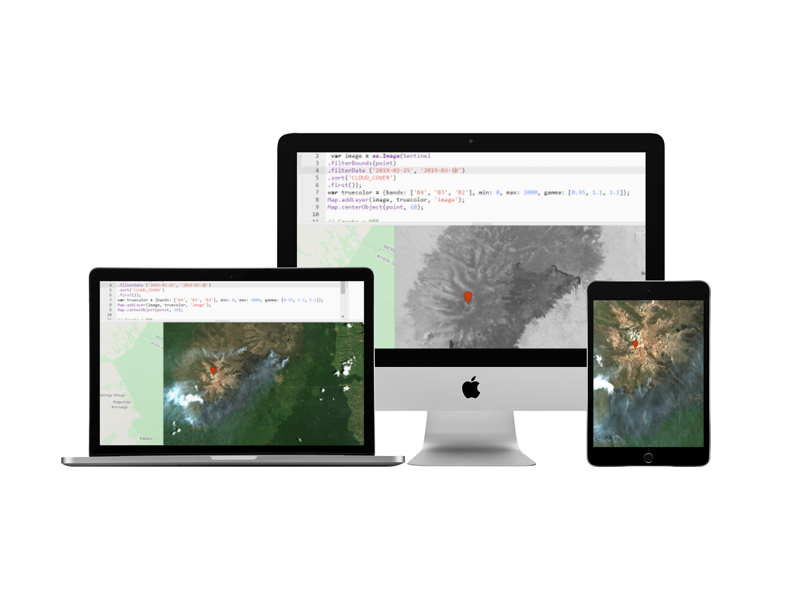

How do we measure the impact of wildfires and apply satellite remote sensing technology to wildfire detection, monitoring, and assessment? The goal of this post is not to explain the science behind wildfires, but rather to cover four major satellite sensors which are useful for wildfire detection and analysis (Landsat 8, Sentinel 2, MODIS and VIIRS).

In this example, I will locate and use wildfire data for Mt. Kenya, analyze it and process some geospatial data to detect fire hotspots and the map burn area. In 2019, thousands of hectares of moorland in the Mt. Kenya Forest have been destroyed by fire.

This video from NASA shows how NASA and NOAA satellites provide a global view of active fires across the entire plant, providing information to the fire management team on the ground. For more information on the techniques highlighted in this video, visit <a href="https://www.nasa.gov/feature/goddard/2019/nasa-tracks-wildfires-from-above-to-aid-firefighters-below" target="_blank"> NASA Tracks Wildfires From Above to Aid Firefighters </a> .

<iframe width="560" height="315" src="https://www.youtube.com/embed/I-kvnFP8ptI" frameborder="0" allow="accelerometer; autoplay; clipboard-write; encrypted-media; gyroscope; picture-in-picture" allowfullscreen></iframe>

We build this simple <a href="https://github.com/mandjo2010/Suivi-feux-de-forets-api-nasa" target="_blank"> React application</a> to track wildfires and plot them on Google map using a Google Maps API key and a <a href=" https://api.nasa.gov" target="_blank">NASA API</a> key. For a quick and advanced view of active fire data within 3 hours of satellite observation, visit NASA's <a href="https://firms.modaps.eosdis.nasa.gov/map/#t:adv;d:2020-09-22..2020-09-23;@0.0,0.0,3z" target="_blank"> Fire Information for Resource Management System </a> (FIRMS).

# Four major satellite sensors for wildfire

Here are the basic specifications of the major satellite sensors that are useful for wildfire detection and analysis:

## 1- Landsat 8

Landsat 8 is the most recently launched Landsat satellite.


```javascript
| Organization            | NASA
| ----------------------- | ------------------------------------------------------------
| Launch Date             | February 11, 2013
| Sensor Type             | Multispectral Sensor
| Number of Bands         | 11 (430–2290 nm)
| Sensors Attached        | Operational Land Imager (OLI) - 9 bands - (Visible, NIR, SWIR)
|                         | Thermal Infrared Sensor (TIRS) - 2 bands - (Thermal)
| Capture Rate            | 740 Scenes / day
| Scene Size              | 185 km x 180 km
| Swath                   | 185km
| Altitude                | 705km
| Spatial Resolution      | Bands 1 to 7 & 9 - 30m; Band 8 - 15m;  Band 10 & 11 - 100m
| Radiometric Resolution  | 12 bit (4096 Greyscales)
| Temporal Resolution     | 16 days
```

`Applications:` Land Cover Management - Agriculture and Forestry - Geological Studies - Glacier Studies - Geopolitical Issues Resolution

## 2-Sentinel 2

The Copernicus Sentinel-2 mission comprises a constellation of two polar-orbiting satellites having wide-swath, high-resolution, multi-spectral imaging missions placed in the same sun-synchronous orbit, phased at 180° to each other.


```javascript
| Organization            | European Space Agency (ESA)
| ----------------------- | ------------------------------------------------------------
| Launch Date             | Sentinel 2A – June 23, 2015;  Sentinel 2B – March 7, 2017
| Sensor Type             | Multispectral Sensor
| Number of Bands         | 13 (443–2190 nm)
| Swath                   | 290km
| Altitude                | 786km
| Spatial Resolution      | Band 2, 3, 4 & 8 - 10m; Band 5, 6, 7, 8a, 11, 12 - 20m;  Band 1, 9, 10 - 60m
| Radiometric Resolution  | 12 bit (4096 Greyscales)
| Temporal Resolution     | 5 days
```

`Applications:` Land Cover Management - Agriculture and Forestry - Disaster Control - Humanitarian Relief Operations - Risk Mapping and Security Concerns

## 3- MODIS

The Moderate Resolution Imaging Spectroradiometer (MODIS) is a payload imaging sensor built by Santa Barbara Remote Sensing. It was launched into Earth orbit by NASA in 1999 onboard the Terra satellite, and in 2002 onboard the Aqua satellite.


```javascript
| Organization            | NASA
| ----------------------- | ------------------------------------------------------------
| Launch Date             | December 18, 1999
| Sensor Type             | Multispectral Sensor
| Number of Bands         | 36 (400–1440 nm)
| Scene Size              | 2330 km x 10 km
| Swath                   | 2330km
| Altitude                | 705km
| Spatial Resolution      | Bands 1,2 – 250m; Bands 3-7 – 500m;  Bands 8-26 – 1000m
| Radiometric Resolution  | 12 bit (4096 Greyscales)
| Temporal Resolution     | 1-2 days
```

`Applications:` Vegetation Health Monitoring - Land Use Changes - Global Snow Cover Trends - Water Level Monitoring - Wildfire Detection

## 4- VIIRS

The Visible Infrared Imaging Radiometer Suite (VIIRS) is a sensor designed and manufactured by the Raytheon Company, onboard the Suomi National Polar-orbiting Partnership (Suomi NPP) and NOAA-20 weather satellites.


```javascript
| Organization            | European Space Agency (ESA)
| ----------------------- | ------------------------------------------------------------
| Launch Date             | October 28, 2011
| Sensor Type             | Multispectral Sensor
| Number of Bands         | 22 (412–1201 nm)
| Sensors Attached        | By NOAA – For Environmental Data Records (EDRs) – National Weather System
|                         | By NASA – For Earth System Data Records (ESDRs) – Scientific Community
| Swath                   | 185km3060km
| Altitude                | 830km
| Spatial Resolution      | 5 Bands - 375m; 17 Bands - 750m
| Radiometric Resolution  | 12 bit (4096 Greyscales)
| Temporal Resolution     | 16 days
```

`Applications:` Changes in Surface Vegetation - Wildfire Detection - Changes in Hydrological Cycle - Water Level Monitoring - Monitor Earth’s Energy Usage - Climate Change Assessment

# Download Data

Many platforms are available to download satellite-based remote sensing data. Here are various data portals and web resources that offer near-real-time updates on wildfire events, and provide image and GIS data to support decision making for fire management and research:

- <a href="http://earthexplorer.usgs.gov/" target="_blank">Landsat 8</a>
- <a href="https://scihub.copernicus.eu/" target="_blank">Sentinel-1, Sentinel-2, Sentinel-3 and Sentinel-5P</a>
- <a href="https://firms.modaps.eosdis.nasa.gov/" target="_blank">NASA Wildfires Data and Products</a>
- <a href="https://api.nasa.gov/" target="_blank">NASA Open API</a>
- <a href="https://ssl.jspacesystems.or.jp/ersdac/GDEM/E/index.html" target="_blank"> Japan Space Systems </a>
- <a href="http://www.vito-eodata.be/PDF/portal/Application.html" target="_blank">1 Km Spot vegetation Data (over Africa for example) </a>

Within earth explorer for example, the left-hand side panel has all the search tools for data selection. Use the polygon tool to drag the map to the area of interest, then draw the area.

The combination of different bands present in satellite data for visualization should always depend on the type of the application you are using. In this case, the application is vegetation. QGIS, a free and open-source GIS tool can be used or other for raster data operations and data visualization using different band combinations.

# Detecting Mt. Kenya wildfires from space

After opening Engine, it’s important to set two variables. The first is the location of the burning area, such as the Mt. Kenya Wildfire.

```javascript
// imports (2 entries)
var point: Point(37.31, -0.15)
var Sentinel: ImageCollection "Sentinel-2 MSI: MultiSpectral Instrument, Level-2A"
```

The second is to define whether to use Sentinel imagery or Sentinel-2 imagery. Then filter it with an appropriate date span (such as May 10th to May 30th of 2020). Sort them by cloud cover to the most cloud-free image.

Define the characteristics (band 4, 3, and 2) for a true color composite image, setting different paramaters to make the image visible.

```javascript
// Define the image and peramaters
var image = ee.Image(
  Sentinel.filterBounds(point)
    .filterDate("2019-02-25", "2019-03-10")
    .sort("CLOUD_COVER")
    .first()
);
var truecolor = { bands: ["B4", "B3", "B2"], min: 0, max: 2000, gamma: [0.95, 1.1, 1.1] };
Map.addLayer(image, truecolor, "image");
Map.centerObject(point, 10);
```

You also need to define the characteristics(band 4, 3, and 2), a true color composite for the image that you want to present. You can set different parmaters to make the image visible.

```javascript
// Create a NBR
var nbr = image.normalizedDifference(["B8", "B12"]);
//Define the palette.
var burnPalette = ["black", "white"];
Map.addLayer(nbr, { min: -1, max: 1, palette: burnPalette }, "NBR");
```

The next step is to create the Normalized Burn Ratio (NBR). Since the NBR uses bands eight and 12, define these characteristics in order to use to use a normalized difference. Set the desired color scheme before hitting Run.

When running the NBR over Mt. Kenya, the burn scar (true color) becomes visible. Unselect the NBR layer to see the image.


# Running Classifications

I needed some quick research about field work to know the different types of vegetation before running a classification.

To create a classified map, I reviewed a supervised image classification within ENVI, which is very powerful remote sensing data processing software. ENVI was originally dedicated to hyperspectral analysis using large volumes of data and complex information; but it’s also been adapted to different types of data: VHSR, radar, thermal.


My goal was not to study the science of wildfires or the ecology of Mt. Kenya, it was to locate the fire. I believe the future of Mt Kenya is in all our hands.

<iframe width="560" height="315" src="https://www.youtube.com/embed/zRdwYMi3AEQ" frameborder="0" allow="accelerometer; autoplay; clipboard-write; encrypted-media; gyroscope; picture-in-picture" allowfullscreen></iframe>
