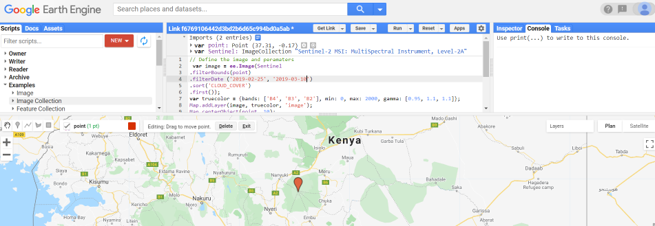
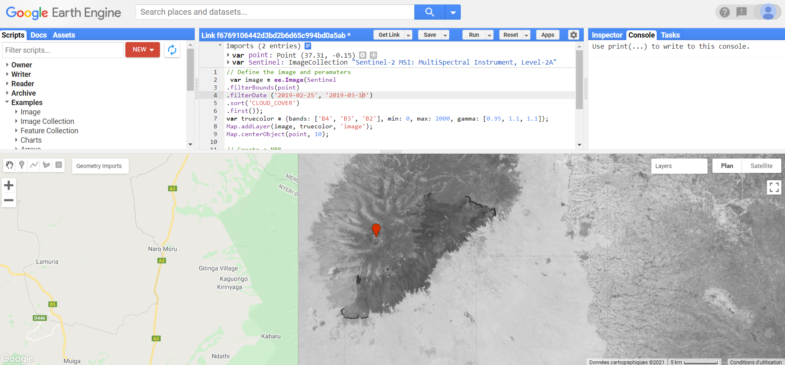
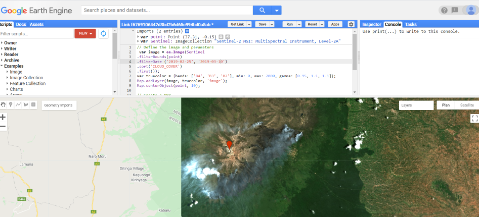

How to mesure the impacts of wildfire and how to apply satellite remote sensing technology to wildfire detection, monitoring, and assessment ? The goal of this post is not to explain de science behind wildfires, but rather to cover 4 major satellite sensors which are useful for wildfire detection and analysis (Landsat 8, Sentinel 2, MODIS and VIIRS).

In this example, I will locate and use wildfire data for Mt Kenya as well as any part of the Globe, analyze it and process some geospatial data to detect fire hotspots and map burn area. In 2019, thousands of hectares of moorland in Mt Kenya Forest have been destroyed by a fire.

This video from NASA shows how NASA and NOAA satellites provide a global view of active fires across the entire plant providing information to the fire management team on the ground. For more information on the techniques highlighted in this video, visit <a href="https://www.nasa.gov/feature/goddard/2019/nasa-tracks-wildfires-from-above-to-aid-firefighters-below" target="_blank"> NASA Tracks Wildfires </a> From Above to Aid Firefighters.

<iframe width="560" height="315" src="https://www.youtube.com/embed/I-kvnFP8ptI" frameborder="0" allow="accelerometer; autoplay; clipboard-write; encrypted-media; gyroscope; picture-in-picture" allowfullscreen></iframe>

We build this simple <a href="https://github.com/mandjo2010/Suivi-feux-de-forets-api-nasa" target="_blank"> React app</a> to track wildfires and plot them on Google map using a Google Maps API key and a <a href=" https://api.nasa.gov" target="_blank">NASA API</a> key. For a quick and advanced view of active fire data within 3 hours of satellite observation, visit NASA's <a href="https://firms.modaps.eosdis.nasa.gov/map/#t:adv;d:2020-09-22..2020-09-23;@0.0,0.0,3z" target="_blank"> Fire Information for Resource Management System </a> (FIRMS).

# 4 major satellite sensors for wildfire

Here are the basic specifications of the major satellite sensors which are useful for wildfire detection and analysis

## 1- Landsat 8

Landsat 8 is the most recently launched Landsat satellite.


```javascript
| Organization            | NASA
| ----------------------- | ------------------------------------------------------------
| Launch Date             | February 11, 2013
| Sensor Type             | Multispectral Sensor
| Number of Bands         | 11 (430–2290 nm)
| Sensors Attached        | Operational Land Imager (OLI) - 9 bands - (Visible, NIR, SWIR)
|                         | Thermal Infrared Sensor (TIRS) - 2 bands - (Thermal)
| Capture Rate            | 740 Scenes / day
| Scene Size              | 185 km x 180 km
| Swath                   | 185km
| Altitude                | 705km
| Spatial Resolution      | Bands 1 to 7 & 9 - 30m; Band 8 - 15m;  Band 10 & 11 - 100m
| Radiometric Resolution  | 12 bit (4096 Greyscales)
| Temporal Resolution     | 16 days
```

`Applications:` Land Cover Management - Agriculture and Forestry - Geological Studies - Glacier Studies - Geopolitical Issues Resolution

## 2-Sentinel 2

The Copernicus Sentinel-2 mission comprises a constellation of two polar-orbiting satellites having wide-swath, high-resolution, multi-spectral imaging missions placed in the same sun-synchronous orbit, phased at 180° to each other.


```javascript
| Organization            | European Space Agency (ESA)
| ----------------------- | ------------------------------------------------------------
| Launch Date             | Sentinel 2A – June 23, 2015;  Sentinel 2B – March 7, 2017
| Sensor Type             | Multispectral Sensor
| Number of Bands         | 13 (443–2190 nm)
| Swath                   | 290km
| Altitude                | 786km
| Spatial Resolution      | Band 2, 3, 4 & 8 - 10m; Band 5, 6, 7, 8a, 11, 12 - 20m;  Band 1, 9, 10 - 60m
| Radiometric Resolution  | 12 bit (4096 Greyscales)
| Temporal Resolution     | 5 days
```

`Applications:` Land Cover Management - Agriculture and Forestry - Disaster Control - Humanitarian Relief Operations - Risk Mapping and Security Concerns

## 3- MODIS

The Moderate Resolution Imaging Spectroradiometer (MODIS), is a payload imaging sensor built by Santa Barbara Remote Sensing that was launched into Earth orbit by NASA in 1999 onboard the Terra satellite, and in 2002 onboard the Aqua satellite


```javascript
| Organization            | NASA
| ----------------------- | ------------------------------------------------------------
| Launch Date             | December 18, 1999
| Sensor Type             | Multispectral Sensor
| Number of Bands         | 36 (400–1440 nm)
| Scene Size              | 2330 km x 10 km
| Swath                   | 2330km
| Altitude                | 705km
| Spatial Resolution      | Bands 1,2 – 250m; Bands 3-7 – 500m;  Bands 8-26 – 1000m
| Radiometric Resolution  | 12 bit (4096 Greyscales)
| Temporal Resolution     | 1-2 days
```

`Applications:` Vegetation Health Monitoring - Landuse Changes - Global Snow Cover Trends - Water Level Monitoring - Wildfire Detection

## 4- VIIRS

The Visible Infrared Imaging Radiometer Suite (VIIRS) is a sensor designed and manufactured by the Raytheon Company onboard the Suomi National Polar-orbiting Partnership (Suomi NPP) and NOAA-20 weather satellites.


```javascript
| Organization            | European Space Agency (ESA)
| ----------------------- | ------------------------------------------------------------
| Launch Date             | October 28, 2011
| Sensor Type             | Multispectral Sensor
| Number of Bands         | 22 (412–1201 nm)
| Sensors Attached        | By NOAA – For Environmental Data Records (EDRs) – National Weather System
|                         | By NASA – For Earth System Data Records (ESDRs) – Scientific Community
| Swath                   | 185km3060km
| Altitude                | 830km
| Spatial Resolution      | 5 Bands - 375m; 17 Bands - 750m
| Radiometric Resolution  | 12 bit (4096 Greyscales)
| Temporal Resolution     | 16 days
```

`Applications:` Changes in Surface Vegetation - Wildfire Detection - Changes in Hydrological Cycle - Water Level MonitoringMonitor Earth’s Energy Usage - Climate Change Assessment

# Download Data

There are many platforms available for downloading Satellite based Remote Sensing data. Here are various data portals and web resources that offer near real-time updates on wildfire events and provide image and GIS data to support decision making for fire management and fire research:

- <a href="http://earthexplorer.usgs.gov/" target="_blank">Landsat 8</a>
- <a href="https://scihub.copernicus.eu/" target="_blank">Sentinel-1, Sentinel-2, Sentinel-3 and Sentinel-5P</a>
- <a href="https://firms.modaps.eosdis.nasa.gov/" target="_blank">NASA Wildfires Data and Products</a>
- <a href="https://api.nasa.gov/" target="_blank">NASA Open API</a>
- <a href="https://ssl.jspacesystems.or.jp/ersdac/GDEM/E/index.html" target="_blank"> Japan Space Systems </a>
- <a href="http://www.vito-eodata.be/PDF/portal/Application.html" target="_blank">1 Km Spot vegetation Data (over Africa for example) </a>

Within earthexplorer for example, the left-hand side panel has all the search tools for data selection. Use the polygon tool to drag the map to the area of interest, and then draw the area.

The combination of different bands present in satellite data that you want for visualization should always depend on the type of the application you are using them for. In this case, the application is vegetation. QGIS, a free and open source GIS tool can be use or other for raster operations and data visualization using different band combinations.

# Detecting Mt Kenya wildfire from space

Do you recall from the react app at the top of this page that use NASA API to track wildfires and plot them on Google? you are fine here, because you are going to use Google Earth Engine to assess wildfires. You can drag and move the point by holding it to wherever you want onto the earth(where are fire).

So once you've opened up Engine, the first thing that you're going to set are two variables. The first variable
is the location of the burning area of your choice. I am interested in the Mt Kenya Wildfire.

```javascript
// imports (2 entries)
var point: Point(37.31, -0.15)
var Sentinel: ImageCollection "Sentinel-2 MSI: MultiSpectral Instrument, Level-2A"
```



The second variable to set is a variable to define that we want to use Sentinel imagery or Sentinel-2 imagery. Then you have to filter it from appropriate date (May 10th to May 30th of 2020). Why summer according to you ? Sort them by cloud cover to the most cloud free image.

```javascript
// Define the image and peramaters
var image = ee.Image(
  Sentinel.filterBounds(point)
    .filterDate("2019-02-25", "2019-03-10")
    .sort("CLOUD_COVER")
    .first()
);
var truecolor = { bands: ["B4", "B3", "B2"], min: 0, max: 2000, gamma: [0.95, 1.1, 1.1] };
Map.addLayer(image, truecolor, "image");
Map.centerObject(point, 10);
```

You also need to define the characteristics(band 4, 3, and 2), a true color composite for the image that you want to present. You can set different parmaters to make the image visible.

```javascript
// Create a NBR
var nbr = image.normalizedDifference(["B8", "B12"]);
//Define the palette.
var burnPalette = ["black", "white"];
Map.addLayer(nbr, { min: -1, max: 1, palette: burnPalette }, "NBR");
```

The next step that you're going to do is to create the Normalized Burn Ration (NBR). Since the MBR uses band eight and 12, define the characteristics(band 8 and 12) in order to use to use a normalized difference. You can set color scheme as you want before hitting Run.

When you run the NBR over the Mr Kenya, you see the burn scare (true color). Unselecte the NBR layer to see the image



# Running Classifications

How to select imagery for creating Mt Kenya forests map based on the characteristics of the imagery such as pixel size, bands, or time of year? I needed some quick research about field work to know the different types of vegetation before running classification.

I went over supervised image classification within ENVI, a very powerful remote sensing data processing software to create classified map product. ENVI was originally dedicated to hyperspectral analysis and therefore to large volumes of data and complex information. But it's currently adapted to different types of data: VHSR, radar, thermal.

Once again, my goal here was not to study the science of Wildfire or the ecology of Mt Kenya. My mission here was to locate the fire and I beleve that the futur of Mt Kenya is in all our hands, together let's celebrate Mt Kenya.

<iframe width="560" height="315" src="https://www.youtube.com/embed/zRdwYMi3AEQ" frameborder="0" allow="accelerometer; autoplay; clipboard-write; encrypted-media; gyroscope; picture-in-picture" allowfullscreen></iframe>
