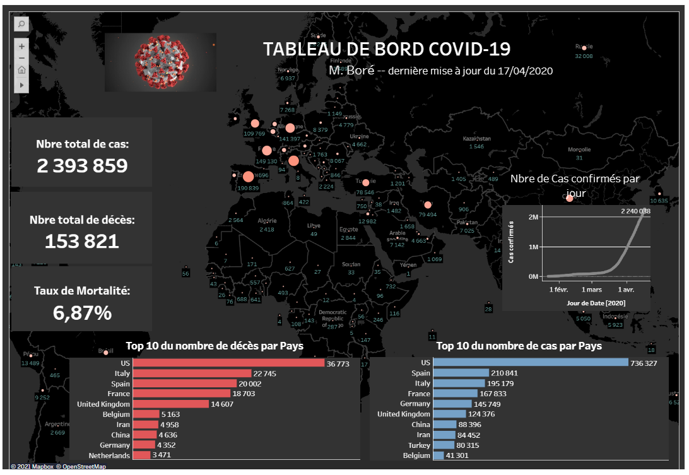
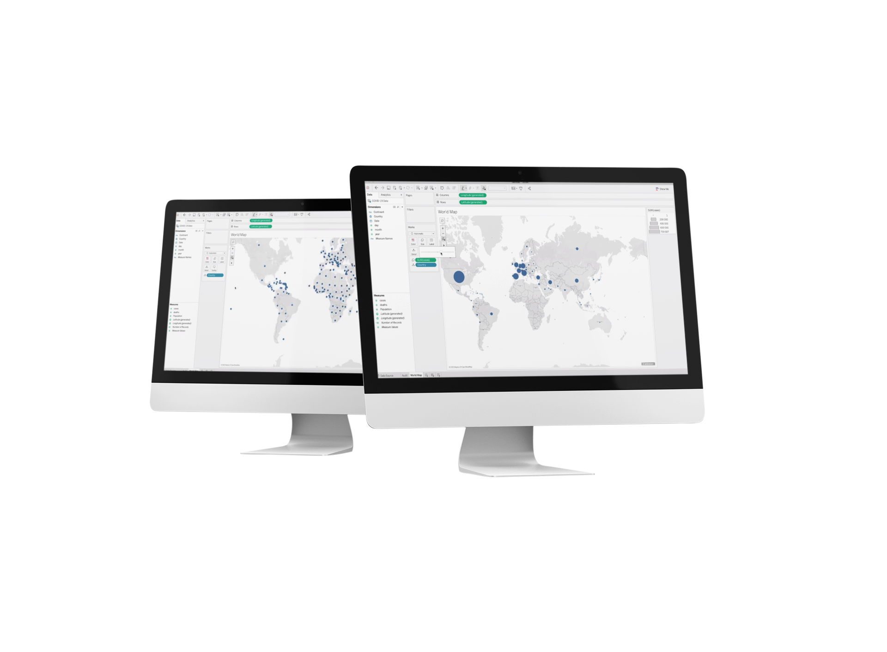

According to Harvard Business Review, data science is the “sexiest job of the 21st century”. That’s because we are currently living in a data world and there’s a lot of information out there that so many people, countries and companies don’t know yet what do with.

In this post, I’ll explain how I build <a href="https://public.tableau.com/profile/crestoni#!/vizhome/COVID-19Dashboard_15872243969970/DashboardCOVID19" target="_blank">this</a> dashboard using <a href="https://public.tableau.com/s/" target="_blank">Tableau</a>, a data visualization tool which enables to create beautiful dashboards quickly with little use of code or without needing to write a single line of code.


Last update: 04/17/2020

### 1- Download and install Tableau

Once the trial version of Tableau is downloaded, click continue to proceed the installation by following all default instructions.

### 2- Creating Data Source

Now that Tableau is up and running, create the data source by importing data into Google sheets for example. But making sure that the data is relevant and authoritative is vital to ensure that the dashboard is credible. For this example, data has been generously provided by Europe. I fetched it from <a href="https://data.europa.eu/euodp/en/data/dataset/covid-19-coronavirus-data" target="_blank">EU Open Data Portal.</a>


As soon as the data is ready, connect it to Tableau workbook Desktop.

### 3- Connecting Data to Tableau

Tableau has a lot of connection options to data, stored in different places. Whether the data might be store on a local computer in spreadsheet or text file, or a big data, or even from a public domain such as U.S. Census Bureau, or from a cloud database source. In this case, I am using Google sheet data source.

Tableau desktop needs authorization to Google account in order to proceed connection to the data coming form Google sheet. This window below shows data is connected. Another dataset can be added by it into Tableau. In this case, I only used one sheet. It's good practice to rename the source of data and the sheet.

To explore data, there two different views that can be use. One from the normal table view, or by switching to just view headings(metadata). It's also possible to order the colum, filter a specific area or item.


### 4- Preparing the data for analysis

When you connect to a new data source, Tableau assigns each field in the data source as a dimension or measure in the Data pane, depending on the type of data the field contains. You use these fields to create views of your data.

To check the number of records, click on it, drag and drop it into Tableau. By this way, a small bar chart appears with giving number when hovering over it.

Before moving forward building chart, it's better to audit data to make sure that it's making sense. Is your data reliable ? In this case, I the moment of building this dashboard, cases number and deahts were corect.


### 5- Creating chart or map within Tableau

There are two steps to create a basic Tableau bar Chart or bring in latitude and longitude.

1.  Drag and drop a measure field from the lower left of the screen to the Rows shelf at the top of the screen
2.  Drag and drop a dimension field from the upper left of the screen to the Columns shelf at the top of the screen

To map the number of cases according the size, click on cases, and drag it over to size section and drop it. So if a country has a large number of cases, it should have a large . Otherwise, it should have a small dot. Doing that in tableau is pretty simple.

Now the map, appear with much more larger dots in countries with the large amount of cases.



Maps in Tableau can be thought of as scatter plots with a background image. Tableau will plot a point at each combination of the latitude on the Y-axis and longitude on the X-axis. To help illustrate the scatter plot concept, take a look at the following two images. First, the latitude and longitude plotted with no background image. And below, the same data points plotted with a background image of the world in dark color.


To only show the top 10 countries, create a new chart on tableau. A chart is basically a calculation logic on a specific part of the data. It's possible to edit it, add more information and change the color.


### 6- Creating calculation on Tableau

Sometimes data source does not contain a field (or column) that is needed for analysis. For example, data source might contain fields with values for death and cases, but not for Mortality Rate (MR). In this case, I created a calculated field for mortality rate using data from the death fields.

This topic below demonstrates how to create a simple calculated field in Tableau. The first headline cards created and that will be using for calculations is total cases.

#### Total Cases

```javascript
SUM(Cases);
```

The second headline cards created and that will be using for calculations is total Deaths.

#### Total Deaths

```javascript
SUM(Deaths);
```

#### Mortality Rate

So the mortality rate would be the percentage of people who have died out of the confirmed cases. The default number format of MR is % (make sure to change this format). The formula would be some of deaths over the sum of cases. As the mortality rate is not in the dataset, I ma using, I have to create it. the mortality rate would be the some off the total deaths over the some of total cases.

```javascript
SUM(Deaths) / SUM(Cases);
```

#### Growth formula

Then calculate the growth to see how many cases were this time last month compared to the current cases. Start by calculating both last and current dates fields in order to know the number of cases that were present last month this time.

```javascript
SUM(Cases this Month ) - SUM(Cases last Month) / SUM(Cases last Month )
```

### 7- Building a dasboard

Done with cleaning data, all the your worksheets has been created and they're communicating important information that you want to share. You can use your dashboard to display multiple worksheets at once, and—if you want—make them interact with one another.

When you’re ready to create a best tableau dashboard in an existing workbook, right-click on the tab list or filmstrip view and choose New Dashboard from the context menu, then click the New Dashboard tab along the bottom of the workspace, or choose Dashboard, New Dashboard from the drop-down menus.

A blank dashboard will appear with the Data window replaced by four sections: a list of existing worksheets in the workbook, a selection of additional dashboard elements a layout section containing the organization of items added to the dashboard, and a sizing section for customizing dashboard element sizes.

The next and final step will be to put your dashoard online.

### 8- Publishing your dashboard

It's time to publish your dashboard to tableau public in order to share it with a wide audience. If you don't have yet your Tableau account, create one. Tableau content can be published to Tableau server, distributed via Tableau Mobile, Tableau Reader, Tableau Desktop or sent as static images. All of these options have different capabilities, security models and requirements.

Tableau server and Tableau Online are great options for publishing and sharing Tableau content. Tableau server provides browser-based analytics without the need to download software. Within your Tableau, navigate to the top bar and click on server and go down to tableau public and click on Save to Tableau Public. Then you will be ask to sign into your account.
